This file is a merged representation of a subset of the codebase, containing specifically included files and files not matching ignore patterns, combined into a single document by Repomix.

# File Summary

## Purpose
This file contains a packed representation of the entire repository's contents.
It is designed to be easily consumable by AI systems for analysis, code review,
or other automated processes.

## File Format
The content is organized as follows:
1. This summary section
2. Repository information
3. Directory structure
4. Multiple file entries, each consisting of:
  a. A header with the file path (## File: path/to/file)
  b. The full contents of the file in a code block

## Usage Guidelines
- This file should be treated as read-only. Any changes should be made to the
  original repository files, not this packed version.
- When processing this file, use the file path to distinguish
  between different files in the repository.
- Be aware that this file may contain sensitive information. Handle it with
  the same level of security as you would the original repository.

## Notes
- Some files may have been excluded based on .gitignore rules and Repomix's configuration
- Binary files are not included in this packed representation. Please refer to the Repository Structure section for a complete list of file paths, including binary files
- Only files matching these patterns are included: docs/**
- Files matching these patterns are excluded: docs/img,  docs/javascripts,  docs/extra
- Files matching patterns in .gitignore are excluded
- Files matching default ignore patterns are excluded
- Files are sorted by Git change count (files with more changes are at the bottom)

## Additional Info

# Directory Structure
```
docs/
  .hooks/
    algolia.py
    main.py
  .overrides/
    .icons/
      logfire/
        logo.svg
    partials/
      search.html
  .partials/
    index-header.html
  api/
    models/
      anthropic.md
      base.md
      bedrock.md
      cohere.md
      fallback.md
      function.md
      gemini.md
      groq.md
      instrumented.md
      mistral.md
      openai.md
      test.md
      wrapper.md
    pydantic_evals/
      dataset.md
      evaluators.md
      generation.md
      otel.md
      reporting.md
    pydantic_graph/
      exceptions.md
      graph.md
      mermaid.md
      nodes.md
      persistence.md
    agent.md
    common_tools.md
    exceptions.md
    format_as_xml.md
    mcp.md
    messages.md
    providers.md
    result.md
    settings.md
    tools.md
    usage.md
  examples/
    bank-support.md
    chat-app.md
    flight-booking.md
    index.md
    pydantic-model.md
    question-graph.md
    rag.md
    sql-gen.md
    stream-markdown.md
    stream-whales.md
    weather-agent.md
  extra/
    tweaks.css
  javascripts/
    algolia-search.js
  mcp/
    client.md
    index.md
    run-python.md
    server.md
  models/
    anthropic.md
    bedrock.md
    cohere.md
    gemini.md
    groq.md
    index.md
    mistral.md
    openai.md
  agents.md
  changelog.md
  cli.md
  common-tools.md
  contributing.md
  dependencies.md
  evals.md
  graph.md
  help.md
  index.md
  input.md
  install.md
  logfire.md
  message-history.md
  multi-agent-applications.md
  output.md
  testing.md
  tools.md
  troubleshooting.md
```

# Files

## File: docs/.hooks/algolia.py
````python
# pyright: reportUnknownMemberType=false
from __future__ import annotations as _annotations

import os
import sys
from pathlib import Path
from typing import TYPE_CHECKING, cast

from pydantic import TypeAdapter
from typing_extensions import TypedDict

if TYPE_CHECKING:
    from mkdocs.config import Config
    from mkdocs.structure.files import Files
    from mkdocs.structure.pages import Page


class AlgoliaRecord(TypedDict):
    content: str
    pageID: str
    abs_url: str
    title: str
    objectID: str
    rank: int


records: list[AlgoliaRecord] = []
records_ta = TypeAdapter(list[AlgoliaRecord])
# these values should match docs/javascripts/search-worker.js.
ALGOLIA_APP_ID = 'KPPUDTIAVX'
ALGOLIA_INDEX_NAME = 'pydantic-ai-docs'

# Algolia has a limit of 100kb per record in the paid plan,
# leave some space for the other fields as well.
MAX_CONTENT_LENGTH = 90_000


def on_page_content(html: str, page: Page, config: Config, files: Files) -> str:
    if not os.getenv('CI'):
        return html

    from bs4 import BeautifulSoup

    assert page.title is not None, 'Page title must not be None'
    title = cast(str, page.title)

    soup = BeautifulSoup(html, 'html.parser')

    # If the page does not start with a heading, add the h1 with the title
    # Some examples don't have a heading. or start with h2
    first_element = soup.find()

    if not first_element or not first_element.name or first_element.name not in ['h1', 'h2', 'h3']:
        soup.insert(0, BeautifulSoup(f'<h1 id="{title}">{title}</h1>', 'html.parser'))

    # Clean up presentational and UI elements
    for element in soup.find_all(['autoref']):
        element.decompose()

    # this removes the large source code embeds from Github
    for element in soup.find_all('details'):
        element.decompose()

    # Cleanup code examples
    for extra in soup.find_all('div', attrs={'class': 'language-python highlight'}):
        extra.replace_with(BeautifulSoup(f'<pre>{extra.find("code").get_text()}</pre>', 'html.parser'))

    # Cleanup code examples, part 2
    for extra in soup.find_all('div', attrs={'class': 'language-python doc-signature highlight'}):
        extra.replace_with(BeautifulSoup(f'<pre>{extra.find("code").get_text()}</pre>', 'html.parser'))

    # The API reference generates HTML tables with line numbers, this strips the line numbers cell and goes back to a code block
    for extra in soup.find_all('table', attrs={'class': 'highlighttable'}):
        extra.replace_with(BeautifulSoup(f'<pre>{extra.find("code").get_text()}</pre>', 'html.parser'))

    headings = soup.find_all(['h1', 'h2', 'h3'])

    # Use the rank to put the sections in the beginning higher in the search results
    rank = 100

    # Process each section
    for current_heading in headings:
        heading_id = current_heading.get('id', '')
        section_title = current_heading.get_text().replace('¶', '').strip()

        # Get content until next heading
        content: list[str] = []
        sibling = current_heading.find_next_sibling()
        while sibling and sibling.name not in {'h1', 'h2', 'h3'}:
            content.append(str(sibling))
            sibling = sibling.find_next_sibling()

        section_html = ''.join(content)

        section_soup = BeautifulSoup(section_html, 'html.parser')
        section_plain_text = section_soup.get_text(' ', strip=True)

        # Create anchor URL
        anchor_url: str = f'{page.abs_url}#{heading_id}' if heading_id else page.abs_url or ''

        record_title = title

        if current_heading.name == 'h2':
            record_title = f'{title} - {section_title}'
        elif current_heading.name == 'h3':
            previous_heading = current_heading.find_previous(['h1', 'h2'])
            record_title = f'{title} - {previous_heading.get_text()} - {section_title}'

        # print(f'Adding record {record_title}, {rank}, {current_heading.name}')
        # Create record for this section
        records.append(
            AlgoliaRecord(
                content=section_plain_text,
                pageID=title,
                abs_url=anchor_url,
                title=record_title,
                objectID=anchor_url,
                rank=rank,
            )
        )

        rank -= 5

    return html


ALGOLIA_RECORDS_FILE = 'algolia_records.json'


def on_post_build(config: Config) -> None:
    if records:
        algolia_records_path = Path(config['site_dir']) / ALGOLIA_RECORDS_FILE
        with algolia_records_path.open('wb') as f:
            f.write(records_ta.dump_json(records))


def algolia_upload() -> None:
    from algoliasearch.search.client import SearchClientSync

    algolia_write_api_key = os.environ['ALGOLIA_WRITE_API_KEY']

    client = SearchClientSync(ALGOLIA_APP_ID, algolia_write_api_key)
    filtered_records: list[AlgoliaRecord] = []

    algolia_records_path = Path.cwd() / 'site' / ALGOLIA_RECORDS_FILE

    with algolia_records_path.open('rb') as f:
        all_records = records_ta.validate_json(f.read())

    for record in all_records:
        content = record['content']
        if len(content) > MAX_CONTENT_LENGTH:
            print(
                f"Record with title '{record['title']}' has more than {MAX_CONTENT_LENGTH} characters, {len(content)}."
            )
            print(content)
        else:
            filtered_records.append(record)

    print(f'Uploading {len(filtered_records)} out of {len(all_records)} records to Algolia...')

    client.clear_objects(index_name=ALGOLIA_INDEX_NAME)
    client.set_settings(
        index_name=ALGOLIA_INDEX_NAME,
        index_settings={
            'searchableAttributes': ['title', 'content'],
            'attributesToSnippet': ['content:40'],
            'customRanking': [
                'desc(rank)',
            ],
        },
    )

    client.batch(
        index_name=ALGOLIA_INDEX_NAME,
        batch_write_params={'requests': [{'action': 'addObject', 'body': record} for record in filtered_records]},
    )


if __name__ == '__main__':
    if sys.argv[-1] == 'upload':
        algolia_upload()
    else:
        print('Run with "upload" argument to upload records to Algolia.')
        exit(1)
````

## File: docs/.hooks/main.py
````python
from __future__ import annotations as _annotations

import re
import time
import urllib.parse
from pathlib import Path

from jinja2 import Environment
from mkdocs.config import Config
from mkdocs.structure.files import Files
from mkdocs.structure.pages import Page


def on_page_markdown(markdown: str, page: Page, config: Config, files: Files) -> str:
    """Called on each file after it is read and before it is converted to HTML."""
    markdown = replace_uv_python_run(markdown)
    markdown = render_examples(markdown)
    markdown = render_video(markdown)
    return markdown


# path to the main mkdocs material bundle file, found during `on_env`
bundle_path: Path | None = None


def on_env(env: Environment, config: Config, files: Files) -> Environment:
    global bundle_path
    for file in files:
        if re.match('assets/javascripts/bundle.[a-z0-9]+.min.js', file.src_uri):
            bundle_path = Path(file.dest_dir) / file.src_uri

    env.globals['build_timestamp'] = str(int(time.time()))
    return env


def on_post_build(config: Config) -> None:
    """Inject extra CSS into mermaid styles to avoid titles being the same color as the background in dark mode."""
    if bundle_path.exists():
        content = bundle_path.read_text()
        content, _ = re.subn(r'}(\.statediagram)', '}.statediagramTitleText{fill:#888}\1', content, count=1)
        bundle_path.write_text(content)


def replace_uv_python_run(markdown: str) -> str:
    return re.sub(r'```bash\n(.*?)(python/uv[\- ]run|pip/uv[\- ]add|py-cli)(.+?)\n```', sub_run, markdown)


def sub_run(m: re.Match[str]) -> str:
    prefix = m.group(1)
    command = m.group(2)
    if 'pip' in command:
        pip_base = 'pip install'
        uv_base = 'uv add'
    elif command == 'py-cli':
        pip_base = ''
        uv_base = 'uv run'
    else:
        pip_base = 'python'
        uv_base = 'uv run'
    suffix = m.group(3)
    return f"""\
=== "pip"

    ```bash
    {prefix}{pip_base}{suffix}
    ```

=== "uv"

    ```bash
    {prefix}{uv_base}{suffix}
    ```"""


EXAMPLES_DIR = Path(__file__).parent.parent.parent / 'examples'


def render_examples(markdown: str) -> str:
    return re.sub(r'^#! *examples/(.+)', sub_example, markdown, flags=re.M)


def sub_example(m: re.Match[str]) -> str:
    example_path = EXAMPLES_DIR / m.group(1)
    content = example_path.read_text().strip()
    # remove leading docstring which duplicates what's in the docs page
    content = re.sub(r'^""".*?"""', '', content, count=1, flags=re.S).strip()

    return content


def render_video(markdown: str) -> str:
    return re.sub(r'\{\{ *video\((["\'])(.+?)\1(?:, (\d+))?(?:, (\d+))?\) *\}\}', sub_cf_video, markdown)


def sub_cf_video(m: re.Match[str]) -> str:
    video_id = m.group(2)
    time = m.group(3)
    time = f'{time}s' if time else ''
    padding_top = m.group(4) or '67'

    domain = 'https://customer-nmegqx24430okhaq.cloudflarestream.com'
    poster = f'{domain}/{video_id}/thumbnails/thumbnail.jpg?time={time}&height=600'
    return f"""
<div style="position: relative; padding-top: {padding_top}%;">
  <iframe
    src="{domain}/{video_id}/iframe?poster={urllib.parse.quote_plus(poster)}"
    loading="lazy"
    style="border: none; position: absolute; top: 0; left: 0; height: 100%; width: 100%;"
    allow="accelerometer; gyroscope; autoplay; encrypted-media; picture-in-picture;"
    allowfullscreen="true"
  ></iframe>
</div>
"""
````

## File: docs/.overrides/.icons/logfire/logo.svg
````
<svg viewBox="0 0 90 90" fill="none" xmlns="http://www.w3.org/2000/svg">
<rect width="90" height="90" fill="#E520E9"/>
<path d="M48.75 60V48.75H37.5V18.75H26.25V60H37.5V71.25H63.75V60H48.75Z" fill="#092224"/>
</svg>
````

## File: docs/.overrides/partials/search.html
````html
<div class="md-search" role="dialog">
  <label class="md-search__overlay" for="__search"></label>
  <div class="md-search__inner" role="search">
    <form class="md-search__form" name="search">
      <input type="text" id="searchbox" class="md-search__input" name="query" aria-label="Search" placeholder="Search" autocapitalize="off" autocorrect="off" autocomplete="off" spellcheck="false" required="">
      <label class="md-search__icon md-icon" for="__search">

        <svg xmlns="http://www.w3.org/2000/svg" viewBox="0 0 24 24"><path d="M9.5 3A6.5 6.5 0 0 1 16 9.5c0 1.61-.59 3.09-1.56 4.23l.27.27h.79l5 5-1.5 1.5-5-5v-.79l-.27-.27A6.516 6.516 0 0 1 9.5 16 6.5 6.5 0 0 1 3 9.5 6.5 6.5 0 0 1 9.5 3m0 2C7 5 5 7 5 9.5S7 14 9.5 14 14 12 14 9.5 12 5 9.5 5Z"></path></svg>

        <svg xmlns="http://www.w3.org/2000/svg" viewBox="0 0 24 24"><path d="M20 11v2H8l5.5 5.5-1.42 1.42L4.16 12l7.92-7.92L13.5 5.5 8 11h12Z"></path></svg>
      </label>
      <nav class="md-search__options" aria-label="Search">

        <button id="searchbox-clear" type="reset" class="md-search__icon md-icon" title="Clear" aria-label="Clear" tabindex="-1">

          <svg xmlns="http://www.w3.org/2000/svg" viewBox="0 0 24 24"><path d="M19 6.41 17.59 5 12 10.59 6.41 5 5 6.41 10.59 12 5 17.59 6.41 19 12 13.41 17.59 19 19 17.59 13.41 12 19 6.41Z"></path></svg>
        </button>
      </nav>

        <div class="md-search__suggest"></div>

    </form>
    <div class="md-search__output">
      <div class="md-search__scrollwrap" tabindex="0">
        <div class="md-search-result">
          <div class="md-search-result__meta" id="type-to-start-searching">Type to start searching</div>
          <ol class="md-search-result__list" id="hits" role="presentation"></ol>
        </div>
      </div>
    </div>
  </div>
</div>
````

## File: docs/.partials/index-header.html
````html
<div class="text-center">
  
</div>
<div class="text-center">
  
</div>
<p class="text-center">
  <em>Agent Framework / shim to use Pydantic with LLMs</em>
</p>
<p class="text-center">
  <a href="https://github.com/pydantic/pydantic-ai/actions/workflows/ci.yml?query=branch%3Amain">
    
  </a>
  <a href="https://coverage-badge.samuelcolvin.workers.dev/redirect/pydantic/pydantic-ai">
    
  </a>
  <a href="https://pypi.python.org/pypi/pydantic-ai">
    
  </a>
  <a href="https://github.com/pydantic/pydantic-ai">
    
  </a>
  <a href="https://github.com/pydantic/pydantic-ai/blob/main/LICENSE">
    
  </a>
</p>

<p class="text-emphasis">
  PydanticAI is a Python agent framework designed to make it less painful to
  build production grade applications with Generative AI.
</p>
````

## File: docs/api/models/anthropic.md
````markdown
# `pydantic_ai.models.anthropic`

## Setup

For details on how to set up authentication with this model, see [model configuration for Anthropic](../../models/anthropic.md).

::: pydantic_ai.models.anthropic
````

## File: docs/api/models/base.md
````markdown
# `pydantic_ai.models`

::: pydantic_ai.models
    options:
      members:
        - KnownModelName
        - ModelRequestParameters
        - Model
        - AbstractToolDefinition
        - StreamedResponse
        - ALLOW_MODEL_REQUESTS
        - check_allow_model_requests
        - override_allow_model_requests
````

## File: docs/api/models/bedrock.md
````markdown
# `pydantic_ai.models.bedrock`

## Setup

For details on how to set up authentication with this model, see [model configuration for Bedrock](../../models/bedrock.md).

::: pydantic_ai.models.bedrock
````

## File: docs/api/models/cohere.md
````markdown
# `pydantic_ai.models.cohere`

## Setup

For details on how to set up authentication with this model, see [model configuration for Cohere](../../models/cohere.md).

::: pydantic_ai.models.cohere
````

## File: docs/api/models/fallback.md
````markdown
# pydantic_ai.models.fallback

::: pydantic_ai.models.fallback
````

## File: docs/api/models/function.md
````markdown
# `pydantic_ai.models.function`

A model controlled by a local function.

[`FunctionModel`][pydantic_ai.models.function.FunctionModel] is similar to [`TestModel`](test.md),
but allows greater control over the model's behavior.

Its primary use case is for more advanced unit testing than is possible with `TestModel`.

Here's a minimal example:

```py {title="function_model_usage.py" call_name="test_my_agent" noqa="I001"}
from pydantic_ai import Agent
from pydantic_ai.messages import ModelMessage, ModelResponse, TextPart
from pydantic_ai.models.function import FunctionModel, AgentInfo

my_agent = Agent('openai:gpt-4o')


async def model_function(
    messages: list[ModelMessage], info: AgentInfo
) -> ModelResponse:
    print(messages)
    """
    [
        ModelRequest(
            parts=[
                UserPromptPart(
                    content='Testing my agent...',
                    timestamp=datetime.datetime(...),
                    part_kind='user-prompt',
                )
            ],
            instructions=None,
            kind='request',
        )
    ]
    """
    print(info)
    """
    AgentInfo(
        function_tools=[], allow_text_output=True, output_tools=[], model_settings=None
    )
    """
    return ModelResponse(parts=[TextPart('hello world')])


async def test_my_agent():
    """Unit test for my_agent, to be run by pytest."""
    with my_agent.override(model=FunctionModel(model_function)):
        result = await my_agent.run('Testing my agent...')
        assert result.output == 'hello world'
```

See [Unit testing with `FunctionModel`](../../testing.md#unit-testing-with-functionmodel) for detailed documentation.

::: pydantic_ai.models.function
````

## File: docs/api/models/gemini.md
````markdown
# `pydantic_ai.models.gemini`

Custom interface to the `generativelanguage.googleapis.com` API using
[HTTPX](https://www.python-httpx.org/) and [Pydantic](https://docs.pydantic.dev/latest/).

The Google SDK for interacting with the `generativelanguage.googleapis.com` API
[`google-generativeai`](https://ai.google.dev/gemini-api/docs/quickstart?lang=python) reads like it was written by a
Java developer who thought they knew everything about OOP, spent 30 minutes trying to learn Python,
gave up and decided to build the library to prove how horrible Python is. It also doesn't use httpx for HTTP requests,
and tries to implement tool calling itself, but doesn't use Pydantic or equivalent for validation.

We therefore implement support for the API directly.

Despite these shortcomings, the Gemini model is actually quite powerful and very fast.

## Setup

For details on how to set up authentication with this model, see [model configuration for Gemini](../../models/gemini.md).

::: pydantic_ai.models.gemini
````

## File: docs/api/models/groq.md
````markdown
# `pydantic_ai.models.groq`

## Setup

For details on how to set up authentication with this model, see [model configuration for Groq](../../models/groq.md).

::: pydantic_ai.models.groq
````

## File: docs/api/models/instrumented.md
````markdown
# pydantic_ai.models.instrumented

::: pydantic_ai.models.instrumented
````

## File: docs/api/models/mistral.md
````markdown
# `pydantic_ai.models.mistral`

## Setup

For details on how to set up authentication with this model, see [model configuration for Mistral](../../models/mistral.md).

::: pydantic_ai.models.mistral
````

## File: docs/api/models/openai.md
````markdown
# `pydantic_ai.models.openai`

## Setup

For details on how to set up authentication with this model, see [model configuration for OpenAI](../../models/openai.md).

::: pydantic_ai.models.openai
````

## File: docs/api/models/test.md
````markdown
# `pydantic_ai.models.test`

Utility model for quickly testing apps built with PydanticAI.

Here's a minimal example:

```py {title="test_model_usage.py" call_name="test_my_agent" noqa="I001"}
from pydantic_ai import Agent
from pydantic_ai.models.test import TestModel

my_agent = Agent('openai:gpt-4o', system_prompt='...')


async def test_my_agent():
    """Unit test for my_agent, to be run by pytest."""
    m = TestModel()
    with my_agent.override(model=m):
        result = await my_agent.run('Testing my agent...')
        assert result.output == 'success (no tool calls)'
    assert m.last_model_request_parameters.function_tools == []
```

See [Unit testing with `TestModel`](../../testing.md#unit-testing-with-testmodel) for detailed documentation.

::: pydantic_ai.models.test
````

## File: docs/api/models/wrapper.md
````markdown
# pydantic_ai.models.wrapper

::: pydantic_ai.models.wrapper
````

## File: docs/api/pydantic_evals/dataset.md
````markdown
# `pydantic_evals.dataset`

::: pydantic_evals.dataset
````

## File: docs/api/pydantic_evals/evaluators.md
````markdown
# `pydantic_evals.evaluators`

::: pydantic_evals.evaluators

::: pydantic_evals.evaluators.llm_as_a_judge
````

## File: docs/api/pydantic_evals/generation.md
````markdown
# `pydantic_evals.generation`

::: pydantic_evals.generation
````

## File: docs/api/pydantic_evals/otel.md
````markdown
# `pydantic_evals.otel`

::: pydantic_evals.otel
````

## File: docs/api/pydantic_evals/reporting.md
````markdown
# `pydantic_evals.reporting`

::: pydantic_evals.reporting
````

## File: docs/api/pydantic_graph/exceptions.md
````markdown
# `pydantic_graph.exceptions`

::: pydantic_graph.exceptions
````

## File: docs/api/pydantic_graph/graph.md
````markdown
# `pydantic_graph`

::: pydantic_graph.graph
````

## File: docs/api/pydantic_graph/mermaid.md
````markdown
# `pydantic_graph.mermaid`

::: pydantic_graph.mermaid
````

## File: docs/api/pydantic_graph/nodes.md
````markdown
# `pydantic_graph.nodes`

::: pydantic_graph.nodes
    options:
        members:
            - StateT
            - GraphRunContext
            - BaseNode
            - End
            - Edge
            - DepsT
            - RunEndT
            - NodeRunEndT
````

## File: docs/api/pydantic_graph/persistence.md
````markdown
# `pydantic_graph.persistence`

::: pydantic_graph.persistence

::: pydantic_graph.persistence.in_mem

::: pydantic_graph.persistence.file
````

## File: docs/api/agent.md
````markdown
# `pydantic_ai.agent`

::: pydantic_ai.agent
    options:
        members:
            - Agent
            - AgentRun
            - AgentRunResult
            - EndStrategy
            - RunOutputDataT
            - capture_run_messages
            - InstrumentationSettings
````

## File: docs/api/common_tools.md
````markdown
# `pydantic_ai.common_tools`

::: pydantic_ai.common_tools.duckduckgo

::: pydantic_ai.common_tools.tavily
````

## File: docs/api/exceptions.md
````markdown
# `pydantic_ai.exceptions`

::: pydantic_ai.exceptions
````

## File: docs/api/format_as_xml.md
````markdown
# `pydantic_ai.format_as_xml`

::: pydantic_ai.format_as_xml
````

## File: docs/api/mcp.md
````markdown
# `pydantic_ai.mcp`

::: pydantic_ai.mcp
````

## File: docs/api/messages.md
````markdown
# `pydantic_ai.messages`

The structure of [`ModelMessage`][pydantic_ai.messages.ModelMessage] can be shown as a graph:

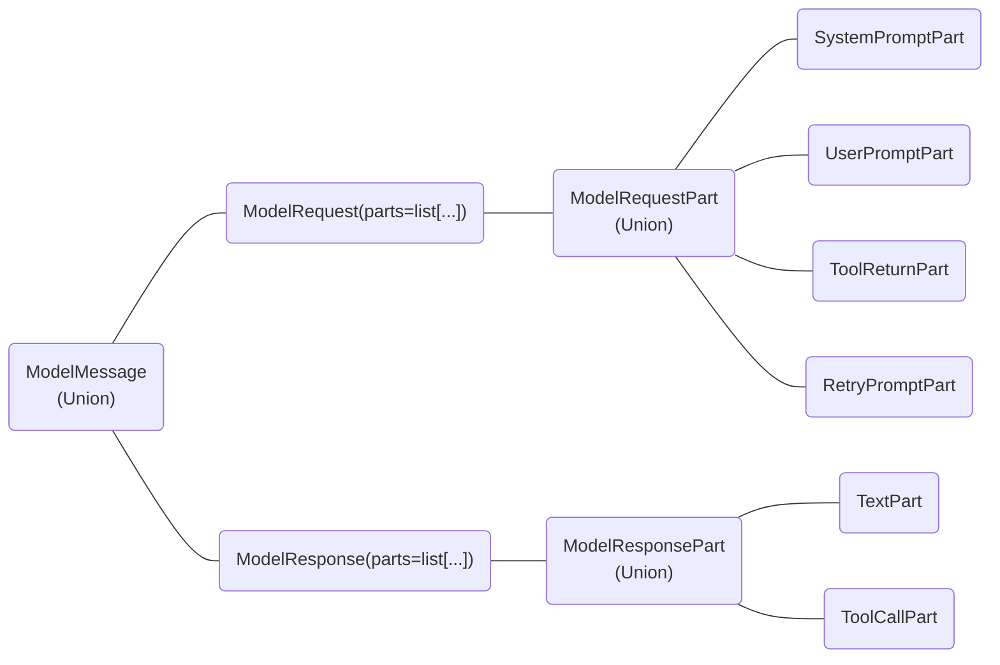

::: pydantic_ai.messages
````

## File: docs/api/providers.md
````markdown
# `pydantic_ai.providers`

::: pydantic_ai.providers.Provider

::: pydantic_ai.providers.google_vertex

::: pydantic_ai.providers.openai

::: pydantic_ai.providers.deepseek

::: pydantic_ai.providers.bedrock

::: pydantic_ai.providers.groq

::: pydantic_ai.providers.azure

::: pydantic_ai.providers.cohere

::: pydantic_ai.providers.mistral
````

## File: docs/api/result.md
````markdown
# `pydantic_ai.result`

::: pydantic_ai.result
    options:
        inherited_members: true
        members:
            - OutputDataT
            - StreamedRunResult
````

## File: docs/api/settings.md
````markdown
# `pydantic_ai.settings`

::: pydantic_ai.settings
    options:
      inherited_members: true
      members:
        - ModelSettings
        - UsageLimits
````

## File: docs/api/tools.md
````markdown
# `pydantic_ai.tools`

::: pydantic_ai.tools
````

## File: docs/api/usage.md
````markdown
# `pydantic_ai.usage`

::: pydantic_ai.usage
````

## File: docs/examples/bank-support.md
````markdown
Small but complete example of using PydanticAI to build a support agent for a bank.

Demonstrates:

* [dynamic system prompt](../agents.md#system-prompts)
* [structured `output_type`](../output.md#structured-output)
* [tools](../tools.md)

## Running the Example

With [dependencies installed and environment variables set](./index.md#usage), run:

```bash
python/uv-run -m pydantic_ai_examples.bank_support
```

(or `PYDANTIC_AI_MODEL=gemini-1.5-flash ...`)

## Example Code

```python {title="bank_support.py"}
#! examples/pydantic_ai_examples/bank_support.py
```
````

## File: docs/examples/chat-app.md
````markdown
# Chat App with FastAPI

Simple chat app example build with FastAPI.

Demonstrates:

* [reusing chat history](../message-history.md)
* [serializing messages](../message-history.md#accessing-messages-from-results)
* [streaming responses](../output.md#streamed-results)

This demonstrates storing chat history between requests and using it to give the model context for new responses.

Most of the complex logic here is between `chat_app.py` which streams the response to the browser,
and `chat_app.ts` which renders messages in the browser.

## Running the Example

With [dependencies installed and environment variables set](./index.md#usage), run:

```bash
python/uv-run -m pydantic_ai_examples.chat_app
```

Then open the app at [localhost:8000](http://localhost:8000).


## Example Code

Python code that runs the chat app:

```python {title="chat_app.py"}
#! examples/pydantic_ai_examples/chat_app.py
```

Simple HTML page to render the app:

```html {title="chat_app.html"}
#! examples/pydantic_ai_examples/chat_app.html
```

TypeScript to handle rendering the messages, to keep this simple (and at the risk of offending frontend developers) the typescript code is passed to the browser as plain text and transpiled in the browser.

```ts {title="chat_app.ts"}
#! examples/pydantic_ai_examples/chat_app.ts
```
````

## File: docs/examples/flight-booking.md
````markdown
Example of a multi-agent flow where one agent delegates work to another, then hands off control to a third agent.

Demonstrates:

* [agent delegation](../multi-agent-applications.md#agent-delegation)
* [programmatic agent hand-off](../multi-agent-applications.md#programmatic-agent-hand-off)
* [usage limits](../agents.md#usage-limits)

In this scenario, a group of agents work together to find the best flight for a user.

The control flow for this example can be summarised as follows:

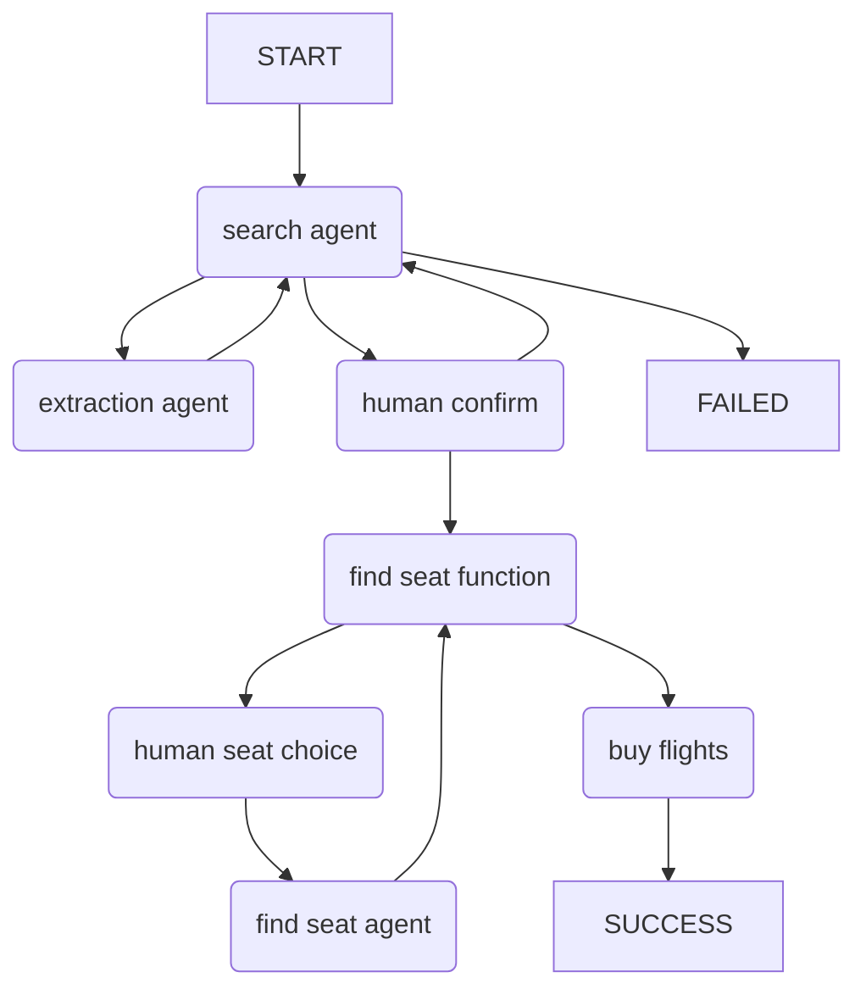

## Running the Example

With [dependencies installed and environment variables set](./index.md#usage), run:

```bash
python/uv-run -m pydantic_ai_examples.flight_booking
```

## Example Code

```python {title="flight_booking.py"}
#! examples/pydantic_ai_examples/flight_booking.py
```
````

## File: docs/examples/index.md
````markdown
# Examples

Examples of how to use PydanticAI and what it can do.

## Usage

These examples are distributed with `pydantic-ai` so you can run them either by cloning the [pydantic-ai repo](https://github.com/pydantic/pydantic-ai) or by simply installing `pydantic-ai` from PyPI with `pip` or `uv`.

### Installing required dependencies

Either way you'll need to install extra dependencies to run some examples, you just need to install the `examples` optional dependency group.

If you've installed `pydantic-ai` via pip/uv, you can install the extra dependencies with:

```bash
pip/uv-add "pydantic-ai[examples]"
```

If you clone the repo, you should instead use `uv sync --extra examples` to install extra dependencies.

### Setting model environment variables

These examples will need you to set up authentication with one or more of the LLMs, see the [model configuration](../models/index.md) docs for details on how to do this.

TL;DR: in most cases you'll need to set one of the following environment variables:

=== "OpenAI"

    ```bash
    export OPENAI_API_KEY=your-api-key
    ```

=== "Google Gemini"

    ```bash
    export GEMINI_API_KEY=your-api-key
    ```

### Running Examples

To run the examples (this will work whether you installed `pydantic_ai`, or cloned the repo), run:

```bash
python/uv-run -m pydantic_ai_examples.<example_module_name>
```

For examples, to run the very simple [`pydantic_model`](./pydantic-model.md) example:

```bash
python/uv-run -m pydantic_ai_examples.pydantic_model
```

If you like one-liners and you're using uv, you can run a pydantic-ai example with zero setup:

```bash
OPENAI_API_KEY='your-api-key' \
  uv run --with "pydantic-ai[examples]" \
  -m pydantic_ai_examples.pydantic_model
```

---

You'll probably want to edit examples in addition to just running them. You can copy the examples to a new directory with:

```bash
python/uv-run -m pydantic_ai_examples --copy-to examples/
```
````

## File: docs/examples/pydantic-model.md
````markdown
# Pydantic Model

Simple example of using PydanticAI to construct a Pydantic model from a text input.

Demonstrates:

* [structured `output_type`](../output.md#structured-output)

## Running the Example

With [dependencies installed and environment variables set](./index.md#usage), run:

```bash
python/uv-run -m pydantic_ai_examples.pydantic_model
```

This examples uses `openai:gpt-4o` by default, but it works well with other models, e.g. you can run it
with Gemini using:

```bash
PYDANTIC_AI_MODEL=gemini-1.5-pro python/uv-run -m pydantic_ai_examples.pydantic_model
```

(or `PYDANTIC_AI_MODEL=gemini-1.5-flash ...`)

## Example Code

```python {title="pydantic_model.py"}
#! examples/pydantic_ai_examples/pydantic_model.py
```
````

## File: docs/examples/question-graph.md
````markdown
# Question Graph

Example of a graph for asking and evaluating questions.

Demonstrates:

* [`pydantic_graph`](../graph.md)

## Running the Example

With [dependencies installed and environment variables set](./index.md#usage), run:

```bash
python/uv-run -m pydantic_ai_examples.question_graph
```

## Example Code

```python {title="question_graph.py"}
#! examples/pydantic_ai_examples/question_graph.py
```

The mermaid diagram generated in this example looks like this:

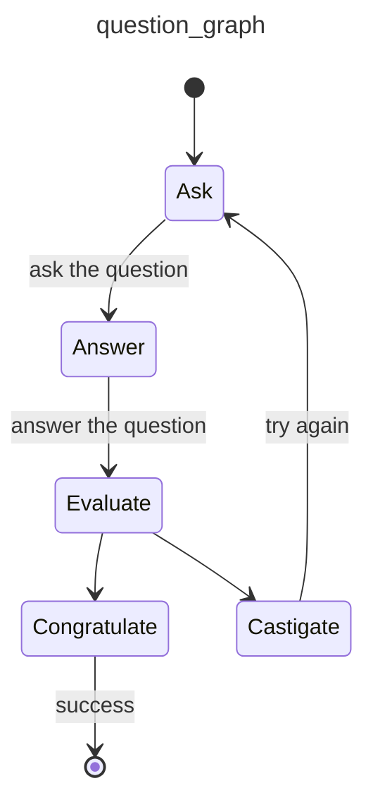
````

## File: docs/examples/rag.md
````markdown
# RAG

RAG search example. This demo allows you to ask question of the [logfire](https://pydantic.dev/logfire) documentation.

Demonstrates:

* [tools](../tools.md)
* [agent dependencies](../dependencies.md)
* RAG search

This is done by creating a database containing each section of the markdown documentation, then registering
the search tool with the PydanticAI agent.

Logic for extracting sections from markdown files and a JSON file with that data is available in
[this gist](https://gist.github.com/samuelcolvin/4b5bb9bb163b1122ff17e29e48c10992).

[PostgreSQL with pgvector](https://github.com/pgvector/pgvector) is used as the search database, the easiest way to download and run pgvector is using Docker:

```bash
mkdir postgres-data
docker run --rm \
  -e POSTGRES_PASSWORD=postgres \
  -p 54320:5432 \
  -v `pwd`/postgres-data:/var/lib/postgresql/data \
  pgvector/pgvector:pg17
```

As with the [SQL gen](./sql-gen.md) example, we run postgres on port `54320` to avoid conflicts with any other postgres instances you may have running.
We also mount the PostgreSQL `data` directory locally to persist the data if you need to stop and restart the container.

With that running and [dependencies installed and environment variables set](./index.md#usage), we can build the search database with (**WARNING**: this requires the `OPENAI_API_KEY` env variable and will calling the OpenAI embedding API around 300 times to generate embeddings for each section of the documentation):

```bash
python/uv-run -m pydantic_ai_examples.rag build
```

(Note building the database doesn't use PydanticAI right now, instead it uses the OpenAI SDK directly.)

You can then ask the agent a question with:

```bash
python/uv-run -m pydantic_ai_examples.rag search "How do I configure logfire to work with FastAPI?"
```

## Example Code

```python {title="rag.py"}
#! examples/pydantic_ai_examples/rag.py
```
````

## File: docs/examples/sql-gen.md
````markdown
# SQL Generation

Example demonstrating how to use PydanticAI to generate SQL queries based on user input.

Demonstrates:

* [dynamic system prompt](../agents.md#system-prompts)
* [structured `output_type`](../output.md#structured-output)
* [output validation](../output.md#output-validator-functions)
* [agent dependencies](../dependencies.md)

## Running the Example

The resulting SQL is validated by running it as an `EXPLAIN` query on PostgreSQL. To run the example, you first need to run PostgreSQL, e.g. via Docker:

```bash
docker run --rm -e POSTGRES_PASSWORD=postgres -p 54320:5432 postgres
```
_(we run postgres on port `54320` to avoid conflicts with any other postgres instances you may have running)_

With [dependencies installed and environment variables set](./index.md#usage), run:

```bash
python/uv-run -m pydantic_ai_examples.sql_gen
```

or to use a custom prompt:

```bash
python/uv-run -m pydantic_ai_examples.sql_gen "find me errors"
```

This model uses `gemini-1.5-flash` by default since Gemini is good at single shot queries of this kind.

## Example Code

```python {title="sql_gen.py"}
#! examples/pydantic_ai_examples/sql_gen.py
```
````

## File: docs/examples/stream-markdown.md
````markdown
This example shows how to stream markdown from an agent, using the [`rich`](https://github.com/Textualize/rich) library to highlight the output in the terminal.

It'll run the example with both OpenAI and Google Gemini models if the required environment variables are set.

Demonstrates:

* [streaming text responses](../output.md#streaming-text)

## Running the Example

With [dependencies installed and environment variables set](./index.md#usage), run:

```bash
python/uv-run -m pydantic_ai_examples.stream_markdown
```

## Example Code

```python
#! examples/pydantic_ai_examples/stream_markdown.py
```
````

## File: docs/examples/stream-whales.md
````markdown
Information about whales — an example of streamed structured response validation.

Demonstrates:

* [streaming structured output](../output.md#streaming-structured-output)

This script streams structured responses from GPT-4 about whales, validates the data
and displays it as a dynamic table using [`rich`](https://github.com/Textualize/rich) as the data is received.

## Running the Example

With [dependencies installed and environment variables set](./index.md#usage), run:

```bash
python/uv-run -m pydantic_ai_examples.stream_whales
```

Should give an output like this:

{{ video('53dd5e7664c20ae90ed90ae42f606bf3', 25) }}

## Example Code

```python {title="stream_whales.py"}
#! examples/pydantic_ai_examples/stream_whales.py
```
````

## File: docs/examples/weather-agent.md
````markdown
Example of PydanticAI with multiple tools which the LLM needs to call in turn to answer a question.

Demonstrates:

* [tools](../tools.md)
* [agent dependencies](../dependencies.md)
* [streaming text responses](../output.md#streaming-text)
* Building a [Gradio](https://www.gradio.app/) UI for the agent

In this case the idea is a "weather" agent — the user can ask for the weather in multiple locations,
the agent will use the `get_lat_lng` tool to get the latitude and longitude of the locations, then use
the `get_weather` tool to get the weather for those locations.

## Running the Example

To run this example properly, you might want to add two extra API keys **(Note if either key is missing, the code will fall back to dummy data, so they're not required)**:

* A weather API key from [tomorrow.io](https://www.tomorrow.io/weather-api/) set via `WEATHER_API_KEY`
* A geocoding API key from [geocode.maps.co](https://geocode.maps.co/) set via `GEO_API_KEY`

With [dependencies installed and environment variables set](./index.md#usage), run:

```bash
python/uv-run -m pydantic_ai_examples.weather_agent
```

## Example Code

```python {title="pydantic_ai_examples/weather_agent.py"}
#! examples/pydantic_ai_examples/weather_agent.py
```

## Running the UI

You can build multi-turn chat applications for your agent with [Gradio](https://www.gradio.app/), a framework for building AI web applications entirely in python. Gradio comes with built-in chat components and agent support so the entire UI will be implemented in a single python file!

Here's what the UI looks like for the weather agent:

{{ video('c549d8d8827ded15f326f998e428e6c3', 6) }}

Note, to run the UI, you'll need Python 3.10+.

```bash
pip install gradio>=5.9.0
python/uv-run -m pydantic_ai_examples.weather_agent_gradio
```

## UI Code

```python {title="pydantic_ai_examples/weather_agent_gradio.py"}
#! examples/pydantic_ai_examples/weather_agent_gradio.py
```
````

## File: docs/extra/tweaks.css
````css
/* Revert hue value to that of pre mkdocs-material v9.4.0 */
[data-md-color-scheme="slate"] {
  --md-hue: 230;
  --md-default-bg-color: hsla(230, 15%, 21%, 1);
}

.hide {
  display: none;
}

.text-center {
  text-align: center;
}

img.index-header {
  width: 70%;
  max-width: 500px;
}

.pydantic-pink {
  color: #FF007F;
}

.team-blue {
  color: #0072CE;
}

.secure-green {
  color: #00A86B;
}

.shapes-orange {
  color: #FF7F32;
}

.puzzle-purple {
  color: #652D90;
}

.wheel-gray {
  color: #6E6E6E;
}

.vertical-middle {
  vertical-align: middle;
}

.text-emphasis {
  font-size: 1rem;
  font-weight: 300;
  font-style: italic;
}

#version-notice {
  margin-bottom: 10px;
}

.mermaid {
  text-align: center;
}

.md-search__input::-webkit-search-decoration,
.md-search__input::-webkit-search-cancel-button,
.md-search__input::-webkit-search-results-button,
.md-search__input::-webkit-search-results-decoration {
  -webkit-appearance:none;
}

.md-search-result__article {
  padding-bottom: .55em;
}

.ais-SearchBox-form {
  display: flex;
  flex-direction: row;
  gap: 10px;
}
````

## File: docs/javascripts/algolia-search.js
````javascript
const ALGOLIA_APP_ID = 'KPPUDTIAVX';
const ALGOLIA_API_KEY = '1fc841595212a2c3afe8c24dd4cb8790';
const ALGOLIA_INDEX_NAME = 'pydantic-ai-docs';

const { liteClient: algoliasearch } = window['algoliasearch/lite'];
const searchClient = algoliasearch(ALGOLIA_APP_ID, ALGOLIA_API_KEY);

const search = instantsearch({
  indexName: ALGOLIA_INDEX_NAME,
  searchClient,
  searchFunction(helper) {
    const query = helper.state.query

    if (query && query.length > 1) {
      document.querySelector('#hits').hidden = false
      document.querySelector('#type-to-start-searching').hidden = true
      helper.search();
    } else {
      document.querySelector('#hits').hidden = true
      document.querySelector('#type-to-start-searching').hidden = false
    }
  },
});

// create custom widget, to integrate with MkDocs built-in markup
const customSearchBox = instantsearch.connectors.connectSearchBox((renderOptions, isFirstRender) => {
  const { query, refine, clear } = renderOptions;

  if (isFirstRender) {
    document.querySelector('#searchbox').addEventListener('input', event => {
      refine(event.target.value);
    });

    document.querySelector('#searchbox').addEventListener('focus', () => {
      document.querySelector('#__search').checked = true;
    });

    document.querySelector('#searchbox-clear').addEventListener('click', () => {
      clear();
    });

    document.querySelector('#searchbox').addEventListener('keydown', (event) => {
      // on down arrow, find the first search result and focus it
      if (event.key === 'ArrowDown') {
        document.querySelector('.md-search-result__link').focus();
        event.preventDefault();
      }
    });

    // for Hits, add keyboard navigation
    document.querySelector('#hits').addEventListener('keydown', (event) => {
      if (event.key === 'ArrowDown') {
        const next = event.target.parentElement.nextElementSibling;
        if (next) {
          next.querySelector('.md-search-result__link').focus();
          event.preventDefault();
        }
      } else if (event.key === 'ArrowUp') {
        const prev = event.target.parentElement.previousElementSibling;
        if (prev) {
          prev.querySelector('.md-search-result__link').focus();
        } else {
          document.querySelector('#searchbox').focus();
        }
        event.preventDefault();
      }
    })

    document.addEventListener('keydown', (event) => {
      // if forward slash is pressed, focus the search box
      if (event.key === '/' && event.target.tagName !== 'INPUT') {
        document.querySelector('#searchbox').focus();
        event.preventDefault();
      }
    })
  }


  document.querySelector('#type-to-start-searching').hidden = query.length > 1;
  document.querySelector('#searchbox').value = query;
});

search.addWidgets([
  customSearchBox({}),

  instantsearch.widgets.hits({
    container: '#hits',
    cssClasses: {
      'list': 'md-search-result__list',
      'item': 'md-search-result__item'
    },
    templates: {
      item: (hit, { html, components }) => {
        return html`
          <a href="${hit.abs_url}" class="md-search-result__link" tabindex="-1">
            <div class="md-search-result__article md-typeset">
              <div class="md-search-result__icon md-icon"></div>
              <h1>${components.Highlight({ attribute: 'title', hit })}</h1>
              <article>${components.Snippet({ attribute: 'content', hit })} </article>
            </div>
          </a>`
      },
    },
  })
]);

search.start();
````

## File: docs/mcp/client.md
````markdown
# Client

PydanticAI can act as an [MCP client](https://modelcontextprotocol.io/quickstart/client), connecting to MCP servers
to use their tools.

## Install

You need to either install [`pydantic-ai`](../install.md), or[`pydantic-ai-slim`](../install.md#slim-install) with the `mcp` optional group:

```bash
pip/uv-add "pydantic-ai-slim[mcp]"
```

!!! note
    MCP integration requires Python 3.10 or higher.

## Usage

PydanticAI comes with two ways to connect to MCP servers:

- [`MCPServerHTTP`][pydantic_ai.mcp.MCPServerHTTP] which connects to an MCP server using the [HTTP SSE](https://spec.modelcontextprotocol.io/specification/2024-11-05/basic/transports/#http-with-sse) transport
- [`MCPServerStdio`][pydantic_ai.mcp.MCPServerStdio] which runs the server as a subprocess and connects to it using the [stdio](https://spec.modelcontextprotocol.io/specification/2024-11-05/basic/transports/#stdio) transport

Examples of both are shown below; [mcp-run-python](run-python.md) is used as the MCP server in both examples.

### SSE Client

[`MCPServerHTTP`][pydantic_ai.mcp.MCPServerHTTP] connects over HTTP using the [HTTP + Server Sent Events transport](https://spec.modelcontextprotocol.io/specification/2024-11-05/basic/transports/#http-with-sse) to a server.

!!! note
    [`MCPServerHTTP`][pydantic_ai.mcp.MCPServerHTTP] requires an MCP server to be running and accepting HTTP connections before calling [`agent.run_mcp_servers()`][pydantic_ai.Agent.run_mcp_servers]. Running the server is not managed by PydanticAI.

The name "HTTP" is used since this implemented will be adapted in future to use the new
[Streamable HTTP](https://github.com/modelcontextprotocol/specification/pull/206) currently in development.

Before creating the SSE client, we need to run the server (docs [here](run-python.md)):

```bash {title="terminal (run sse server)"}
deno run \
  -N -R=node_modules -W=node_modules --node-modules-dir=auto \
  jsr:@pydantic/mcp-run-python sse
```

```python {title="mcp_sse_client.py" py="3.10"}
from pydantic_ai import Agent
from pydantic_ai.mcp import MCPServerHTTP

server = MCPServerHTTP(url='http://localhost:3001/sse')  # (1)!
agent = Agent('openai:gpt-4o', mcp_servers=[server])  # (2)!


async def main():
    async with agent.run_mcp_servers():  # (3)!
        result = await agent.run('How many days between 2000-01-01 and 2025-03-18?')
    print(result.output)
    #> There are 9,208 days between January 1, 2000, and March 18, 2025.
```

1. Define the MCP server with the URL used to connect.
2. Create an agent with the MCP server attached.
3. Create a client session to connect to the server.

_(This example is complete, it can be run "as is" with Python 3.10+ — you'll need to add `asyncio.run(main())` to run `main`)_

**What's happening here?**

- The model is receiving the prompt "how many days between 2000-01-01 and 2025-03-18?"
- The model decides "Oh, I've got this `run_python_code` tool, that will be a good way to answer this question", and writes some python code to calculate the answer.
- The model returns a tool call
- PydanticAI sends the tool call to the MCP server using the SSE transport
- The model is called again with the return value of running the code
- The model returns the final answer

You can visualise this clearly, and even see the code that's run by adding three lines of code to instrument the example with [logfire](https://logfire.pydantic.dev/docs):

```python {title="mcp_sse_client_logfire.py" test="skip"}
import logfire

logfire.configure()
logfire.instrument_pydantic_ai()
```

Will display as follows:


### MCP "stdio" Server

The other transport offered by MCP is the [stdio transport](https://spec.modelcontextprotocol.io/specification/2024-11-05/basic/transports/#stdio) where the server is run as a subprocess and communicates with the client over `stdin` and `stdout`. In this case, you'd use the [`MCPServerStdio`][pydantic_ai.mcp.MCPServerStdio] class.

!!! note
    When using [`MCPServerStdio`][pydantic_ai.mcp.MCPServerStdio] servers, the [`agent.run_mcp_servers()`][pydantic_ai.Agent.run_mcp_servers] context manager is responsible for starting and stopping the server.

```python {title="mcp_stdio_client.py" py="3.10"}
from pydantic_ai import Agent
from pydantic_ai.mcp import MCPServerStdio

server = MCPServerStdio(  # (1)!
    'deno',
    args=[
        'run',
        '-N',
        '-R=node_modules',
        '-W=node_modules',
        '--node-modules-dir=auto',
        'jsr:@pydantic/mcp-run-python',
        'stdio',
    ]
)
agent = Agent('openai:gpt-4o', mcp_servers=[server])


async def main():
    async with agent.run_mcp_servers():
        result = await agent.run('How many days between 2000-01-01 and 2025-03-18?')
    print(result.output)
    #> There are 9,208 days between January 1, 2000, and March 18, 2025.
```

1. See [MCP Run Python](run-python.md) for more information.
````

## File: docs/mcp/index.md
````markdown
# Model Context Protocol (MCP)

PydanticAI supports [Model Context Protocol (MCP)](https://modelcontextprotocol.io) in three ways:

1. [Agents](../agents.md) act as an MCP Client, connecting to MCP servers to use their tools, [learn more …](client.md)
2. Agents can be used within MCP servers, [learn more …](server.md)
3. As part of PydanticAI, we're building a number of MCP servers, [see below](#mcp-servers)

## What is MCP?

The Model Context Protocol is a standardized protocol that allow AI applications (including programmatic agents like PydanticAI, coding agents like [cursor](https://www.cursor.com/), and desktop applications like [Claude Desktop](https://claude.ai/download)) to connect to external tools and services using a common interface.

As with other protocols, the dream of MCP is that a wide range of applications can speak to each other without the need for specific integrations.

There is a great list of MCP servers at [github.com/modelcontextprotocol/servers](https://github.com/modelcontextprotocol/servers).

Some examples of what this means:

* PydanticAI could use a web search service implemented as an MCP server to implement a deep research agent
* Cursor could connect to the [Pydantic Logfire](https://github.com/pydantic/logfire-mcp) MCP server to search logs, traces and metrics to gain context while fixing a bug
* PydanticAI, or any other MCP client could connect to our [Run Python](run-python.md) MCP server to run arbitrary Python code in a sandboxed environment

## MCP Servers

To add functionality to PydanticAI while making it as widely usable as possible, we're implementing some functionality as MCP servers.

So far, we've only implemented one MCP server as part of PydanticAI:

* [Run Python](run-python.md): A sandboxed Python interpreter that can run arbitrary code, with a focus on security and safety.
````

## File: docs/mcp/run-python.md
````markdown
# MCP Run Python

The **MCP Run Python** package is an MCP server that allows agents to execute Python code in a secure, sandboxed environment. It uses [Pyodide](https://pyodide.org/) to run Python code in a JavaScript environment with [Deno](https://deno.com/), isolating execution from the host system.

## Features

- **Secure Execution**: Run Python code in a sandboxed WebAssembly environment
- **Package Management**: Automatically detects and installs required dependencies
- **Complete Results**: Captures standard output, standard error, and return values
- **Asynchronous Support**: Runs async code properly
- **Error Handling**: Provides detailed error reports for debugging

## Installation

!!! warning "Switch from npx to deno"
    We previously distributed `mcp-run-python` as an `npm` package to use via `npx`.
    We now recommend using `deno` instead as it provides better sandboxing and security.

The MCP Run Python server is distributed as a [JSR package](https://jsr.io/@pydantic/mcp-run-python) and can be run directly using [`deno run`](https://deno.com/):

```bash {title="terminal"}
deno run \
  -N -R=node_modules -W=node_modules --node-modules-dir=auto \
  jsr:@pydantic/mcp-run-python [stdio|sse|warmup]
```

where:

- `-N -R=node_modules -W=node_modules` (alias of
  `--allow-net --allow-read=node_modules --allow-write=node_modules`) allows
  network access and read+write access to `./node_modules`. These are required
  so Pyodide can download and cache the Python standard library and packages
- `--node-modules-dir=auto` tells deno to use a local `node_modules` directory
- `stdio` runs the server with the
  [Stdio MCP transport](https://spec.modelcontextprotocol.io/specification/2024-11-05/basic/transports/#stdio)
  — suitable for running the process as a subprocess locally
- `sse` runs the server with the
  [SSE MCP transport](https://spec.modelcontextprotocol.io/specification/2024-11-05/basic/transports/#http-with-sse)
  — running the server as an HTTP server to connect locally or remotely
- `warmup` will run a minimal Python script to download and cache the Python
  standard library. This is also useful to check the server is running
  correctly.

Usage of `jsr:@pydantic/mcp-run-python` with PydanticAI is described in the [client](client.md#mcp-stdio-server) documentation.

## Direct Usage

As well as using this server with PydanticAI, it can be connected to other MCP clients. For clarity, in this example we connect directly using the [Python MCP client](https://github.com/modelcontextprotocol/python-sdk).

```python {title="mcp_run_python.py" py="3.10"}
from mcp import ClientSession, StdioServerParameters
from mcp.client.stdio import stdio_client

code = """
import numpy
a = numpy.array([1, 2, 3])
print(a)
a
"""
server_params = StdioServerParameters(
    command='deno',
    args=[
        'run',
        '-N',
        '-R=node_modules',
        '-W=node_modules',
        '--node-modules-dir=auto',
        'jsr:@pydantic/mcp-run-python',
        'stdio',
    ],
)


async def main():
    async with stdio_client(server_params) as (read, write):
        async with ClientSession(read, write) as session:
            await session.initialize()
            tools = await session.list_tools()
            print(len(tools.tools))
            #> 1
            print(repr(tools.tools[0].name))
            #> 'run_python_code'
            print(repr(tools.tools[0].inputSchema))
            """
            {'type': 'object', 'properties': {'python_code': {'type': 'string', 'description': 'Python code to run'}}, 'required': ['python_code'], 'additionalProperties': False, '$schema': 'http://json-schema.org/draft-07/schema#'}
            """
            result = await session.call_tool('run_python_code', {'python_code': code})
            print(result.content[0].text)
            """
            <status>success</status>
            <dependencies>["numpy"]</dependencies>
            <output>
            [1 2 3]
            </output>
            <return_value>
            [
              1,
              2,
              3
            ]
            </return_value>
            """
```

If an exception occurs, `status` will be `install-error` or `run-error` and `return_value` will be replaced
by `error` which will include the traceback and exception message.

## Dependencies

Dependencies are installed when code is run.

Dependencies can be defined in one of two ways:

### Inferred from imports

If there's no metadata, dependencies are inferred from imports in the code,
as shown in the example [above](#direct-usage).

### Inline script metadata

As introduced in PEP 723, explained [here](https://packaging.python.org/en/latest/specifications/inline-script-metadata/#inline-script-metadata), and popularized by [uv](https://docs.astral.sh/uv/guides/scripts/#declaring-script-dependencies) — dependencies can be defined in a comment at the top of the file.

This allows use of dependencies that aren't imported in the code, and is more explicit.

```py {title="inline_script_metadata.py" py="3.10"}
from mcp import ClientSession
from mcp.client.stdio import stdio_client

# using `server_params` from the above example.
from mcp_run_python import server_params

code = """\
# /// script
# dependencies = ["pydantic", "email-validator"]
# ///
import pydantic

class Model(pydantic.BaseModel):
    email: pydantic.EmailStr

print(Model(email='hello@pydantic.dev'))
"""


async def main():
    async with stdio_client(server_params) as (read, write):
        async with ClientSession(read, write) as session:
            await session.initialize()
            result = await session.call_tool('run_python_code', {'python_code': code})
            print(result.content[0].text)
            """
            <status>success</status>
            <dependencies>["pydantic","email-validator"]</dependencies>
            <output>
            email='hello@pydantic.dev'
            </output>
            """
```

It also allows versions to be pinned for non-binary packages (Pyodide only supports a single version for the binary packages it supports, like `pydantic` and `numpy`).

E.g. you could set the dependencies to

```python
# /// script
# dependencies = ["rich<13"]
# ///
```

## Logging

MCP Run Python supports emitting stdout and stderr from the python execution as [MCP logging messages](https://github.com/modelcontextprotocol/specification/blob/eb4abdf2bb91e0d5afd94510741eadd416982350/docs/specification/draft/server/utilities/logging.md?plain=1).

For logs to be emitted you must set the logging level when connecting to the server. By default, the log level is set to the highest level, `emergency`.

Currently, it's not possible to demonstrate this due to a bug in the Python MCP Client, see [modelcontextprotocol/python-sdk#201](https://github.com/modelcontextprotocol/python-sdk/issues/201#issuecomment-2727663121).
````

## File: docs/mcp/server.md
````markdown
# Server

PydanticAI models can also be used within MCP Servers.

Here's a simple example of a [Python MCP server](https://github.com/modelcontextprotocol/python-sdk) using PydanticAI within a tool call:

```py {title="mcp_server.py" py="3.10"}
from mcp.server.fastmcp import FastMCP

from pydantic_ai import Agent

server = FastMCP('PydanticAI Server')
server_agent = Agent(
    'anthropic:claude-3-5-haiku-latest', system_prompt='always reply in rhyme'
)


@server.tool()
async def poet(theme: str) -> str:
    """Poem generator"""
    r = await server_agent.run(f'write a poem about {theme}')
    return r.output


if __name__ == '__main__':
    server.run()
```

This server can be queried with any MCP client. Here is an example using a direct Python client:

```py {title="mcp_client.py" py="3.10"}
import asyncio
import os

from mcp import ClientSession, StdioServerParameters
from mcp.client.stdio import stdio_client


async def client():
    server_params = StdioServerParameters(
        command='uv', args=['run', 'mcp_server.py', 'server'], env=os.environ
    )
    async with stdio_client(server_params) as (read, write):
        async with ClientSession(read, write) as session:
            await session.initialize()
            result = await session.call_tool('poet', {'theme': 'socks'})
            print(result.content[0].text)
            """
            Oh, socks, those garments soft and sweet,
            That nestle softly 'round our feet,
            From cotton, wool, or blended thread,
            They keep our toes from feeling dread.
            """


if __name__ == '__main__':
    asyncio.run(client())
```

Note: [sampling](https://modelcontextprotocol.io/docs/concepts/sampling#sampling), whereby servers may request LLM completions from the client, is not yet supported in PydanticAI.
````

## File: docs/models/anthropic.md
````markdown
# Anthropic

## Install

To use `AnthropicModel` models, you need to either install `pydantic-ai`, or install `pydantic-ai-slim` with the `anthropic` optional group:

```bash
pip/uv-add "pydantic-ai-slim[anthropic]"
```

## Configuration

To use [Anthropic](https://anthropic.com) through their API, go to [console.anthropic.com/settings/keys](https://console.anthropic.com/settings/keys) to generate an API key.

`AnthropicModelName` contains a list of available Anthropic models.

## Environment variable

Once you have the API key, you can set it as an environment variable:

```bash
export ANTHROPIC_API_KEY='your-api-key'
```

You can then use `AnthropicModel` by name:

```python
from pydantic_ai import Agent

agent = Agent('anthropic:claude-3-5-sonnet-latest')
...
```

Or initialise the model directly with just the model name:

```python
from pydantic_ai import Agent
from pydantic_ai.models.anthropic import AnthropicModel

model = AnthropicModel('claude-3-5-sonnet-latest')
agent = Agent(model)
...
```

## `provider` argument

You can provide a custom `Provider` via the `provider` argument:

```python
from pydantic_ai import Agent
from pydantic_ai.models.anthropic import AnthropicModel
from pydantic_ai.providers.anthropic import AnthropicProvider

model = AnthropicModel(
    'claude-3-5-sonnet-latest', provider=AnthropicProvider(api_key='your-api-key')
)
agent = Agent(model)
...
```

## Custom HTTP Client

You can customize the `AnthropicProvider` with a custom `httpx.AsyncClient`:

```python
from httpx import AsyncClient

from pydantic_ai import Agent
from pydantic_ai.models.anthropic import AnthropicModel
from pydantic_ai.providers.anthropic import AnthropicProvider

custom_http_client = AsyncClient(timeout=30)
model = AnthropicModel(
    'claude-3-5-sonnet-latest',
    provider=AnthropicProvider(api_key='your-api-key', http_client=custom_http_client),
)
agent = Agent(model)
...
```
````

## File: docs/models/bedrock.md
````markdown
# Bedrock

## Install

To use `BedrockConverseModel`, you need to either install `pydantic-ai`, or install `pydantic-ai-slim` with the `bedrock` optional group:

```bash
pip/uv-add "pydantic-ai-slim[bedrock]"
```

## Configuration

To use [AWS Bedrock](https://aws.amazon.com/bedrock/), you'll need an AWS account with Bedrock enabled and appropriate credentials. You can use either AWS credentials directly or a pre-configured boto3 client.

`BedrockModelName` contains a list of available Bedrock models, including models from Anthropic, Amazon, Cohere, Meta, and Mistral.

## Environment variables

You can set your AWS credentials as environment variables ([among other options](https://boto3.amazonaws.com/v1/documentation/api/latest/guide/configuration.html#using-environment-variables)):

```bash
export AWS_ACCESS_KEY_ID='your-access-key'
export AWS_SECRET_ACCESS_KEY='your-secret-key'
export AWS_DEFAULT_REGION='us-east-1'  # or your preferred region
```

You can then use `BedrockConverseModel` by name:

```python
from pydantic_ai import Agent

agent = Agent('bedrock:anthropic.claude-3-sonnet-20240229-v1:0')
...
```

Or initialize the model directly with just the model name:

```python
from pydantic_ai import Agent
from pydantic_ai.models.bedrock import BedrockConverseModel

model = BedrockConverseModel('anthropic.claude-3-sonnet-20240229-v1:0')
agent = Agent(model)
...
```

## Customizing Bedrock Runtime API

You can customize the Bedrock Runtime API calls by adding additional parameters, such as [guardrail
configurations](https://docs.aws.amazon.com/bedrock/latest/userguide/guardrails.html) and [performance settings](https://docs.aws.amazon.com/bedrock/latest/userguide/latency-optimized-inference.html). For a complete list of configurable parameters, refer to the
documentation for [`BedrockModelSettings`][pydantic_ai.models.bedrock.BedrockModelSettings].

```python {title="customize_bedrock_model_settings.py"}
from pydantic_ai import Agent
from pydantic_ai.models.bedrock import BedrockConverseModel, BedrockModelSettings

# Define Bedrock model settings with guardrail and performance configurations
bedrock_model_settings = BedrockModelSettings(
    bedrock_guardrail_config={
        'guardrailIdentifier': 'v1',
        'guardrailVersion': 'v1',
        'trace': 'enabled'
    },
    bedrock_performance_configuration={
        'latency': 'optimized'
    }
)


model = BedrockConverseModel(model_name='us.amazon.nova-pro-v1:0')

agent = Agent(model=model, model_settings=bedrock_model_settings)
```

## `provider` argument

You can provide a custom `BedrockProvider` via the `provider` argument. This is useful when you want to specify credentials directly or use a custom boto3 client:

```python
from pydantic_ai import Agent
from pydantic_ai.models.bedrock import BedrockConverseModel
from pydantic_ai.providers.bedrock import BedrockProvider

# Using AWS credentials directly
model = BedrockConverseModel(
    'anthropic.claude-3-sonnet-20240229-v1:0',
    provider=BedrockProvider(
        region_name='us-east-1',
        aws_access_key_id='your-access-key',
        aws_secret_access_key='your-secret-key',
    ),
)
agent = Agent(model)
...
```

You can also pass a pre-configured boto3 client:

```python
import boto3

from pydantic_ai import Agent
from pydantic_ai.models.bedrock import BedrockConverseModel
from pydantic_ai.providers.bedrock import BedrockProvider

# Using a pre-configured boto3 client
bedrock_client = boto3.client('bedrock-runtime', region_name='us-east-1')
model = BedrockConverseModel(
    'anthropic.claude-3-sonnet-20240229-v1:0',
    provider=BedrockProvider(bedrock_client=bedrock_client),
)
agent = Agent(model)
...
```
````

## File: docs/models/cohere.md
````markdown
# Cohere

## Install

To use `CohereModel`, you need to either install `pydantic-ai`, or install `pydantic-ai-slim` with the `cohere` optional group:

```bash
pip/uv-add "pydantic-ai-slim[cohere]"
```

## Configuration

To use [Cohere](https://cohere.com/) through their API, go to [dashboard.cohere.com/api-keys](https://dashboard.cohere.com/api-keys) and follow your nose until you find the place to generate an API key.

`CohereModelName` contains a list of the most popular Cohere models.

## Environment variable

Once you have the API key, you can set it as an environment variable:

```bash
export CO_API_KEY='your-api-key'
```

You can then use `CohereModel` by name:

```python
from pydantic_ai import Agent

agent = Agent('cohere:command')
...
```

Or initialise the model directly with just the model name:

```python
from pydantic_ai import Agent
from pydantic_ai.models.cohere import CohereModel

model = CohereModel('command')
agent = Agent(model)
...
```

## `provider` argument

You can provide a custom `Provider` via the `provider` argument:

```python
from pydantic_ai import Agent
from pydantic_ai.models.cohere import CohereModel
from pydantic_ai.providers.cohere import CohereProvider

model = CohereModel('command', provider=CohereProvider(api_key='your-api-key'))
agent = Agent(model)
...
```

You can also customize the `CohereProvider` with a custom `http_client`:

```python
from httpx import AsyncClient

from pydantic_ai import Agent
from pydantic_ai.models.cohere import CohereModel
from pydantic_ai.providers.cohere import CohereProvider

custom_http_client = AsyncClient(timeout=30)
model = CohereModel(
    'command',
    provider=CohereProvider(api_key='your-api-key', http_client=custom_http_client),
)
agent = Agent(model)
...
```
````

## File: docs/models/gemini.md
````markdown
# Gemini

PydanticAI supports Google's Gemini models through two different APIs:

- Generative Language API (`generativelanguage.googleapis.com`)
- Vertex AI API (`*-aiplatform.googleapis.com`)

## Gemini via Generative Language API

### Install

To use `GeminiModel` models, you just need to install `pydantic-ai` or `pydantic-ai-slim`, no extra dependencies are required.

### Configuration

`GeminiModel` lets you use Google's Gemini models through their [Generative Language API](https://ai.google.dev/api/all-methods), `generativelanguage.googleapis.com`.

`GeminiModelName` contains a list of available Gemini models that can be used through this interface.

To use `GeminiModel`, go to [aistudio.google.com](https://aistudio.google.com/apikey) and select "Create API key".

### Environment variable

Once you have the API key, you can set it as an environment variable:

```bash
export GEMINI_API_KEY=your-api-key
```

You can then use `GeminiModel` by name:

```python
from pydantic_ai import Agent

agent = Agent('google-gla:gemini-2.0-flash')
...
```

!!! note
    The `google-gla` provider prefix represents the [Google **G**enerative **L**anguage **A**PI](https://ai.google.dev/api/all-methods) for `GeminiModel`s.
    `google-vertex` is used with [Vertex AI](https://cloud.google.com/vertex-ai/generative-ai/docs/learn/models).

Or initialise the model directly with just the model name and provider:

```python
from pydantic_ai import Agent
from pydantic_ai.models.gemini import GeminiModel

model = GeminiModel('gemini-2.0-flash', provider='google-gla')
agent = Agent(model)
...
```

### `provider` argument

You can provide a custom `Provider` via the `provider` argument:

```python
from pydantic_ai import Agent
from pydantic_ai.models.gemini import GeminiModel
from pydantic_ai.providers.google_gla import GoogleGLAProvider

model = GeminiModel(
    'gemini-2.0-flash', provider=GoogleGLAProvider(api_key='your-api-key')
)
agent = Agent(model)
...
```

You can also customize the `GoogleGLAProvider` with a custom `http_client`:

```python
from httpx import AsyncClient

from pydantic_ai import Agent
from pydantic_ai.models.gemini import GeminiModel
from pydantic_ai.providers.google_gla import GoogleGLAProvider

custom_http_client = AsyncClient(timeout=30)
model = GeminiModel(
    'gemini-2.0-flash',
    provider=GoogleGLAProvider(api_key='your-api-key', http_client=custom_http_client),
)
agent = Agent(model)
...
```

## Gemini via VertexAI

If you are an enterprise user, you should use the `google-vertex` provider with `GeminiModel` which uses the `*-aiplatform.googleapis.com` API.

`GeminiModelName` contains a list of available Gemini models that can be used through this interface.

### Install

To use the `google-vertex` provider with `GeminiModel`, you need to either install `pydantic-ai`, or install `pydantic-ai-slim` with the `vertexai` optional group:

```bash
pip/uv-add "pydantic-ai-slim[vertexai]"
```

### Configuration

This interface has a number of advantages over `generativelanguage.googleapis.com` documented above:

1. The VertexAI API comes with more enterprise readiness guarantees.
2. You can [purchase provisioned throughput](https://cloud.google.com/vertex-ai/generative-ai/docs/provisioned-throughput#purchase-provisioned-throughput) with VertexAI to guarantee capacity.
3. If you're running PydanticAI inside GCP, you don't need to set up authentication, it should "just work".
4. You can decide which region to use, which might be important from a regulatory perspective, and might improve latency.

The big disadvantage is that for local development you may need to create and configure a "service account", which can be challenging to get right.

Whichever way you authenticate, you'll need to have VertexAI enabled in your GCP account.

### Application default credentials

Luckily if you're running PydanticAI inside GCP, or you have the [`gcloud` CLI](https://cloud.google.com/sdk/gcloud) installed and configured, you should be able to use `VertexAIModel` without any additional setup.

To use `VertexAIModel`, with [application default credentials](https://cloud.google.com/docs/authentication/application-default-credentials) configured (e.g. with `gcloud`), you can simply use:

```python
from pydantic_ai import Agent
from pydantic_ai.models.gemini import GeminiModel

model = GeminiModel('gemini-2.0-flash', provider='google-vertex')
agent = Agent(model)
...
```

Internally this uses [`google.auth.default()`](https://google-auth.readthedocs.io/en/master/reference/google.auth.html) from the `google-auth` package to obtain credentials.

!!! note "Won't fail until `agent.run()`"
    Because `google.auth.default()` requires network requests and can be slow, it's not run until you call `agent.run()`.

You may also need to pass the `project_id` argument to `GoogleVertexProvider` if application default credentials don't set a project, if you pass `project_id` and it conflicts with the project set by application default credentials, an error is raised.

### Service account

If instead of application default credentials, you want to authenticate with a service account, you'll need to create a service account, add it to your GCP project (note: this step is necessary even if you created the service account within the project), give that service account the "Vertex AI Service Agent" role, and download the service account JSON file.

Once you have the JSON file, you can use it thus:

```python
from pydantic_ai import Agent
from pydantic_ai.models.gemini import GeminiModel
from pydantic_ai.providers.google_vertex import GoogleVertexProvider

model = GeminiModel(
    'gemini-2.0-flash',
    provider=GoogleVertexProvider(service_account_file='path/to/service-account.json'),
)
agent = Agent(model)
...
```

Alternatively, if you already have the service account information in memory, you can pass it as a dictionary:

```python
import json

from pydantic_ai import Agent
from pydantic_ai.models.gemini import GeminiModel
from pydantic_ai.providers.google_vertex import GoogleVertexProvider

service_account_info = json.loads(
    '{"type": "service_account", "project_id": "my-project-id"}'
)
model = GeminiModel(
    'gemini-2.0-flash',
    provider=GoogleVertexProvider(service_account_info=service_account_info),
)
agent = Agent(model)
...
```

### Customising region

Whichever way you authenticate, you can specify which region requests will be sent to via the `region` argument.

Using a region close to your application can improve latency and might be important from a regulatory perspective.

```python
from pydantic_ai import Agent
from pydantic_ai.models.gemini import GeminiModel
from pydantic_ai.providers.google_vertex import GoogleVertexProvider

model = GeminiModel(
    'gemini-2.0-flash', provider=GoogleVertexProvider(region='asia-east1')
)
agent = Agent(model)
...
```

You can also customize the `GoogleVertexProvider` with a custom `http_client`:

```python
from httpx import AsyncClient

from pydantic_ai import Agent
from pydantic_ai.models.gemini import GeminiModel
from pydantic_ai.providers.google_vertex import GoogleVertexProvider

custom_http_client = AsyncClient(timeout=30)
model = GeminiModel(
    'gemini-2.0-flash',
    provider=GoogleVertexProvider(region='asia-east1', http_client=custom_http_client),
)
agent = Agent(model)
...
```
````

## File: docs/models/groq.md
````markdown
# Groq

## Install

To use `GroqModel`, you need to either install `pydantic-ai`, or install `pydantic-ai-slim` with the `groq` optional group:

```bash
pip/uv-add "pydantic-ai-slim[groq]"
```

## Configuration

To use [Groq](https://groq.com/) through their API, go to [console.groq.com/keys](https://console.groq.com/keys) and follow your nose until you find the place to generate an API key.

`GroqModelName` contains a list of available Groq models.

## Environment variable

Once you have the API key, you can set it as an environment variable:

```bash
export GROQ_API_KEY='your-api-key'
```

You can then use `GroqModel` by name:

```python
from pydantic_ai import Agent

agent = Agent('groq:llama-3.3-70b-versatile')
...
```

Or initialise the model directly with just the model name:

```python
from pydantic_ai import Agent
from pydantic_ai.models.groq import GroqModel

model = GroqModel('llama-3.3-70b-versatile')
agent = Agent(model)
...
```

## `provider` argument

You can provide a custom `Provider` via the `provider` argument:

```python
from pydantic_ai import Agent
from pydantic_ai.models.groq import GroqModel
from pydantic_ai.providers.groq import GroqProvider

model = GroqModel(
    'llama-3.3-70b-versatile', provider=GroqProvider(api_key='your-api-key')
)
agent = Agent(model)
...
```

You can also customize the `GroqProvider` with a custom `httpx.AsyncHTTPClient`:

```python
from httpx import AsyncClient

from pydantic_ai import Agent
from pydantic_ai.models.groq import GroqModel
from pydantic_ai.providers.groq import GroqProvider

custom_http_client = AsyncClient(timeout=30)
model = GroqModel(
    'llama-3.3-70b-versatile',
    provider=GroqProvider(api_key='your-api-key', http_client=custom_http_client),
)
agent = Agent(model)
...
```
````

## File: docs/models/index.md
````markdown
# Model Providers

PydanticAI is model-agnostic and has built-in support for multiple model providers:

* [OpenAI](openai.md)
* [DeepSeek](openai.md#openai-compatible-models)
* [Anthropic](anthropic.md)
* [Gemini](gemini.md) (via two different APIs: Generative Language API and VertexAI API)
* [Ollama](openai.md#ollama)
* [Groq](groq.md)
* [Mistral](mistral.md)
* [Cohere](cohere.md)
* [Bedrock](bedrock.md)

## OpenAI-compatible Providers

Many models are compatible with the OpenAI API, and can be used with `OpenAIModel` in PydanticAI:

* [OpenRouter](openai.md#openrouter)
* [Grok (xAI)](openai.md#grok-xai)
* [Perplexity](openai.md#perplexity)
* [Fireworks AI](openai.md#fireworks-ai)
* [Together AI](openai.md#together-ai)
* [Azure AI Foundry](openai.md#azure-ai-foundry)

PydanticAI also comes with [`TestModel`](../api/models/test.md) and [`FunctionModel`](../api/models/function.md)
for testing and development.

To use each model provider, you need to configure your local environment and make sure you have the right
packages installed.

## Models and Providers

PydanticAI uses a few key terms to describe how it interacts with different LLMs:

* **Model**: This refers to the PydanticAI class used to make requests following a specific LLM API
    (generally by wrapping a vendor-provided SDK, like the `openai` python SDK). These classes implement a
    vendor-SDK-agnostic API, ensuring a single PydanticAI agent is portable to different LLM vendors without
    any other code changes just by swapping out the Model it uses. Model classes are named
    roughly in the format `<VendorSdk>Model`, for example, we have `OpenAIModel`, `AnthropicModel`, `GeminiModel`,
    etc. When using a Model class, you specify the actual LLM model name (e.g., `gpt-4o`,
    `claude-3-5-sonnet-latest`, `gemini-1.5-flash`) as a parameter.
* **Provider**: This refers to Model-specific classes which handle the authentication and connections
    to an LLM vendor. Passing a non-default _Provider_ as a parameter to a Model is how you can ensure
    that your agent will make requests to a specific endpoint, or make use of a specific approach to
    authentication (e.g., you can use Vertex-specific auth with the `GeminiModel` by way of the `VertexProvider`).
    In particular, this is how you can make use of an AI gateway, or an LLM vendor that offers API compatibility
    with the vendor SDK used by an existing Model (such as `OpenAIModel`).

In short, you select a specific model name (like `gpt-4o`), PydanticAI uses the appropriate Model class (like `OpenAIModel`), and the provider handles the connection and authentication to the underlying service.

## Custom Models

To implement support for models not already supported, you will need to subclass the [`Model`][pydantic_ai.models.Model] abstract base class.

For streaming, you'll also need to implement the following abstract base class:

* [`StreamedResponse`][pydantic_ai.models.StreamedResponse]

The best place to start is to review the source code for existing implementations, e.g. [`OpenAIModel`](https://github.com/pydantic/pydantic-ai/blob/main/pydantic_ai_slim/pydantic_ai/models/openai.py).

For details on when we'll accept contributions adding new models to PydanticAI, see the [contributing guidelines](../contributing.md#new-model-rules).

<!-- TODO(Marcelo): We need to create a section in the docs about reliability. -->
## Fallback Model

You can use [`FallbackModel`][pydantic_ai.models.fallback.FallbackModel] to attempt multiple models
in sequence until one successfully returns a result. Under the hood, PydanticAI automatically switches
from one model to the next if the current model returns a 4xx or 5xx status code.

In the following example, the agent first makes a request to the OpenAI model (which fails due to an invalid API key),
and then falls back to the Anthropic model.

<!-- TODO(Marcelo): Do not skip this test. For some reason it becomes a flaky test if we don't skip it. -->
```python {title="fallback_model.py" test="skip"}
from pydantic_ai import Agent
from pydantic_ai.models.anthropic import AnthropicModel
from pydantic_ai.models.fallback import FallbackModel
from pydantic_ai.models.openai import OpenAIModel

openai_model = OpenAIModel('gpt-4o')
anthropic_model = AnthropicModel('claude-3-5-sonnet-latest')
fallback_model = FallbackModel(openai_model, anthropic_model)

agent = Agent(fallback_model)
response = agent.run_sync('What is the capital of France?')
print(response.data)
#> Paris

print(response.all_messages())
"""
[
    ModelRequest(
        parts=[
            UserPromptPart(
                content='What is the capital of France?',
                timestamp=datetime.datetime(...),
                part_kind='user-prompt',
            )
        ],
        kind='request',
    ),
    ModelResponse(
        parts=[TextPart(content='Paris', part_kind='text')],
        model_name='claude-3-5-sonnet-latest',
        timestamp=datetime.datetime(...),
        kind='response',
    ),
]
"""
```

The `ModelResponse` message above indicates in the `model_name` field that the output was returned by the Anthropic model, which is the second model specified in the `FallbackModel`.

!!! note
    Each model's options should be configured individually. For example, `base_url`, `api_key`, and custom clients should be set on each model itself, not on the `FallbackModel`.

In this next example, we demonstrate the exception-handling capabilities of `FallbackModel`.
If all models fail, a [`FallbackExceptionGroup`][pydantic_ai.exceptions.FallbackExceptionGroup] is raised, which
contains all the exceptions encountered during the `run` execution.

=== "Python >=3.11"

    ```python {title="fallback_model_failure.py" py="3.11"}
    from pydantic_ai import Agent
    from pydantic_ai.exceptions import ModelHTTPError
    from pydantic_ai.models.anthropic import AnthropicModel
    from pydantic_ai.models.fallback import FallbackModel
    from pydantic_ai.models.openai import OpenAIModel

    openai_model = OpenAIModel('gpt-4o')
    anthropic_model = AnthropicModel('claude-3-5-sonnet-latest')
    fallback_model = FallbackModel(openai_model, anthropic_model)

    agent = Agent(fallback_model)
    try:
        response = agent.run_sync('What is the capital of France?')
    except* ModelHTTPError as exc_group:
        for exc in exc_group.exceptions:
            print(exc)
    ```

=== "Python <3.11"

    Since [`except*`](https://docs.python.org/3/reference/compound_stmts.html#except-star) is only supported
    in Python 3.11+, we use the [`exceptiongroup`](https://github.com/agronholm/exceptiongroup) backport
    package for earlier Python versions:

    ```python {title="fallback_model_failure.py" noqa="F821" test="skip"}
    from exceptiongroup import catch

    from pydantic_ai import Agent
    from pydantic_ai.exceptions import ModelHTTPError
    from pydantic_ai.models.anthropic import AnthropicModel
    from pydantic_ai.models.fallback import FallbackModel
    from pydantic_ai.models.openai import OpenAIModel


    def model_status_error_handler(exc_group: BaseExceptionGroup) -> None:
        for exc in exc_group.exceptions:
            print(exc)


    openai_model = OpenAIModel('gpt-4o')
    anthropic_model = AnthropicModel('claude-3-5-sonnet-latest')
    fallback_model = FallbackModel(openai_model, anthropic_model)

    agent = Agent(fallback_model)
    with catch({ModelHTTPError: model_status_error_handler}):
        response = agent.run_sync('What is the capital of France?')
    ```

By default, the `FallbackModel` only moves on to the next model if the current model raises a
[`ModelHTTPError`][pydantic_ai.exceptions.ModelHTTPError]. You can customize this behavior by
passing a custom `fallback_on` argument to the `FallbackModel` constructor.
````

## File: docs/models/mistral.md
````markdown
# Mistral

## Install

To use `MistralModel`, you need to either install `pydantic-ai`, or install `pydantic-ai-slim` with the `mistral` optional group:

```bash
pip/uv-add "pydantic-ai-slim[mistral]"
```

## Configuration

To use [Mistral](https://mistral.ai) through their API, go to [console.mistral.ai/api-keys/](https://console.mistral.ai/api-keys/) and follow your nose until you find the place to generate an API key.

`LatestMistralModelNames` contains a list of the most popular Mistral models.

## Environment variable

Once you have the API key, you can set it as an environment variable:

```bash
export MISTRAL_API_KEY='your-api-key'
```

You can then use `MistralModel` by name:

```python
from pydantic_ai import Agent

agent = Agent('mistral:mistral-large-latest')
...
```

Or initialise the model directly with just the model name:

```python
from pydantic_ai import Agent
from pydantic_ai.models.mistral import MistralModel

model = MistralModel('mistral-small-latest')
agent = Agent(model)
...
```

## `provider` argument

You can provide a custom `Provider` via the `provider` argument:

```python
from pydantic_ai import Agent
from pydantic_ai.models.mistral import MistralModel
from pydantic_ai.providers.mistral import MistralProvider

model = MistralModel(
    'mistral-large-latest', provider=MistralProvider(api_key='your-api-key')
)
agent = Agent(model)
...
```

You can also customize the provider with a custom `httpx.AsyncHTTPClient`:

```python
from httpx import AsyncClient

from pydantic_ai import Agent
from pydantic_ai.models.mistral import MistralModel
from pydantic_ai.providers.mistral import MistralProvider

custom_http_client = AsyncClient(timeout=30)
model = MistralModel(
    'mistral-large-latest',
    provider=MistralProvider(api_key='your-api-key', http_client=custom_http_client),
)
agent = Agent(model)
...
```
````

## File: docs/models/openai.md
````markdown
# OpenAI

## Install

To use OpenAI models, you need to either install `pydantic-ai`, or install `pydantic-ai-slim` with the `openai` optional group:

```bash
pip/uv-add "pydantic-ai-slim[openai]"
```

## Configuration

To use `OpenAIModel` through their main API, go to [platform.openai.com](https://platform.openai.com/) and follow your nose until you find the place to generate an API key.

## Environment variable

Once you have the API key, you can set it as an environment variable:

```bash
export OPENAI_API_KEY='your-api-key'
```

You can then use `OpenAIModel` by name:

```python
from pydantic_ai import Agent

agent = Agent('openai:gpt-4o')
...
```

Or initialise the model directly with just the model name:

```python
from pydantic_ai import Agent
from pydantic_ai.models.openai import OpenAIModel

model = OpenAIModel('gpt-4o')
agent = Agent(model)
...
```

By default, the `OpenAIModel` uses the `OpenAIProvider` with the `base_url` set to `https://api.openai.com/v1`.

## Configure the provider

If you want to pass parameters in code to the provider, you can programmatically instantiate the
[OpenAIProvider][pydantic_ai.providers.openai.OpenAIProvider] and pass it to the model:

```python
from pydantic_ai import Agent
from pydantic_ai.models.openai import OpenAIModel
from pydantic_ai.providers.openai import OpenAIProvider

model = OpenAIModel('gpt-4o', provider=OpenAIProvider(api_key='your-api-key'))
agent = Agent(model)
...
```

## Custom OpenAI Client

`OpenAIProvider` also accepts a custom `AsyncOpenAI` client via the `openai_client` parameter, so you can customise the `organization`, `project`, `base_url` etc. as defined in the [OpenAI API docs](https://platform.openai.com/docs/api-reference).

You could also use the [`AsyncAzureOpenAI`](https://learn.microsoft.com/en-us/azure/ai-services/openai/how-to/switching-endpoints) client to use the Azure OpenAI API.

```python
from openai import AsyncAzureOpenAI

from pydantic_ai import Agent
from pydantic_ai.models.openai import OpenAIModel
from pydantic_ai.providers.openai import OpenAIProvider

client = AsyncAzureOpenAI(
    azure_endpoint='...',
    api_version='2024-07-01-preview',
    api_key='your-api-key',
)

model = OpenAIModel(
    'gpt-4o',
    provider=OpenAIProvider(openai_client=client),
)
agent = Agent(model)
...
```

## OpenAI Responses API

PydanticAI also supports OpenAI's [Responses API](https://platform.openai.com/docs/api-reference/responses) through the `OpenAIResponsesModel` class.

```python
from pydantic_ai import Agent
from pydantic_ai.models.openai import OpenAIResponsesModel

model = OpenAIResponsesModel('gpt-4o')
agent = Agent(model)
...
```

The Responses API has built-in tools that you can use instead of building your own:

- [Web search](https://platform.openai.com/docs/guides/tools-web-search): allow models to search the web for the latest information before generating a response.
- [File search](https://platform.openai.com/docs/guides/tools-file-search): allow models to search your files for relevant information before generating a response.
- [Computer use](https://platform.openai.com/docs/guides/tools-computer-use): allow models to use a computer to perform tasks on your behalf.

You can use the `OpenAIResponsesModelSettings` class to make use of those built-in tools:

```python
from openai.types.responses import WebSearchToolParam  # (1)!

from pydantic_ai import Agent
from pydantic_ai.models.openai import OpenAIResponsesModel, OpenAIResponsesModelSettings

model_settings = OpenAIResponsesModelSettings(
    openai_builtin_tools=[WebSearchToolParam(type='web_search_preview')],
)
model = OpenAIResponsesModel('gpt-4o')
agent = Agent(model=model, model_settings=model_settings)

result = agent.run_sync('What is the weather in Tokyo?')
print(result.output)
"""
As of 7:48 AM on Wednesday, April 2, 2025, in Tokyo, Japan, the weather is cloudy with a temperature of 53°F (12°C).
"""
```

1. The file search tool and computer use tool can also be imported from `openai.types.responses`.

You can learn more about the differences between the Responses API and Chat Completions API in the [OpenAI API docs](https://platform.openai.com/docs/guides/responses-vs-chat-completions).

## OpenAI-compatible Models

Many models are compatible with the OpenAI API, and can be used with `OpenAIModel` in PydanticAI.
Before getting started, check the [installation and configuration](#install) instructions above.

To use another OpenAI-compatible API, you can make use of the `base_url` and `api_key` arguments from `OpenAIProvider`:

```python
from pydantic_ai import Agent
from pydantic_ai.models.openai import OpenAIModel
from pydantic_ai.providers.openai import OpenAIProvider

model = OpenAIModel(
    'model_name',
    provider=OpenAIProvider(
        base_url='https://<openai-compatible-api-endpoint>.com', api_key='your-api-key'
    ),
)
agent = Agent(model)
...
```

You can also use the `provider` argument with a custom provider class like the `DeepSeekProvider`:

```python
from pydantic_ai import Agent
from pydantic_ai.models.openai import OpenAIModel
from pydantic_ai.providers.deepseek import DeepSeekProvider

model = OpenAIModel(
    'deepseek-chat',
    provider=DeepSeekProvider(api_key='your-deepseek-api-key'),
)
agent = Agent(model)
...
```

You can also customize any provider with a custom `http_client`:

```python
from httpx import AsyncClient

from pydantic_ai import Agent
from pydantic_ai.models.openai import OpenAIModel
from pydantic_ai.providers.deepseek import DeepSeekProvider

custom_http_client = AsyncClient(timeout=30)
model = OpenAIModel(
    'deepseek-chat',
    provider=DeepSeekProvider(
        api_key='your-deepseek-api-key', http_client=custom_http_client
    ),
)
agent = Agent(model)
...
```

### Ollama

To use [Ollama](https://ollama.com/), you must first download the Ollama client, and then download a model using the [Ollama model library](https://ollama.com/library).

You must also ensure the Ollama server is running when trying to make requests to it. For more information, please see the [Ollama documentation](https://github.com/ollama/ollama/tree/main/docs).

#### Example local usage

With `ollama` installed, you can run the server with the model you want to use:

```bash
ollama run llama3.2
```

(this will pull the `llama3.2` model if you don't already have it downloaded)

Then run your code, here's a minimal example:

```python
from pydantic import BaseModel

from pydantic_ai import Agent
from pydantic_ai.models.openai import OpenAIModel
from pydantic_ai.providers.openai import OpenAIProvider


class CityLocation(BaseModel):
    city: str
    country: str


ollama_model = OpenAIModel(
    model_name='llama3.2', provider=OpenAIProvider(base_url='http://localhost:11434/v1')
)
agent = Agent(ollama_model, output_type=CityLocation)

result = agent.run_sync('Where were the olympics held in 2012?')
print(result.output)
#> city='London' country='United Kingdom'
print(result.usage())
"""
Usage(requests=1, request_tokens=57, response_tokens=8, total_tokens=65, details=None)
"""
```

#### Example using a remote server

```python
from pydantic import BaseModel

from pydantic_ai import Agent
from pydantic_ai.models.openai import OpenAIModel
from pydantic_ai.providers.openai import OpenAIProvider

ollama_model = OpenAIModel(
    model_name='qwen2.5-coder:7b',  # (1)!
    provider=OpenAIProvider(base_url='http://192.168.1.74:11434/v1'),  # (2)!
)


class CityLocation(BaseModel):
    city: str
    country: str


agent = Agent(model=ollama_model, output_type=CityLocation)

result = agent.run_sync('Where were the olympics held in 2012?')
print(result.output)
#> city='London' country='United Kingdom'
print(result.usage())
"""
Usage(requests=1, request_tokens=57, response_tokens=8, total_tokens=65, details=None)
"""
```

1. The name of the model running on the remote server
2. The url of the remote server

### Azure AI Foundry

If you want to use [Azure AI Foundry](https://ai.azure.com/) as your provider, you can do so by using the `AzureProvider` class.

```python
from pydantic_ai import Agent
from pydantic_ai.models.openai import OpenAIModel
from pydantic_ai.providers.azure import AzureProvider

model = OpenAIModel(
    'gpt-4o',
    provider=AzureProvider(
        azure_endpoint='your-azure-endpoint',
        api_version='your-api-version',
        api_key='your-api-key',
    ),
)
agent = Agent(model)
...
```

### OpenRouter

To use [OpenRouter](https://openrouter.ai), first create an API key at [openrouter.ai/keys](https://openrouter.ai/keys).

Once you have the API key, you can use it with the `OpenAIProvider`:

```python
from pydantic_ai import Agent
from pydantic_ai.models.openai import OpenAIModel
from pydantic_ai.providers.openai import OpenAIProvider

model = OpenAIModel(
    'anthropic/claude-3.5-sonnet',
    provider=OpenAIProvider(
        base_url='https://openrouter.ai/api/v1',
        api_key='your-openrouter-api-key',
    ),
)
agent = Agent(model)
...
```

### Grok (xAI)

Go to [xAI API Console](https://console.x.ai/) and create an API key.
Once you have the API key, you can use it with the `OpenAIProvider`:

```python
from pydantic_ai import Agent
from pydantic_ai.models.openai import OpenAIModel
from pydantic_ai.providers.openai import OpenAIProvider

model = OpenAIModel(
    'grok-2-1212',
    provider=OpenAIProvider(base_url='https://api.x.ai/v1', api_key='your-xai-api-key'),
)
agent = Agent(model)
...
```

### Perplexity

Follow the Perplexity [getting started](https://docs.perplexity.ai/guides/getting-started)
guide to create an API key. Then, you can query the Perplexity API with the following:

```python
from pydantic_ai import Agent
from pydantic_ai.models.openai import OpenAIModel
from pydantic_ai.providers.openai import OpenAIProvider

model = OpenAIModel(
    'sonar-pro',
    provider=OpenAIProvider(
        base_url='https://api.perplexity.ai',
        api_key='your-perplexity-api-key',
    ),
)
agent = Agent(model)
...
```

### Fireworks AI

Go to [Fireworks.AI](https://fireworks.ai/) and create an API key in your account settings.
Once you have the API key, you can use it with the `OpenAIProvider`:

```python
from pydantic_ai import Agent
from pydantic_ai.models.openai import OpenAIModel
from pydantic_ai.providers.openai import OpenAIProvider

model = OpenAIModel(
    'accounts/fireworks/models/qwq-32b',  # model library available at https://fireworks.ai/models
    provider=OpenAIProvider(
        base_url='https://api.fireworks.ai/inference/v1',
        api_key='your-fireworks-api-key',
    ),
)
agent = Agent(model)
...
```

### Together AI

Go to [Together.ai](https://www.together.ai/) and create an API key in your account settings.
Once you have the API key, you can use it with the `OpenAIProvider`:

```python
from pydantic_ai import Agent
from pydantic_ai.models.openai import OpenAIModel
from pydantic_ai.providers.openai import OpenAIProvider

model = OpenAIModel(
    'meta-llama/Llama-3.3-70B-Instruct-Turbo-Free',  # model library available at https://www.together.ai/models
    provider=OpenAIProvider(
        base_url='https://api.together.xyz/v1',
        api_key='your-together-api-key',
    ),
)
agent = Agent(model)
...
```
````

## File: docs/agents.md
````markdown
## Introduction

Agents are PydanticAI's primary interface for interacting with LLMs.

In some use cases a single Agent will control an entire application or component,
but multiple agents can also interact to embody more complex workflows.

The [`Agent`][pydantic_ai.Agent] class has full API documentation, but conceptually you can think of an agent as a container for:

| **Component**                                 | **Description**                                                                                           |
|-----------------------------------------------|-----------------------------------------------------------------------------------------------------------|
| [System prompt(s)](#system-prompts)           | A set of instructions for the LLM written by the developer.                                               |
| [Function tool(s)](tools.md)                  | Functions that the LLM may call to get information while generating a response.                           |
| [Structured output type](output.md)           | The structured datatype the LLM must return at the end of a run, if specified.                            |
| [Dependency type constraint](dependencies.md) | System prompt functions, tools, and output validators may all use dependencies when they're run.          |
| [LLM model](api/models/base.md)               | Optional default LLM model associated with the agent. Can also be specified when running the agent.       |
| [Model Settings](#additional-configuration)   | Optional default model settings to help fine tune requests. Can also be specified when running the agent. |

In typing terms, agents are generic in their dependency and output types, e.g., an agent which required dependencies of type `#!python Foobar` and produced outputs of type `#!python list[str]` would have type `Agent[Foobar, list[str]]`. In practice, you shouldn't need to care about this, it should just mean your IDE can tell you when you have the right type, and if you choose to use [static type checking](#static-type-checking) it should work well with PydanticAI.

Here's a toy example of an agent that simulates a roulette wheel:

```python {title="roulette_wheel.py"}
from pydantic_ai import Agent, RunContext

roulette_agent = Agent(  # (1)!
    'openai:gpt-4o',
    deps_type=int,
    output_type=bool,
    system_prompt=(
        'Use the `roulette_wheel` function to see if the '
        'customer has won based on the number they provide.'
    ),
)


@roulette_agent.tool
async def roulette_wheel(ctx: RunContext[int], square: int) -> str:  # (2)!
    """check if the square is a winner"""
    return 'winner' if square == ctx.deps else 'loser'


# Run the agent
success_number = 18  # (3)!
result = roulette_agent.run_sync('Put my money on square eighteen', deps=success_number)
print(result.output)  # (4)!
#> True

result = roulette_agent.run_sync('I bet five is the winner', deps=success_number)
print(result.output)
#> False
```

1. Create an agent, which expects an integer dependency and produces a boolean output. This agent will have type `#!python Agent[int, bool]`.
2. Define a tool that checks if the square is a winner. Here [`RunContext`][pydantic_ai.tools.RunContext] is parameterized with the dependency type `int`; if you got the dependency type wrong you'd get a typing error.
3. In reality, you might want to use a random number here e.g. `random.randint(0, 36)`.
4. `result.output` will be a boolean indicating if the square is a winner. Pydantic performs the output validation, and it'll be typed as a `bool` since its type is derived from the `output_type` generic parameter of the agent.


!!! tip "Agents are designed for reuse, like FastAPI Apps"
    Agents are intended to be instantiated once (frequently as module globals) and reused throughout your application, similar to a small [FastAPI][fastapi.FastAPI] app or an [APIRouter][fastapi.APIRouter].

## Running Agents

There are four ways to run an agent:

1. [`agent.run()`][pydantic_ai.Agent.run] — a coroutine which returns a [`RunResult`][pydantic_ai.agent.AgentRunResult] containing a completed response.
2. [`agent.run_sync()`][pydantic_ai.Agent.run_sync] — a plain, synchronous function which returns a [`RunResult`][pydantic_ai.agent.AgentRunResult] containing a completed response (internally, this just calls `loop.run_until_complete(self.run())`).
3. [`agent.run_stream()`][pydantic_ai.Agent.run_stream] — a coroutine which returns a [`StreamedRunResult`][pydantic_ai.result.StreamedRunResult], which contains methods to stream a response as an async iterable.
4. [`agent.iter()`][pydantic_ai.Agent.iter] — a context manager which returns an [`AgentRun`][pydantic_ai.agent.AgentRun], an async-iterable over the nodes of the agent's underlying [`Graph`][pydantic_graph.graph.Graph].

Here's a simple example demonstrating the first three:

```python {title="run_agent.py"}
from pydantic_ai import Agent

agent = Agent('openai:gpt-4o')

result_sync = agent.run_sync('What is the capital of Italy?')
print(result_sync.output)
#> Rome


async def main():
    result = await agent.run('What is the capital of France?')
    print(result.output)
    #> Paris

    async with agent.run_stream('What is the capital of the UK?') as response:
        print(await response.get_output())
        #> London
```
_(This example is complete, it can be run "as is" — you'll need to add `asyncio.run(main())` to run `main`)_

You can also pass messages from previous runs to continue a conversation or provide context, as described in [Messages and Chat History](message-history.md).


### Iterating Over an Agent's Graph

Under the hood, each `Agent` in PydanticAI uses **pydantic-graph** to manage its execution flow. **pydantic-graph** is a generic, type-centric library for building and running finite state machines in Python. It doesn't actually depend on PydanticAI — you can use it standalone for workflows that have nothing to do with GenAI — but PydanticAI makes use of it to orchestrate the handling of model requests and model responses in an agent's run.

In many scenarios, you don't need to worry about pydantic-graph at all; calling `agent.run(...)` simply traverses the underlying graph from start to finish. However, if you need deeper insight or control — for example to capture each tool invocation, or to inject your own logic at specific stages — PydanticAI exposes the lower-level iteration process via [`Agent.iter`][pydantic_ai.Agent.iter]. This method returns an [`AgentRun`][pydantic_ai.agent.AgentRun], which you can async-iterate over, or manually drive node-by-node via the [`next`][pydantic_ai.agent.AgentRun.next] method. Once the agent's graph returns an [`End`][pydantic_graph.nodes.End], you have the final result along with a detailed history of all steps.

#### `async for` iteration

Here's an example of using `async for` with `iter` to record each node the agent executes:

```python {title="agent_iter_async_for.py"}
from pydantic_ai import Agent

agent = Agent('openai:gpt-4o')


async def main():
    nodes = []
    # Begin an AgentRun, which is an async-iterable over the nodes of the agent's graph
    async with agent.iter('What is the capital of France?') as agent_run:
        async for node in agent_run:
            # Each node represents a step in the agent's execution
            nodes.append(node)
    print(nodes)
    """
    [
        UserPromptNode(
            user_prompt='What is the capital of France?',
            instructions=None,
            instructions_functions=[],
            system_prompts=(),
            system_prompt_functions=[],
            system_prompt_dynamic_functions={},
        ),
        ModelRequestNode(
            request=ModelRequest(
                parts=[
                    UserPromptPart(
                        content='What is the capital of France?',
                        timestamp=datetime.datetime(...),
                        part_kind='user-prompt',
                    )
                ],
                instructions=None,
                kind='request',
            )
        ),
        CallToolsNode(
            model_response=ModelResponse(
                parts=[TextPart(content='Paris', part_kind='text')],
                model_name='gpt-4o',
                timestamp=datetime.datetime(...),
                kind='response',
            )
        ),
        End(data=FinalResult(output='Paris', tool_name=None, tool_call_id=None)),
    ]
    """
    print(agent_run.result.output)
    #> Paris
```

- The `AgentRun` is an async iterator that yields each node (`BaseNode` or `End`) in the flow.
- The run ends when an `End` node is returned.

#### Using `.next(...)` manually

You can also drive the iteration manually by passing the node you want to run next to the `AgentRun.next(...)` method. This allows you to inspect or modify the node before it executes or skip nodes based on your own logic, and to catch errors in `next()` more easily:

```python {title="agent_iter_next.py"}
from pydantic_ai import Agent
from pydantic_graph import End

agent = Agent('openai:gpt-4o')


async def main():
    async with agent.iter('What is the capital of France?') as agent_run:
        node = agent_run.next_node  # (1)!

        all_nodes = [node]

        # Drive the iteration manually:
        while not isinstance(node, End):  # (2)!
            node = await agent_run.next(node)  # (3)!
            all_nodes.append(node)  # (4)!

        print(all_nodes)
        """
        [
            UserPromptNode(
                user_prompt='What is the capital of France?',
                instructions=None,
                instructions_functions=[],
                system_prompts=(),
                system_prompt_functions=[],
                system_prompt_dynamic_functions={},
            ),
            ModelRequestNode(
                request=ModelRequest(
                    parts=[
                        UserPromptPart(
                            content='What is the capital of France?',
                            timestamp=datetime.datetime(...),
                            part_kind='user-prompt',
                        )
                    ],
                    instructions=None,
                    kind='request',
                )
            ),
            CallToolsNode(
                model_response=ModelResponse(
                    parts=[TextPart(content='Paris', part_kind='text')],
                    model_name='gpt-4o',
                    timestamp=datetime.datetime(...),
                    kind='response',
                )
            ),
            End(data=FinalResult(output='Paris', tool_name=None, tool_call_id=None)),
        ]
        """
```

1. We start by grabbing the first node that will be run in the agent's graph.
2. The agent run is finished once an `End` node has been produced; instances of `End` cannot be passed to `next`.
3. When you call `await agent_run.next(node)`, it executes that node in the agent's graph, updates the run's history, and returns the *next* node to run.
4. You could also inspect or mutate the new `node` here as needed.

#### Accessing usage and the final output

You can retrieve usage statistics (tokens, requests, etc.) at any time from the [`AgentRun`][pydantic_ai.agent.AgentRun] object via `agent_run.usage()`. This method returns a [`Usage`][pydantic_ai.usage.Usage] object containing the usage data.

Once the run finishes, `agent_run.result` becomes a [`AgentRunResult`][pydantic_ai.agent.AgentRunResult] object containing the final output (and related metadata).

---

### Streaming

Here is an example of streaming an agent run in combination with `async for` iteration:

```python {title="streaming.py"}
import asyncio
from dataclasses import dataclass
from datetime import date

from pydantic_ai import Agent
from pydantic_ai.messages import (
    FinalResultEvent,
    FunctionToolCallEvent,
    FunctionToolResultEvent,
    PartDeltaEvent,
    PartStartEvent,
    TextPartDelta,
    ToolCallPartDelta,
)
from pydantic_ai.tools import RunContext


@dataclass
class WeatherService:
    async def get_forecast(self, location: str, forecast_date: date) -> str:
        # In real code: call weather API, DB queries, etc.
        return f'The forecast in {location} on {forecast_date} is 24°C and sunny.'

    async def get_historic_weather(self, location: str, forecast_date: date) -> str:
        # In real code: call a historical weather API or DB
        return (
            f'The weather in {location} on {forecast_date} was 18°C and partly cloudy.'
        )


weather_agent = Agent[WeatherService, str](
    'openai:gpt-4o',
    deps_type=WeatherService,
    output_type=str,  # We'll produce a final answer as plain text
    system_prompt='Providing a weather forecast at the locations the user provides.',
)


@weather_agent.tool
async def weather_forecast(
    ctx: RunContext[WeatherService],
    location: str,
    forecast_date: date,
) -> str:
    if forecast_date >= date.today():
        return await ctx.deps.get_forecast(location, forecast_date)
    else:
        return await ctx.deps.get_historic_weather(location, forecast_date)


output_messages: list[str] = []


async def main():
    user_prompt = 'What will the weather be like in Paris on Tuesday?'

    # Begin a node-by-node, streaming iteration
    async with weather_agent.iter(user_prompt, deps=WeatherService()) as run:
        async for node in run:
            if Agent.is_user_prompt_node(node):
                # A user prompt node => The user has provided input
                output_messages.append(f'=== UserPromptNode: {node.user_prompt} ===')
            elif Agent.is_model_request_node(node):
                # A model request node => We can stream tokens from the model's request
                output_messages.append(
                    '=== ModelRequestNode: streaming partial request tokens ==='
                )
                async with node.stream(run.ctx) as request_stream:
                    async for event in request_stream:
                        if isinstance(event, PartStartEvent):
                            output_messages.append(
                                f'[Request] Starting part {event.index}: {event.part!r}'
                            )
                        elif isinstance(event, PartDeltaEvent):
                            if isinstance(event.delta, TextPartDelta):
                                output_messages.append(
                                    f'[Request] Part {event.index} text delta: {event.delta.content_delta!r}'
                                )
                            elif isinstance(event.delta, ToolCallPartDelta):
                                output_messages.append(
                                    f'[Request] Part {event.index} args_delta={event.delta.args_delta}'
                                )
                        elif isinstance(event, FinalResultEvent):
                            output_messages.append(
                                f'[Result] The model produced a final output (tool_name={event.tool_name})'
                            )
            elif Agent.is_call_tools_node(node):
                # A handle-response node => The model returned some data, potentially calls a tool
                output_messages.append(
                    '=== CallToolsNode: streaming partial response & tool usage ==='
                )
                async with node.stream(run.ctx) as handle_stream:
                    async for event in handle_stream:
                        if isinstance(event, FunctionToolCallEvent):
                            output_messages.append(
                                f'[Tools] The LLM calls tool={event.part.tool_name!r} with args={event.part.args} (tool_call_id={event.part.tool_call_id!r})'
                            )
                        elif isinstance(event, FunctionToolResultEvent):
                            output_messages.append(
                                f'[Tools] Tool call {event.tool_call_id!r} returned => {event.result.content}'
                            )
            elif Agent.is_end_node(node):
                assert run.result.output == node.data.output
                # Once an End node is reached, the agent run is complete
                output_messages.append(
                    f'=== Final Agent Output: {run.result.output} ==='
                )


if __name__ == '__main__':
    asyncio.run(main())

    print(output_messages)
    """
    [
        '=== UserPromptNode: What will the weather be like in Paris on Tuesday? ===',
        '=== ModelRequestNode: streaming partial request tokens ===',
        '[Request] Starting part 0: ToolCallPart(tool_name=\'weather_forecast\', args=\'{"location":"Pa\', tool_call_id=\'0001\', part_kind=\'tool-call\')',
        '[Request] Part 0 args_delta=ris","forecast_',
        '[Request] Part 0 args_delta=date":"2030-01-',
        '[Request] Part 0 args_delta=01"}',
        '=== CallToolsNode: streaming partial response & tool usage ===',
        '[Tools] The LLM calls tool=\'weather_forecast\' with args={"location":"Paris","forecast_date":"2030-01-01"} (tool_call_id=\'0001\')',
        "[Tools] Tool call '0001' returned => The forecast in Paris on 2030-01-01 is 24°C and sunny.",
        '=== ModelRequestNode: streaming partial request tokens ===',
        "[Request] Starting part 0: TextPart(content='It will be ', part_kind='text')",
        '[Result] The model produced a final output (tool_name=None)',
        "[Request] Part 0 text delta: 'warm and sunny '",
        "[Request] Part 0 text delta: 'in Paris on '",
        "[Request] Part 0 text delta: 'Tuesday.'",
        '=== CallToolsNode: streaming partial response & tool usage ===',
        '=== Final Agent Output: It will be warm and sunny in Paris on Tuesday. ===',
    ]
    """
```

---

### Additional Configuration

#### Usage Limits

PydanticAI offers a [`UsageLimits`][pydantic_ai.usage.UsageLimits] structure to help you limit your
usage (tokens and/or requests) on model runs.

You can apply these settings by passing the `usage_limits` argument to the `run{_sync,_stream}` functions.

Consider the following example, where we limit the number of response tokens:

```py
from pydantic_ai import Agent
from pydantic_ai.exceptions import UsageLimitExceeded
from pydantic_ai.usage import UsageLimits

agent = Agent('anthropic:claude-3-5-sonnet-latest')

result_sync = agent.run_sync(
    'What is the capital of Italy? Answer with just the city.',
    usage_limits=UsageLimits(response_tokens_limit=10),
)
print(result_sync.output)
#> Rome
print(result_sync.usage())
"""
Usage(requests=1, request_tokens=62, response_tokens=1, total_tokens=63, details=None)
"""

try:
    result_sync = agent.run_sync(
        'What is the capital of Italy? Answer with a paragraph.',
        usage_limits=UsageLimits(response_tokens_limit=10),
    )
except UsageLimitExceeded as e:
    print(e)
    #> Exceeded the response_tokens_limit of 10 (response_tokens=32)
```

Restricting the number of requests can be useful in preventing infinite loops or excessive tool calling:

```py
from typing_extensions import TypedDict

from pydantic_ai import Agent, ModelRetry
from pydantic_ai.exceptions import UsageLimitExceeded
from pydantic_ai.usage import UsageLimits


class NeverOutputType(TypedDict):
    """
    Never ever coerce data to this type.
    """

    never_use_this: str


agent = Agent(
    'anthropic:claude-3-5-sonnet-latest',
    retries=3,
    output_type=NeverOutputType,
    system_prompt='Any time you get a response, call the `infinite_retry_tool` to produce another response.',
)


@agent.tool_plain(retries=5)  # (1)!
def infinite_retry_tool() -> int:
    raise ModelRetry('Please try again.')


try:
    result_sync = agent.run_sync(
        'Begin infinite retry loop!', usage_limits=UsageLimits(request_limit=3)  # (2)!
    )
except UsageLimitExceeded as e:
    print(e)
    #> The next request would exceed the request_limit of 3
```

1. This tool has the ability to retry 5 times before erroring, simulating a tool that might get stuck in a loop.
2. This run will error after 3 requests, preventing the infinite tool calling.

!!! note
    This is especially relevant if you've registered many tools. The `request_limit` can be used to prevent the model from calling them in a loop too many times.

#### Model (Run) Settings

PydanticAI offers a [`settings.ModelSettings`][pydantic_ai.settings.ModelSettings] structure to help you fine tune your requests.
This structure allows you to configure common parameters that influence the model's behavior, such as `temperature`, `max_tokens`,
`timeout`, and more.

There are two ways to apply these settings:
1. Passing to `run{_sync,_stream}` functions via the `model_settings` argument. This allows for fine-tuning on a per-request basis.
2. Setting during [`Agent`][pydantic_ai.agent.Agent] initialization via the `model_settings` argument. These settings will be applied by default to all subsequent run calls using said agent. However, `model_settings` provided during a specific run call will override the agent's default settings.

For example, if you'd like to set the `temperature` setting to `0.0` to ensure less random behavior,
you can do the following:

```py
from pydantic_ai import Agent

agent = Agent('openai:gpt-4o')

result_sync = agent.run_sync(
    'What is the capital of Italy?', model_settings={'temperature': 0.0}
)
print(result_sync.output)
#> Rome
```

### Model specific settings

If you wish to further customize model behavior, you can use a subclass of [`ModelSettings`][pydantic_ai.settings.ModelSettings], like [`GeminiModelSettings`][pydantic_ai.models.gemini.GeminiModelSettings], associated with your model of choice.

For example:

```py
from pydantic_ai import Agent, UnexpectedModelBehavior
from pydantic_ai.models.gemini import GeminiModelSettings

agent = Agent('google-gla:gemini-1.5-flash')

try:
    result = agent.run_sync(
        'Write a list of 5 very rude things that I might say to the universe after stubbing my toe in the dark:',
        model_settings=GeminiModelSettings(
            temperature=0.0,  # general model settings can also be specified
            gemini_safety_settings=[
                {
                    'category': 'HARM_CATEGORY_HARASSMENT',
                    'threshold': 'BLOCK_LOW_AND_ABOVE',
                },
                {
                    'category': 'HARM_CATEGORY_HATE_SPEECH',
                    'threshold': 'BLOCK_LOW_AND_ABOVE',
                },
            ],
        ),
    )
except UnexpectedModelBehavior as e:
    print(e)  # (1)!
    """
    Safety settings triggered, body:
    <safety settings details>
    """
```

1. This error is raised because the safety thresholds were exceeded.

## Runs vs. Conversations

An agent **run** might represent an entire conversation — there's no limit to how many messages can be exchanged in a single run. However, a **conversation** might also be composed of multiple runs, especially if you need to maintain state between separate interactions or API calls.

Here's an example of a conversation comprised of multiple runs:

```python {title="conversation_example.py" hl_lines="13"}
from pydantic_ai import Agent

agent = Agent('openai:gpt-4o')

# First run
result1 = agent.run_sync('Who was Albert Einstein?')
print(result1.output)
#> Albert Einstein was a German-born theoretical physicist.

# Second run, passing previous messages
result2 = agent.run_sync(
    'What was his most famous equation?',
    message_history=result1.new_messages(),  # (1)!
)
print(result2.output)
#> Albert Einstein's most famous equation is (E = mc^2).
```

1. Continue the conversation; without `message_history` the model would not know who "his" was referring to.

_(This example is complete, it can be run "as is")_

## Type safe by design {#static-type-checking}

PydanticAI is designed to work well with static type checkers, like mypy and pyright.

!!! tip "Typing is (somewhat) optional"
    PydanticAI is designed to make type checking as useful as possible for you if you choose to use it, but you don't have to use types everywhere all the time.

    That said, because PydanticAI uses Pydantic, and Pydantic uses type hints as the definition for schema and validation, some types (specifically type hints on parameters to tools, and the `output_type` arguments to [`Agent`][pydantic_ai.Agent]) are used at runtime.

    We (the library developers) have messed up if type hints are confusing you more than helping you, if you find this, please create an [issue](https://github.com/pydantic/pydantic-ai/issues) explaining what's annoying you!

In particular, agents are generic in both the type of their dependencies and the type of the outputs they return, so you can use the type hints to ensure you're using the right types.

Consider the following script with type mistakes:

```python {title="type_mistakes.py" hl_lines="18 28"}
from dataclasses import dataclass

from pydantic_ai import Agent, RunContext


@dataclass
class User:
    name: str


agent = Agent(
    'test',
    deps_type=User,  # (1)!
    output_type=bool,
)


@agent.system_prompt
def add_user_name(ctx: RunContext[str]) -> str:  # (2)!
    return f"The user's name is {ctx.deps}."


def foobar(x: bytes) -> None:
    pass


result = agent.run_sync('Does their name start with "A"?', deps=User('Anne'))
foobar(result.output)  # (3)!
```

1. The agent is defined as expecting an instance of `User` as `deps`.
2. But here `add_user_name` is defined as taking a `str` as the dependency, not a `User`.
3. Since the agent is defined as returning a `bool`, this will raise a type error since `foobar` expects `bytes`.

Running `mypy` on this will give the following output:

```bash
➤ uv run mypy type_mistakes.py
type_mistakes.py:18: error: Argument 1 to "system_prompt" of "Agent" has incompatible type "Callable[[RunContext[str]], str]"; expected "Callable[[RunContext[User]], str]"  [arg-type]
type_mistakes.py:28: error: Argument 1 to "foobar" has incompatible type "bool"; expected "bytes"  [arg-type]
Found 2 errors in 1 file (checked 1 source file)
```

Running `pyright` would identify the same issues.

## System Prompts

System prompts might seem simple at first glance since they're just strings (or sequences of strings that are concatenated), but crafting the right system prompt is key to getting the model to behave as you want.

!!! tip
    For most use cases, you should use `instructions` instead of "system prompts".

    If you know what you are doing though and want to preserve system prompt messages in the message history sent to the
    LLM in subsequent completions requests, you can achieve this using the `system_prompt` argument/decorator.

    See the section below on [Instructions](#instructions) for more information.

Generally, system prompts fall into two categories:

1. **Static system prompts**: These are known when writing the code and can be defined via the `system_prompt` parameter of the [`Agent` constructor][pydantic_ai.Agent.__init__].
2. **Dynamic system prompts**: These depend in some way on context that isn't known until runtime, and should be defined via functions decorated with [`@agent.system_prompt`][pydantic_ai.Agent.system_prompt].

You can add both to a single agent; they're appended in the order they're defined at runtime.

Here's an example using both types of system prompts:

```python {title="system_prompts.py"}
from datetime import date

from pydantic_ai import Agent, RunContext

agent = Agent(
    'openai:gpt-4o',
    deps_type=str,  # (1)!
    system_prompt="Use the customer's name while replying to them.",  # (2)!
)


@agent.system_prompt  # (3)!
def add_the_users_name(ctx: RunContext[str]) -> str:
    return f"The user's name is {ctx.deps}."


@agent.system_prompt
def add_the_date() -> str:  # (4)!
    return f'The date is {date.today()}.'


result = agent.run_sync('What is the date?', deps='Frank')
print(result.output)
#> Hello Frank, the date today is 2032-01-02.
```

1. The agent expects a string dependency.
2. Static system prompt defined at agent creation time.
3. Dynamic system prompt defined via a decorator with [`RunContext`][pydantic_ai.tools.RunContext], this is called just after `run_sync`, not when the agent is created, so can benefit from runtime information like the dependencies used on that run.
4. Another dynamic system prompt, system prompts don't have to have the `RunContext` parameter.

_(This example is complete, it can be run "as is")_

## Instructions

Instructions are similar to system prompts. The main difference is that when an explicit `message_history` is provided
in a call to `Agent.run` and similar methods, _instructions_ from any existing messages in the history are not included
in the request to the model — only the instructions of the _current_ agent are included.

You should use:

- `instructions` when you want your request to the model to only include system prompts for the _current_ agent
- `system_prompt` when you want your request to the model to _retain_ the system prompts used in previous requests (possibly made using other agents)

In general, we recommend using `instructions` instead of `system_prompt` unless you have a specific reason to use `system_prompt`.

```python {title="instructions.py"}
from pydantic_ai import Agent

agent = Agent(
    'openai:gpt-4o',
    instructions='You are a helpful assistant that can answer questions and help with tasks.',  # (1)!
)

result = agent.run_sync('What is the capital of France?')
print(result.output)
#> Paris
```

1. This will be the only instructions for this agent.

_(This example is complete, it can be run "as is")_

## Reflection and self-correction

Validation errors from both function tool parameter validation and [structured output validation](output.md#structured-output) can be passed back to the model with a request to retry.

You can also raise [`ModelRetry`][pydantic_ai.exceptions.ModelRetry] from within a [tool](tools.md) or [output validator function](output.md#output-validator-functions) to tell the model it should retry generating a response.

- The default retry count is **1** but can be altered for the [entire agent][pydantic_ai.Agent.__init__], a [specific tool][pydantic_ai.Agent.tool], or an [output validator][pydantic_ai.Agent.__init__].
- You can access the current retry count from within a tool or output validator via [`ctx.retry`][pydantic_ai.tools.RunContext].

Here's an example:

```python {title="tool_retry.py"}
from pydantic import BaseModel

from pydantic_ai import Agent, RunContext, ModelRetry

from fake_database import DatabaseConn


class ChatResult(BaseModel):
    user_id: int
    message: str


agent = Agent(
    'openai:gpt-4o',
    deps_type=DatabaseConn,
    output_type=ChatResult,
)


@agent.tool(retries=2)
def get_user_by_name(ctx: RunContext[DatabaseConn], name: str) -> int:
    """Get a user's ID from their full name."""
    print(name)
    #> John
    #> John Doe
    user_id = ctx.deps.users.get(name=name)
    if user_id is None:
        raise ModelRetry(
            f'No user found with name {name!r}, remember to provide their full name'
        )
    return user_id


result = agent.run_sync(
    'Send a message to John Doe asking for coffee next week', deps=DatabaseConn()
)
print(result.output)
"""
user_id=123 message='Hello John, would you be free for coffee sometime next week? Let me know what works for you!'
"""
```

## Model errors

If models behave unexpectedly (e.g., the retry limit is exceeded, or their API returns `503`), agent runs will raise [`UnexpectedModelBehavior`][pydantic_ai.exceptions.UnexpectedModelBehavior].

In these cases, [`capture_run_messages`][pydantic_ai.capture_run_messages] can be used to access the messages exchanged during the run to help diagnose the issue.

```python {title="agent_model_errors.py"}
from pydantic_ai import Agent, ModelRetry, UnexpectedModelBehavior, capture_run_messages

agent = Agent('openai:gpt-4o')


@agent.tool_plain
def calc_volume(size: int) -> int:  # (1)!
    if size == 42:
        return size**3
    else:
        raise ModelRetry('Please try again.')


with capture_run_messages() as messages:  # (2)!
    try:
        result = agent.run_sync('Please get me the volume of a box with size 6.')
    except UnexpectedModelBehavior as e:
        print('An error occurred:', e)
        #> An error occurred: Tool exceeded max retries count of 1
        print('cause:', repr(e.__cause__))
        #> cause: ModelRetry('Please try again.')
        print('messages:', messages)
        """
        messages:
        [
            ModelRequest(
                parts=[
                    UserPromptPart(
                        content='Please get me the volume of a box with size 6.',
                        timestamp=datetime.datetime(...),
                        part_kind='user-prompt',
                    )
                ],
                instructions=None,
                kind='request',
            ),
            ModelResponse(
                parts=[
                    ToolCallPart(
                        tool_name='calc_volume',
                        args={'size': 6},
                        tool_call_id='pyd_ai_tool_call_id',
                        part_kind='tool-call',
                    )
                ],
                model_name='gpt-4o',
                timestamp=datetime.datetime(...),
                kind='response',
            ),
            ModelRequest(
                parts=[
                    RetryPromptPart(
                        content='Please try again.',
                        tool_name='calc_volume',
                        tool_call_id='pyd_ai_tool_call_id',
                        timestamp=datetime.datetime(...),
                        part_kind='retry-prompt',
                    )
                ],
                instructions=None,
                kind='request',
            ),
            ModelResponse(
                parts=[
                    ToolCallPart(
                        tool_name='calc_volume',
                        args={'size': 6},
                        tool_call_id='pyd_ai_tool_call_id',
                        part_kind='tool-call',
                    )
                ],
                model_name='gpt-4o',
                timestamp=datetime.datetime(...),
                kind='response',
            ),
        ]
        """
    else:
        print(result.output)
```

1. Define a tool that will raise `ModelRetry` repeatedly in this case.
2. [`capture_run_messages`][pydantic_ai.capture_run_messages] is used to capture the messages exchanged during the run.

_(This example is complete, it can be run "as is")_

!!! note
    If you call [`run`][pydantic_ai.Agent.run], [`run_sync`][pydantic_ai.Agent.run_sync], or [`run_stream`][pydantic_ai.Agent.run_stream] more than once within a single `capture_run_messages` context, `messages` will represent the messages exchanged during the first call only.
````

## File: docs/changelog.md
````markdown
# Upgrade Guide

PydanticAI is still pre-version 1, so breaking changes will occur, however:

- We try to minimize them as much as possible.
- We use minor version bumps to signify breaking changes.
- Wherever possible we deprecate old features so code continues to work with deprecation warnings when changing the public API.
- We intend to release V1 in summer 2025, and then follow strict semantic versioning, e.g. no intentional breaking changes except in minor or patch versions.

## Breaking Changes

!!! note
    Here's a filtered list of the breaking changes for each version to help you upgrade PydanticAI.

### v0.1.0 (2025-04-15)

See [#1248](https://github.com/pydantic/pydantic-ai/pull/1248) — the attribute/parameter name `result` was renamed to `output` in many places. Hopefully all changes keep a deprecated attribute or parameter with the old name, so you should get many deprecation warnings.

See [#1484](https://github.com/pydantic/pydantic-ai/pull/1484) — `format_as_xml` was moved and made available to import from the package root, e.g. `from pydantic_ai import format_as_xml`.

---

## Full Changelog

<div id="display-changelog">
  For the full changelog, see <a href="https://github.com/pydantic/pydantic-ai/releases">GitHub Releases</a>.
</div>

<script>
  fetch('/changelog.html').then(r => {
    if (r.ok) {
      r.text().then(t => {
        document.getElementById('display-changelog').innerHTML = t;
      });
    }
  });
</script>
````

## File: docs/cli.md
````markdown
# Command Line Interface (CLI)

**PydanticAI** comes with a simple reference CLI application which you can use to interact with various LLMs directly from the command line.
It provides a convenient way to chat with language models and quickly get answers right in the terminal.

We originally developed this CLI for our own use, but found ourselves using it so frequently that we decided to share it as part of the PydanticAI package.

We plan to continue adding new features, such as interaction with MCP servers, access to tools, and more.

## Installation

To use the CLI, you need to either install [`pydantic-ai`](install.md), or install
[`pydantic-ai-slim`](install.md#slim-install) with the `cli` optional group:

```bash
pip/uv-add "pydantic-ai[cli]"
```

To enable command-line argument autocompletion, run:

```bash
register-python-argcomplete pai >> ~/.bashrc  # for bash
register-python-argcomplete pai >> ~/.zshrc   # for zsh
```

## Usage

You'll need to set an environment variable depending on the provider you intend to use.

If using OpenAI, set the `OPENAI_API_KEY` environment variable:

```bash
export OPENAI_API_KEY='your-api-key-here'
```

Then simply run:

```bash
pai
```

This will start an interactive session where you can chat with the AI model. Special commands available in interactive mode:

- `/exit`: Exit the session
- `/markdown`: Show the last response in markdown format
- `/multiline`: Toggle multiline input mode (use Ctrl+D to submit)

### Choose a model

You can specify which model to use with the `--model` flag:

```bash
$ pai --model=openai:gpt-4 "What's the capital of France?"
```

### Usage with `uvx`

If you have [uv](https://docs.astral.sh/uv/) installed, the quickest way to run the CLI is with `uvx`:

```bash
uvx --from pydantic-ai pai
```
````

## File: docs/common-tools.md
````markdown
# Common Tools

PydanticAI ships with native tools that can be used to enhance your agent's capabilities.

## DuckDuckGo Search Tool

The DuckDuckGo search tool allows you to search the web for information. It is built on top of the
[DuckDuckGo API](https://github.com/deedy5/duckduckgo_search).

### Installation

To use [`duckduckgo_search_tool`][pydantic_ai.common_tools.duckduckgo.duckduckgo_search_tool], you need to install
[`pydantic-ai-slim`](install.md#slim-install) with the `duckduckgo` optional group:

```bash
pip/uv-add "pydantic-ai-slim[duckduckgo]"
```

### Usage

Here's an example of how you can use the DuckDuckGo search tool with an agent:

```py {title="main.py" test="skip"}
from pydantic_ai import Agent
from pydantic_ai.common_tools.duckduckgo import duckduckgo_search_tool

agent = Agent(
    'openai:o3-mini',
    tools=[duckduckgo_search_tool()],
    system_prompt='Search DuckDuckGo for the given query and return the results.',
)

result = agent.run_sync(
    'Can you list the top five highest-grossing animated films of 2025?'
)
print(result.output)
"""
I looked into several sources on animated box‐office performance in 2025, and while detailed
rankings can shift as more money is tallied, multiple independent reports have already
highlighted a couple of record‐breaking shows. For example:

• Ne Zha 2 – News outlets (Variety, Wikipedia's "List of animated feature films of 2025", and others)
    have reported that this Chinese title not only became the highest‑grossing animated film of 2025
    but also broke records as the highest‑grossing non‑English animated film ever. One article noted
    its run exceeded US$1.7 billion.
• Inside Out 2 – According to data shared on Statista and in industry news, this Pixar sequel has been
    on pace to set new records (with some sources even noting it as the highest‑grossing animated film
    ever, as of January 2025).

Beyond those two, some entertainment trade sites (for example, a Just Jared article titled
"Top 10 Highest-Earning Animated Films at the Box Office Revealed") have begun listing a broader
top‑10. Although full consolidated figures can sometimes differ by source and are updated daily during
a box‑office run, many of the industry trackers have begun to single out five films as the biggest
earners so far in 2025.

Unfortunately, although multiple articles discuss the "top animated films" of 2025, there isn't yet a
single, universally accepted list with final numbers that names the complete top five. (Box‑office
rankings, especially mid‑year, can be fluid as films continue to add to their totals.)

Based on what several sources note so far, the two undisputed leaders are:
1. Ne Zha 2
2. Inside Out 2

The remaining top spots (3–5) are reported by some outlets in their "Top‑10 Animated Films"
lists for 2025 but the titles and order can vary depending on the source and the exact cut‑off
date of the data. For the most up‑to‑date and detailed ranking (including the 3rd, 4th, and 5th
highest‑grossing films), I recommend checking resources like:
• Wikipedia's "List of animated feature films of 2025" page
• Box‑office tracking sites (such as Box Office Mojo or The Numbers)
• Trade articles like the one on Just Jared

To summarize with what is clear from the current reporting:
1. Ne Zha 2
2. Inside Out 2
3–5. Other animated films (yet to be definitively finalized across all reporting outlets)

If you're looking for a final, consensus list of the top five, it may be best to wait until
the 2025 year‑end box‑office tallies are in or to consult a regularly updated entertainment industry source.

Would you like help finding a current source or additional details on where to look for the complete updated list?
"""
```

## Tavily Search Tool

!!! info
    Tavily is a paid service, but they have free credits to explore their product.

    You need to [sign up for an account](https://app.tavily.com/home) and get an API key to use the Tavily search tool.

The Tavily search tool allows you to search the web for information. It is built on top of the [Tavily API](https://tavily.com/).

### Installation

To use [`tavily_search_tool`][pydantic_ai.common_tools.tavily.tavily_search_tool], you need to install
[`pydantic-ai-slim`](install.md#slim-install) with the `tavily` optional group:

```bash
pip/uv-add "pydantic-ai-slim[tavily]"
```

### Usage

Here's an example of how you can use the Tavily search tool with an agent:

```py {title="main.py" test="skip"}
import os

from pydantic_ai.agent import Agent
from pydantic_ai.common_tools.tavily import tavily_search_tool

api_key = os.getenv('TAVILY_API_KEY')
assert api_key is not None

agent = Agent(
    'openai:o3-mini',
    tools=[tavily_search_tool(api_key)],
    system_prompt='Search Tavily for the given query and return the results.',
)

result = agent.run_sync('Tell me the top news in the GenAI world, give me links.')
print(result.output)
"""
Here are some of the top recent news articles related to GenAI:

1. How CLEAR users can improve risk analysis with GenAI – Thomson Reuters
   Read more: https://legal.thomsonreuters.com/blog/how-clear-users-can-improve-risk-analysis-with-genai/
   (This article discusses how CLEAR's new GenAI-powered tool streamlines risk analysis by quickly summarizing key information from various public data sources.)

2. TELUS Digital Survey Reveals Enterprise Employees Are Entering Sensitive Data Into AI Assistants More Than You Think – FT.com
   Read more: https://markets.ft.com/data/announce/detail?dockey=600-202502260645BIZWIRE_USPRX____20250226_BW490609-1
   (This news piece highlights findings from a TELUS Digital survey showing that many enterprise employees use public GenAI tools and sometimes even enter sensitive data.)

3. The Essential Guide to Generative AI – Virtualization Review
   Read more: https://virtualizationreview.com/Whitepapers/2025/02/SNOWFLAKE-The-Essential-Guide-to-Generative-AI.aspx
   (This guide provides insights into how GenAI is revolutionizing enterprise strategies and productivity, with input from industry leaders.)

Feel free to click on the links to dive deeper into each story!
"""
```
````

## File: docs/contributing.md
````markdown
We'd love you to contribute to PydanticAI!

## Installation and Setup

Clone your fork and cd into the repo directory

```bash
git clone git@github.com:<your username>/pydantic-ai.git
cd pydantic-ai
```

Install `uv` (version 0.4.30 or later), `pre-commit` and `deno`:

* [`uv` install docs](https://docs.astral.sh/uv/getting-started/installation/)
* [`pre-commit` install docs](https://pre-commit.com/#install)
* [`deno` install docs](https://docs.deno.com/runtime/getting_started/installation/)

To install `pre-commit` you can run the following command:

```bash
uv tool install pre-commit
```

For `deno`, you can run the following, or check
[their documentation](https://docs.deno.com/runtime/getting_started/installation/) for alternative
installation methods:

```bash
curl -fsSL https://deno.land/install.sh | sh
```

Install `pydantic-ai`, all dependencies and pre-commit hooks

```bash
make install
```

## Running Tests etc.

We use `make` to manage most commands you'll need to run.

For details on available commands, run:

```bash
make help
```

To run code formatting, linting, static type checks, and tests with coverage report generation, run:

```bash
make
```

## Documentation Changes

To run the documentation page locally, run:

```bash
uv run mkdocs serve
```

## Rules for adding new models to PydanticAI {#new-model-rules}

To avoid an excessive workload for the maintainers of PydanticAI, we can't accept all model contributions, so we're setting the following rules for when we'll accept new models and when we won't. This should hopefully reduce the chances of disappointment and wasted work.

* To add a new model with an extra dependency, that dependency needs > 500k monthly downloads from PyPI consistently over 3 months or more
* To add a new model which uses another models logic internally and has no extra dependencies, that model's GitHub org needs > 20k stars in total
* For any other model that's just a custom URL and API key, we're happy to add a one-paragraph description with a link and instructions on the URL to use
* For any other model that requires more logic, we recommend you release your own Python package `pydantic-ai-xxx`, which depends on [`pydantic-ai-slim`](install.md#slim-install) and implements a model that inherits from our [`Model`][pydantic_ai.models.Model] ABC

If you're unsure about adding a model, please [create an issue](https://github.com/pydantic/pydantic-ai/issues).
````

## File: docs/dependencies.md
````markdown
# Dependencies

PydanticAI uses a dependency injection system to provide data and services to your agent's [system prompts](agents.md#system-prompts), [tools](tools.md) and [output validators](output.md#output-validator-functions).

Matching PydanticAI's design philosophy, our dependency system tries to use existing best practice in Python development rather than inventing esoteric "magic", this should make dependencies type-safe, understandable easier to test and ultimately easier to deploy in production.

## Defining Dependencies

Dependencies can be any python type. While in simple cases you might be able to pass a single object as a dependency (e.g. an HTTP connection), [dataclasses][] are generally a convenient container when your dependencies included multiple objects.

Here's an example of defining an agent that requires dependencies.

(**Note:** dependencies aren't actually used in this example, see [Accessing Dependencies](#accessing-dependencies) below)

```python {title="unused_dependencies.py"}
from dataclasses import dataclass

import httpx

from pydantic_ai import Agent


@dataclass
class MyDeps:  # (1)!
    api_key: str
    http_client: httpx.AsyncClient


agent = Agent(
    'openai:gpt-4o',
    deps_type=MyDeps,  # (2)!
)


async def main():
    async with httpx.AsyncClient() as client:
        deps = MyDeps('foobar', client)
        result = await agent.run(
            'Tell me a joke.',
            deps=deps,  # (3)!
        )
        print(result.output)
        #> Did you hear about the toothpaste scandal? They called it Colgate.
```

1. Define a dataclass to hold dependencies.
2. Pass the dataclass type to the `deps_type` argument of the [`Agent` constructor][pydantic_ai.Agent.__init__]. **Note**: we're passing the type here, NOT an instance, this parameter is not actually used at runtime, it's here so we can get full type checking of the agent.
3. When running the agent, pass an instance of the dataclass to the `deps` parameter.

_(This example is complete, it can be run "as is" — you'll need to add `asyncio.run(main())` to run `main`)_

## Accessing Dependencies

Dependencies are accessed through the [`RunContext`][pydantic_ai.tools.RunContext] type, this should be the first parameter of system prompt functions etc.

```python {title="system_prompt_dependencies.py" hl_lines="20-27"}
from dataclasses import dataclass

import httpx

from pydantic_ai import Agent, RunContext


@dataclass
class MyDeps:
    api_key: str
    http_client: httpx.AsyncClient


agent = Agent(
    'openai:gpt-4o',
    deps_type=MyDeps,
)


@agent.system_prompt  # (1)!
async def get_system_prompt(ctx: RunContext[MyDeps]) -> str:  # (2)!
    response = await ctx.deps.http_client.get(  # (3)!
        'https://example.com',
        headers={'Authorization': f'Bearer {ctx.deps.api_key}'},  # (4)!
    )
    response.raise_for_status()
    return f'Prompt: {response.text}'


async def main():
    async with httpx.AsyncClient() as client:
        deps = MyDeps('foobar', client)
        result = await agent.run('Tell me a joke.', deps=deps)
        print(result.output)
        #> Did you hear about the toothpaste scandal? They called it Colgate.
```

1. [`RunContext`][pydantic_ai.tools.RunContext] may optionally be passed to a [`system_prompt`][pydantic_ai.Agent.system_prompt] function as the only argument.
2. [`RunContext`][pydantic_ai.tools.RunContext] is parameterized with the type of the dependencies, if this type is incorrect, static type checkers will raise an error.
3. Access dependencies through the [`.deps`][pydantic_ai.tools.RunContext.deps] attribute.
4. Access dependencies through the [`.deps`][pydantic_ai.tools.RunContext.deps] attribute.

_(This example is complete, it can be run "as is" — you'll need to add `asyncio.run(main())` to run `main`)_

### Asynchronous vs. Synchronous dependencies

[System prompt functions](agents.md#system-prompts), [function tools](tools.md) and [output validators](output.md#output-validator-functions) are all run in the async context of an agent run.

If these functions are not coroutines (e.g. `async def`) they are called with
[`run_in_executor`][asyncio.loop.run_in_executor] in a thread pool, it's therefore marginally preferable
to use `async` methods where dependencies perform IO, although synchronous dependencies should work fine too.

!!! note "`run` vs. `run_sync` and Asynchronous vs. Synchronous dependencies"
    Whether you use synchronous or asynchronous dependencies, is completely independent of whether you use `run` or `run_sync` — `run_sync` is just a wrapper around `run` and agents are always run in an async context.

Here's the same example as above, but with a synchronous dependency:

```python {title="sync_dependencies.py"}
from dataclasses import dataclass

import httpx

from pydantic_ai import Agent, RunContext


@dataclass
class MyDeps:
    api_key: str
    http_client: httpx.Client  # (1)!


agent = Agent(
    'openai:gpt-4o',
    deps_type=MyDeps,
)


@agent.system_prompt
def get_system_prompt(ctx: RunContext[MyDeps]) -> str:  # (2)!
    response = ctx.deps.http_client.get(
        'https://example.com', headers={'Authorization': f'Bearer {ctx.deps.api_key}'}
    )
    response.raise_for_status()
    return f'Prompt: {response.text}'


async def main():
    deps = MyDeps('foobar', httpx.Client())
    result = await agent.run(
        'Tell me a joke.',
        deps=deps,
    )
    print(result.output)
    #> Did you hear about the toothpaste scandal? They called it Colgate.
```

1. Here we use a synchronous `httpx.Client` instead of an asynchronous `httpx.AsyncClient`.
2. To match the synchronous dependency, the system prompt function is now a plain function, not a coroutine.

_(This example is complete, it can be run "as is" — you'll need to add `asyncio.run(main())` to run `main`)_

## Full Example

As well as system prompts, dependencies can be used in [tools](tools.md) and [output validators](output.md#output-validator-functions).

```python {title="full_example.py" hl_lines="27-35 38-48"}
from dataclasses import dataclass

import httpx

from pydantic_ai import Agent, ModelRetry, RunContext


@dataclass
class MyDeps:
    api_key: str
    http_client: httpx.AsyncClient


agent = Agent(
    'openai:gpt-4o',
    deps_type=MyDeps,
)


@agent.system_prompt
async def get_system_prompt(ctx: RunContext[MyDeps]) -> str:
    response = await ctx.deps.http_client.get('https://example.com')
    response.raise_for_status()
    return f'Prompt: {response.text}'


@agent.tool  # (1)!
async def get_joke_material(ctx: RunContext[MyDeps], subject: str) -> str:
    response = await ctx.deps.http_client.get(
        'https://example.com#jokes',
        params={'subject': subject},
        headers={'Authorization': f'Bearer {ctx.deps.api_key}'},
    )
    response.raise_for_status()
    return response.text


@agent.output_validator  # (2)!
async def validate_output(ctx: RunContext[MyDeps], output: str) -> str:
    response = await ctx.deps.http_client.post(
        'https://example.com#validate',
        headers={'Authorization': f'Bearer {ctx.deps.api_key}'},
        params={'query': output},
    )
    if response.status_code == 400:
        raise ModelRetry(f'invalid response: {response.text}')
    response.raise_for_status()
    return output


async def main():
    async with httpx.AsyncClient() as client:
        deps = MyDeps('foobar', client)
        result = await agent.run('Tell me a joke.', deps=deps)
        print(result.output)
        #> Did you hear about the toothpaste scandal? They called it Colgate.
```

1. To pass `RunContext` to a tool, use the [`tool`][pydantic_ai.Agent.tool] decorator.
2. `RunContext` may optionally be passed to a [`output_validator`][pydantic_ai.Agent.output_validator] function as the first argument.

_(This example is complete, it can be run "as is" — you'll need to add `asyncio.run(main())` to run `main`)_

## Overriding Dependencies

When testing agents, it's useful to be able to customise dependencies.

While this can sometimes be done by calling the agent directly within unit tests, we can also override dependencies
while calling application code which in turn calls the agent.

This is done via the [`override`][pydantic_ai.Agent.override] method on the agent.

```python {title="joke_app.py"}
from dataclasses import dataclass

import httpx

from pydantic_ai import Agent, RunContext


@dataclass
class MyDeps:
    api_key: str
    http_client: httpx.AsyncClient

    async def system_prompt_factory(self) -> str:  # (1)!
        response = await self.http_client.get('https://example.com')
        response.raise_for_status()
        return f'Prompt: {response.text}'


joke_agent = Agent('openai:gpt-4o', deps_type=MyDeps)


@joke_agent.system_prompt
async def get_system_prompt(ctx: RunContext[MyDeps]) -> str:
    return await ctx.deps.system_prompt_factory()  # (2)!


async def application_code(prompt: str) -> str:  # (3)!
    ...
    ...
    # now deep within application code we call our agent
    async with httpx.AsyncClient() as client:
        app_deps = MyDeps('foobar', client)
        result = await joke_agent.run(prompt, deps=app_deps)  # (4)!
    return result.output
```

1. Define a method on the dependency to make the system prompt easier to customise.
2. Call the system prompt factory from within the system prompt function.
3. Application code that calls the agent, in a real application this might be an API endpoint.
4. Call the agent from within the application code, in a real application this call might be deep within a call stack. Note `app_deps` here will NOT be used when deps are overridden.

_(This example is complete, it can be run "as is")_

```python {title="test_joke_app.py" hl_lines="10-12" call_name="test_application_code"}
from joke_app import MyDeps, application_code, joke_agent


class TestMyDeps(MyDeps):  # (1)!
    async def system_prompt_factory(self) -> str:
        return 'test prompt'


async def test_application_code():
    test_deps = TestMyDeps('test_key', None)  # (2)!
    with joke_agent.override(deps=test_deps):  # (3)!
        joke = await application_code('Tell me a joke.')  # (4)!
    assert joke.startswith('Did you hear about the toothpaste scandal?')
```

1. Define a subclass of `MyDeps` in tests to customise the system prompt factory.
2. Create an instance of the test dependency, we don't need to pass an `http_client` here as it's not used.
3. Override the dependencies of the agent for the duration of the `with` block, `test_deps` will be used when the agent is run.
4. Now we can safely call our application code, the agent will use the overridden dependencies.

## Examples

The following examples demonstrate how to use dependencies in PydanticAI:

- [Weather Agent](examples/weather-agent.md)
- [SQL Generation](examples/sql-gen.md)
- [RAG](examples/rag.md)
````

## File: docs/evals.md
````markdown
# Evals

"Evals" refers to evaluating a model's performance for a specific application.

!!! danger "Warning"
    Unlike unit tests, evals are an emerging art/science; anyone who claims to know for sure exactly how your evals should be defined can safely be ignored.

Pydantic Evals is a powerful evaluation framework designed to help you systematically test and evaluate the performance and accuracy of the systems you build, especially when working with LLMs.

We've designed Pydantic Evals to be useful while not being too opinionated since we (along with everyone else) are still figuring out best practices. We'd love your [feedback](help.md) on the package and how we can improve it.

!!! note "In Beta"
    Pydantic Evals support was [introduced](https://github.com/pydantic/pydantic-ai/pull/935) in v0.0.47 and is currently in beta. The API is subject to change and the documentation is incomplete.

## Installation

To install the Pydantic Evals package, run:

```bash
pip/uv-add pydantic-evals
```

`pydantic-evals` does not depend on `pydantic-ai`, but has an optional dependency on `logfire` if you'd like to
use OpenTelemetry traces in your evals, or send evaluation results to [logfire](https://pydantic.dev/logfire).

```bash
pip/uv-add 'pydantic-evals[logfire]'
```

## Datasets and Cases

In Pydantic Evals, everything begins with `Dataset`s and `Case`s:

- [`Case`][pydantic_evals.Case]: A single test scenario corresponding to "task" inputs. Can also optionally have a name, expected outputs, metadata, and evaluators.
- [`Dataset`][pydantic_evals.Dataset]: A collection of test cases designed for the evaluation of a specific task or function.

```python {title="simple_eval_dataset.py"}
from pydantic_evals import Case, Dataset

case1 = Case(
    name='simple_case',
    inputs='What is the capital of France?',
    expected_output='Paris',
    metadata={'difficulty': 'easy'},
)

dataset = Dataset(cases=[case1])
```

_(This example is complete, it can be run "as is")_

## Evaluators

Evaluators are the components that analyze and score the results of your task when tested against a case.

Pydantic Evals includes several built-in evaluators and allows you to create custom evaluators:

```python {title="simple_eval_evaluator.py"}
from dataclasses import dataclass

from simple_eval_dataset import dataset

from pydantic_evals.evaluators import Evaluator, EvaluatorContext
from pydantic_evals.evaluators.common import IsInstance

dataset.add_evaluator(IsInstance(type_name='str'))  # (1)!


@dataclass
class MyEvaluator(Evaluator):
    async def evaluate(self, ctx: EvaluatorContext[str, str]) -> float:  # (2)!
        if ctx.output == ctx.expected_output:
            return 1.0
        elif (
            isinstance(ctx.output, str)
            and ctx.expected_output.lower() in ctx.output.lower()
        ):
            return 0.8
        else:
            return 0.0


dataset.add_evaluator(MyEvaluator())
```

1. You can add built-in evaluators to a dataset using the [`add_evaluator`][pydantic_evals.Dataset.add_evaluator] method.
2. This custom evaluator returns a simple score based on whether the output matches the expected output.

_(This example is complete, it can be run "as is")_

## Evaluation Process

The evaluation process involves running a task against all cases in a dataset:

Putting the above two examples together and using the more declarative `evaluators` kwarg to [`Dataset`][pydantic_evals.Dataset]:

```python {title="simple_eval_complete.py"}
from pydantic_evals import Case, Dataset
from pydantic_evals.evaluators import Evaluator, EvaluatorContext, IsInstance

case1 = Case(  # (1)!
    name='simple_case',
    inputs='What is the capital of France?',
    expected_output='Paris',
    metadata={'difficulty': 'easy'},
)


class MyEvaluator(Evaluator[str, str]):
    def evaluate(self, ctx: EvaluatorContext[str, str]) -> float:
        if ctx.output == ctx.expected_output:
            return 1.0
        elif (
            isinstance(ctx.output, str)
            and ctx.expected_output.lower() in ctx.output.lower()
        ):
            return 0.8
        else:
            return 0.0


dataset = Dataset(
    cases=[case1],
    evaluators=[IsInstance(type_name='str'), MyEvaluator()],  # (3)!
)


async def guess_city(question: str) -> str:  # (4)!
    return 'Paris'


report = dataset.evaluate_sync(guess_city)  # (5)!
report.print(include_input=True, include_output=True, include_durations=False)  # (6)!
"""
                              Evaluation Summary: guess_city
┏━━━━━━━━━━━━━┳━━━━━━━━━━━━━━━━━━━━━━━━━━━━━━━━┳━━━━━━━━━┳━━━━━━━━━━━━━━━━━━━┳━━━━━━━━━━━━┓
┃ Case ID     ┃ Inputs                         ┃ Outputs ┃ Scores            ┃ Assertions ┃
┡━━━━━━━━━━━━━╇━━━━━━━━━━━━━━━━━━━━━━━━━━━━━━━━╇━━━━━━━━━╇━━━━━━━━━━━━━━━━━━━╇━━━━━━━━━━━━┩
│ simple_case │ What is the capital of France? │ Paris   │ MyEvaluator: 1.00 │ ✔          │
├─────────────┼────────────────────────────────┼─────────┼───────────────────┼────────────┤
│ Averages    │                                │         │ MyEvaluator: 1.00 │ 100.0% ✔   │
└─────────────┴────────────────────────────────┴─────────┴───────────────────┴────────────┘
"""
```

1. Create a [test case][pydantic_evals.Case] as above
2. Also create a custom evaluator function as above
3. Create a [`Dataset`][pydantic_evals.Dataset] with test cases, also set the [`evaluators`][pydantic_evals.Dataset.evaluators] when creating the dataset
4. Our function to evaluate.
5. Run the evaluation with [`evaluate_sync`][pydantic_evals.Dataset.evaluate_sync], which runs the function against all test cases in the dataset, and returns an [`EvaluationReport`][pydantic_evals.reporting.EvaluationReport] object.
6. Print the report with [`print`][pydantic_evals.reporting.EvaluationReport.print], which shows the results of the evaluation, including input and output. We have omitted duration here just to keep the printed output from changing from run to run.

_(This example is complete, it can be run "as is")_

## Evaluation with `LLMJudge`

In this example we evaluate a method for generating recipes based on customer orders.

```python {title="judge_recipes.py"}
from __future__ import annotations

from typing import Any

from pydantic import BaseModel

from pydantic_ai import Agent, format_as_xml
from pydantic_evals import Case, Dataset
from pydantic_evals.evaluators import IsInstance, LLMJudge


class CustomerOrder(BaseModel):  # (1)!
    dish_name: str
    dietary_restriction: str | None = None


class Recipe(BaseModel):
    ingredients: list[str]
    steps: list[str]


recipe_agent = Agent(
    'groq:llama-3.3-70b-versatile',
    output_type=Recipe,
    system_prompt=(
        'Generate a recipe to cook the dish that meets the dietary restrictions.'
    ),
)


async def transform_recipe(customer_order: CustomerOrder) -> Recipe:  # (2)!
    r = await recipe_agent.run(format_as_xml(customer_order))
    return r.output


recipe_dataset = Dataset[CustomerOrder, Recipe, Any](  # (3)!
    cases=[
        Case(
            name='vegetarian_recipe',
            inputs=CustomerOrder(
                dish_name='Spaghetti Bolognese', dietary_restriction='vegetarian'
            ),
            expected_output=None,  # (4)
            metadata={'focus': 'vegetarian'},
            evaluators=(
                LLMJudge(  # (5)!
                    rubric='Recipe should not contain meat or animal products',
                ),
            ),
        ),
        Case(
            name='gluten_free_recipe',
            inputs=CustomerOrder(
                dish_name='Chocolate Cake', dietary_restriction='gluten-free'
            ),
            expected_output=None,
            metadata={'focus': 'gluten-free'},
            # Case-specific evaluator with a focused rubric
            evaluators=(
                LLMJudge(
                    rubric='Recipe should not contain gluten or wheat products',
                ),
            ),
        ),
    ],
    evaluators=[  # (6)!
        IsInstance(type_name='Recipe'),
        LLMJudge(
            rubric='Recipe should have clear steps and relevant ingredients',
            include_input=True,
            model='anthropic:claude-3-7-sonnet-latest',  # (7)!
        ),
    ],
)


report = recipe_dataset.evaluate_sync(transform_recipe)
print(report)
"""
     Evaluation Summary: transform_recipe
┏━━━━━━━━━━━━━━━━━━━━┳━━━━━━━━━━━━┳━━━━━━━━━━┓
┃ Case ID            ┃ Assertions ┃ Duration ┃
┡━━━━━━━━━━━━━━━━━━━━╇━━━━━━━━━━━━╇━━━━━━━━━━┩
│ vegetarian_recipe  │ ✔✔✔        │     10ms │
├────────────────────┼────────────┼──────────┤
│ gluten_free_recipe │ ✔✔✔        │     10ms │
├────────────────────┼────────────┼──────────┤
│ Averages           │ 100.0% ✔   │     10ms │
└────────────────────┴────────────┴──────────┘
"""
```

1. Define models for our task — Input for recipe generation task and output of the task.
2. Define our recipe generation function - this is the task we want to evaluate.
3. Create a dataset with different test cases and different rubrics.
4. No expected output, we'll let the LLM judge the quality.
5. Case-specific evaluator with a focused rubric using [`LLMJudge`][pydantic_evals.evaluators.LLMJudge].
6. Dataset-level evaluators that apply to all cases, including a general quality rubric for all recipes
7. By default `LLMJudge` uses `openai:gpt-4o`, here we use a specific Anthropic model.

_(This example is complete, it can be run "as is")_

## Saving and Loading Datasets

Datasets can be saved to and loaded from YAML or JSON files.

```python {title="save_load_dataset_example.py"}
from pathlib import Path

from judge_recipes import CustomerOrder, Recipe, recipe_dataset

from pydantic_evals import Dataset

recipe_transforms_file = Path('recipe_transform_tests.yaml')
recipe_dataset.to_file(recipe_transforms_file)  # (1)!
print(recipe_transforms_file.read_text())
"""
# yaml-language-server: $schema=recipe_transform_tests_schema.json
cases:
- name: vegetarian_recipe
  inputs:
    dish_name: Spaghetti Bolognese
    dietary_restriction: vegetarian
  metadata:
    focus: vegetarian
  evaluators:
  - LLMJudge: Recipe should not contain meat or animal products
- name: gluten_free_recipe
  inputs:
    dish_name: Chocolate Cake
    dietary_restriction: gluten-free
  metadata:
    focus: gluten-free
  evaluators:
  - LLMJudge: Recipe should not contain gluten or wheat products
evaluators:
- IsInstance: Recipe
- LLMJudge:
    rubric: Recipe should have clear steps and relevant ingredients
    model: anthropic:claude-3-7-sonnet-latest
    include_input: true
"""

# Load dataset from file
loaded_dataset = Dataset[CustomerOrder, Recipe, dict].from_file(recipe_transforms_file)

print(f'Loaded dataset with {len(loaded_dataset.cases)} cases')
#> Loaded dataset with 2 cases
```

_(This example is complete, it can be run "as is")_

## Parallel Evaluation

You can control concurrency during evaluation (this might be useful to prevent exceeding a rate limit):

```python {title="parallel_evaluation_example.py" line_length="100"}
import asyncio
import time

from pydantic_evals import Case, Dataset

# Create a dataset with multiple test cases
dataset = Dataset(
    cases=[
        Case(
            name=f'case_{i}',
            inputs=i,
            expected_output=i * 2,
        )
        for i in range(5)
    ]
)


async def double_number(input_value: int) -> int:
    """Function that simulates work by sleeping for a second before returning double the input."""
    await asyncio.sleep(0.1)  # Simulate work
    return input_value * 2


# Run evaluation with unlimited concurrency
t0 = time.time()
report_default = dataset.evaluate_sync(double_number)
print(f'Evaluation took less than 0.3s: {time.time() - t0 < 0.3}')
#> Evaluation took less than 0.3s: True

report_default.print(include_input=True, include_output=True, include_durations=False)  # (1)!
"""
      Evaluation Summary:
         double_number
┏━━━━━━━━━━┳━━━━━━━━┳━━━━━━━━━┓
┃ Case ID  ┃ Inputs ┃ Outputs ┃
┡━━━━━━━━━━╇━━━━━━━━╇━━━━━━━━━┩
│ case_0   │ 0      │ 0       │
├──────────┼────────┼─────────┤
│ case_1   │ 1      │ 2       │
├──────────┼────────┼─────────┤
│ case_2   │ 2      │ 4       │
├──────────┼────────┼─────────┤
│ case_3   │ 3      │ 6       │
├──────────┼────────┼─────────┤
│ case_4   │ 4      │ 8       │
├──────────┼────────┼─────────┤
│ Averages │        │         │
└──────────┴────────┴─────────┘
"""

# Run evaluation with limited concurrency
t0 = time.time()
report_limited = dataset.evaluate_sync(double_number, max_concurrency=1)
print(f'Evaluation took more than 0.5s: {time.time() - t0 > 0.5}')
#> Evaluation took more than 0.5s: True

report_limited.print(include_input=True, include_output=True, include_durations=False)  # (2)!
"""
      Evaluation Summary:
         double_number
┏━━━━━━━━━━┳━━━━━━━━┳━━━━━━━━━┓
┃ Case ID  ┃ Inputs ┃ Outputs ┃
┡━━━━━━━━━━╇━━━━━━━━╇━━━━━━━━━┩
│ case_0   │ 0      │ 0       │
├──────────┼────────┼─────────┤
│ case_1   │ 1      │ 2       │
├──────────┼────────┼─────────┤
│ case_2   │ 2      │ 4       │
├──────────┼────────┼─────────┤
│ case_3   │ 3      │ 6       │
├──────────┼────────┼─────────┤
│ case_4   │ 4      │ 8       │
├──────────┼────────┼─────────┤
│ Averages │        │         │
└──────────┴────────┴─────────┘
"""
```

1. We have omitted duration here just to keep the printed output from changing from run to run.
2. We have omitted duration here just to keep the printed output from changing from run to run.

_(This example is complete, it can be run "as is")_

## OpenTelemetry Integration

Pydantic Evals integrates with OpenTelemetry for tracing.

The [`EvaluatorContext`][pydantic_evals.evaluators.context.EvaluatorContext] includes a property called `span_tree`
which returns a [`SpanTree`][pydantic_evals.otel.span_tree.SpanTree]. The `SpanTree` provides a way to query and analyze
the spans generated during function execution. This provides a way to access the results of instrumentation during
evaluation.

!!! note
    If you just want to write unit tests that ensure that specific spans are produced during calls to your evaluation
    task, it's usually better to just use the `logfire.testing.capfire` fixture directly.

There are two main ways this is useful.

<!-- TODO: Finish this -->

```python {title="opentelemetry_example.py"}
import asyncio
from typing import Any

import logfire

from pydantic_evals import Case, Dataset
from pydantic_evals.evaluators import Evaluator
from pydantic_evals.evaluators.context import EvaluatorContext
from pydantic_evals.otel.span_tree import SpanQuery

logfire.configure(  # ensure that an OpenTelemetry tracer is configured
    send_to_logfire='if-token-present'
)


class SpanTracingEvaluator(Evaluator[str, str]):
    """Evaluator that analyzes the span tree generated during function execution."""

    def evaluate(self, ctx: EvaluatorContext[str, str]) -> dict[str, Any]:
        # Get the span tree from the context
        span_tree = ctx.span_tree
        if span_tree is None:
            return {'has_spans': False, 'performance_score': 0.0}

        # Find all spans with "processing" in the name
        processing_spans = span_tree.find(lambda node: 'processing' in node.name)

        # Calculate total processing time
        total_processing_time = sum(
            (span.duration.total_seconds() for span in processing_spans), 0.0
        )

        # Check for error spans
        error_query: SpanQuery = {'name_contains': 'error'}
        has_errors = span_tree.any(error_query)

        # Calculate a performance score (lower is better)
        performance_score = 1.0 if total_processing_time < 0.5 else 0.5

        return {
            'has_spans': True,
            'has_errors': has_errors,
            'performance_score': 0 if has_errors else performance_score,
        }


async def process_text(text: str) -> str:
    """Function that processes text with OpenTelemetry instrumentation."""
    with logfire.span('process_text'):
        # Simulate initial processing
        with logfire.span('text_processing'):
            await asyncio.sleep(0.1)
            processed = text.strip().lower()

        # Simulate additional processing
        with logfire.span('additional_processing'):
            if 'error' in processed:
                with logfire.span('error_handling'):
                    logfire.error(f'Error detected in text: {text}')
                    return f'Error processing: {text}'
            await asyncio.sleep(0.2)
            processed = processed.replace(' ', '_')

        return f'Processed: {processed}'


# Create test cases
dataset = Dataset(
    cases=[
        Case(
            name='normal_text',
            inputs='Hello World',
            expected_output='Processed: hello_world',
        ),
        Case(
            name='text_with_error',
            inputs='Contains error marker',
            expected_output='Error processing: Contains error marker',
        ),
    ],
    evaluators=[SpanTracingEvaluator()],
)

# Run evaluation - spans are automatically captured since logfire is configured
report = dataset.evaluate_sync(process_text)

# Print the report
report.print(include_input=True, include_output=True, include_durations=False)  # (1)!
"""
                                              Evaluation Summary: process_text
┏━━━━━━━━━━━━━━━━━┳━━━━━━━━━━━━━━━━━━━━━━━┳━━━━━━━━━━━━━━━━━━━━━━━━━━━━━━━━━━━━━━━━━┳━━━━━━━━━━━━━━━━━━━━━━━━━━┳━━━━━━━━━━━━┓
┃ Case ID         ┃ Inputs                ┃ Outputs                                 ┃ Scores                   ┃ Assertions ┃
┡━━━━━━━━━━━━━━━━━╇━━━━━━━━━━━━━━━━━━━━━━━╇━━━━━━━━━━━━━━━━━━━━━━━━━━━━━━━━━━━━━━━━━╇━━━━━━━━━━━━━━━━━━━━━━━━━━╇━━━━━━━━━━━━┩
│ normal_text     │ Hello World           │ Processed: hello_world                  │ performance_score: 1.00  │ ✔✗         │
├─────────────────┼───────────────────────┼─────────────────────────────────────────┼──────────────────────────┼────────────┤
│ text_with_error │ Contains error marker │ Error processing: Contains error marker │ performance_score: 0     │ ✔✔         │
├─────────────────┼───────────────────────┼─────────────────────────────────────────┼──────────────────────────┼────────────┤
│ Averages        │                       │                                         │ performance_score: 0.500 │ 75.0% ✔    │
└─────────────────┴───────────────────────┴─────────────────────────────────────────┴──────────────────────────┴────────────┘
"""
```

1. We have omitted duration here just to keep the printed output from changing from run to run.

_(This example is complete, it can be run "as is")_

## Generating Test Datasets

Pydantic Evals allows you to generate test datasets using LLMs with [`generate_dataset`][pydantic_evals.generation.generate_dataset].

Datasets can be generated in either JSON or YAML format, in both cases a JSON schema file is generated alongside the dataset and referenced in the dataset, so you should get type checking and auto-completion in your editor.

```python {title="generate_dataset_example.py"}
from __future__ import annotations

from pathlib import Path

from pydantic import BaseModel, Field

from pydantic_evals import Dataset
from pydantic_evals.generation import generate_dataset


class QuestionInputs(BaseModel, use_attribute_docstrings=True):  # (1)!
    """Model for question inputs."""

    question: str
    """A question to answer"""
    context: str | None = None
    """Optional context for the question"""


class AnswerOutput(BaseModel, use_attribute_docstrings=True):  # (2)!
    """Model for expected answer outputs."""

    answer: str
    """The answer to the question"""
    confidence: float = Field(ge=0, le=1)
    """Confidence level (0-1)"""


class MetadataType(BaseModel, use_attribute_docstrings=True):  # (3)!
    """Metadata model for test cases."""

    difficulty: str
    """Difficulty level (easy, medium, hard)"""
    category: str
    """Question category"""


async def main():
    dataset = await generate_dataset(  # (4)!
        dataset_type=Dataset[QuestionInputs, AnswerOutput, MetadataType],
        n_examples=2,
        extra_instructions="""
        Generate question-answer pairs about world capitals and landmarks.
        Make sure to include both easy and challenging questions.
        """,
    )
    output_file = Path('questions_cases.yaml')
    dataset.to_file(output_file)  # (5)!
    print(output_file.read_text())
    """
    # yaml-language-server: $schema=questions_cases_schema.json
    cases:
    - name: Easy Capital Question
      inputs:
        question: What is the capital of France?
      metadata:
        difficulty: easy
        category: Geography
      expected_output:
        answer: Paris
        confidence: 0.95
      evaluators:
      - EqualsExpected
    - name: Challenging Landmark Question
      inputs:
        question: Which world-famous landmark is located on the banks of the Seine River?
      metadata:
        difficulty: hard
        category: Landmarks
      expected_output:
        answer: Eiffel Tower
        confidence: 0.9
      evaluators:
      - EqualsExpected
    """
```

1. Define the schema for the inputs to the task.
2. Define the schema for the expected outputs of the task.
3. Define the schema for the metadata of the test cases.
4. Call [`generate_dataset`][pydantic_evals.generation.generate_dataset] to create a [`Dataset`][pydantic_evals.Dataset] with 2 cases confirming to the schema.
5. Save the dataset to a YAML file, this will also write `questions_cases_schema.json` with the schema JSON schema for `questions_cases.yaml` to make editing easier. The magic `yaml-language-server` comment is supported by at least vscode, jetbrains/pycharm (more details [here](https://github.com/redhat-developer/yaml-language-server#using-inlined-schema)).

_(This example is complete, it can be run "as is" — you'll need to add `asyncio.run(main(answer))` to run `main`)_

You can also write datasets as JSON files:

```python {title="generate_dataset_example_json.py"}
from pathlib import Path

from generate_dataset_example import AnswerOutput, MetadataType, QuestionInputs

from pydantic_evals import Dataset
from pydantic_evals.generation import generate_dataset


async def main():
    dataset = await generate_dataset(  # (1)!
        dataset_type=Dataset[QuestionInputs, AnswerOutput, MetadataType],
        n_examples=2,
        extra_instructions="""
        Generate question-answer pairs about world capitals and landmarks.
        Make sure to include both easy and challenging questions.
        """,
    )
    output_file = Path('questions_cases.json')
    dataset.to_file(output_file)  # (2)!
    print(output_file.read_text())
    """
    {
      "$schema": "questions_cases_schema.json",
      "cases": [
        {
          "name": "Easy Capital Question",
          "inputs": {
            "question": "What is the capital of France?"
          },
          "metadata": {
            "difficulty": "easy",
            "category": "Geography"
          },
          "expected_output": {
            "answer": "Paris",
            "confidence": 0.95
          },
          "evaluators": [
            "EqualsExpected"
          ]
        },
        {
          "name": "Challenging Landmark Question",
          "inputs": {
            "question": "Which world-famous landmark is located on the banks of the Seine River?"
          },
          "metadata": {
            "difficulty": "hard",
            "category": "Landmarks"
          },
          "expected_output": {
            "answer": "Eiffel Tower",
            "confidence": 0.9
          },
          "evaluators": [
            "EqualsExpected"
          ]
        }
      ]
    }
    """
```

1. Generate the [`Dataset`][pydantic_evals.Dataset] exactly as above.
2. Save the dataset to a JSON file, this will also write `questions_cases_schema.json` with th JSON schema for `questions_cases.json`. This time the `$schema` key is included in the JSON file to define the schema for IDEs to use while you edit the file, there's no formal spec for this, but it works in vscode and pycharm and is discussed at length in [json-schema-org/json-schema-spec#828](https://github.com/json-schema-org/json-schema-spec/issues/828).

_(This example is complete, it can be run "as is" — you'll need to add `asyncio.run(main(answer))` to run `main`)_

## Integration with Logfire

Pydantic Evals is implemented using OpenTelemetry to record traces of the evaluation process. These traces contain all
the information included in the terminal output as attributes, but also include full tracing from the executions of the
evaluation task function.

You can send these traces to any OpenTelemetry-compatible backend, including [Pydantic Logfire](https://logfire.pydantic.dev/docs).

All you need to do is configure Logfire via `logfire.configure`:

```python {title="logfire_integration.py"}
import logfire
from judge_recipes import recipe_dataset, transform_recipe

logfire.configure(
    send_to_logfire='if-token-present',  # (1)!
    environment='development',  # (2)!
    service_name='evals',  # (3)!
)

recipe_dataset.evaluate_sync(transform_recipe)
```

1. The `send_to_logfire` argument controls when traces are sent to Logfire. You can set it to `'if-token-present'` to send data to Logfire only if the `LOGFIRE_TOKEN` environment variable is set. See the [Logfire configuration docs](https://logfire.pydantic.dev/docs/reference/configuration/) for more details.
2. The `environment` argument sets the environment for the traces. It's a good idea to set this to `'development'` when running tests or evaluations and sending data to a project with production data, to make it easier to filter these traces out while reviewing data from your production environment(s).
3. The `service_name` argument sets the service name for the traces. This is displayed in the Logfire UI to help you identify the source of the associated spans.

Logfire has some special integration with Pydantic Evals traces, including a table view of the evaluation results
on the evaluation root span (which is generated in each call to [`Dataset.evaluate`][pydantic_evals.Dataset.evaluate]):


and a detailed view of the inputs and outputs for the execution of each case:


In addition, any OpenTelemetry spans generated during the evaluation process will be sent to Logfire, allowing you to
visualize the full execution of the code called during the evaluation process:


This can be especially helpful when attempting to write evaluators that make use of the `span_tree` property of the
[`EvaluatorContext`][pydantic_evals.evaluators.context.EvaluatorContext], as described in the
[OpenTelemetry Integration](#opentelemetry-integration) section above.

This allows you to write evaluations that depend on information about which code paths were executed during the call to
the task function without needing to manually instrument the code being evaluated, as long as the code being evaluated
is already adequately instrumented with OpenTelemetry. In the case of PydanticAI agents, for example, this can be used
to ensure specific tools are (or are not) called during the execution of specific cases.

Using OpenTelemetry in this way also means that all data used to evaluate the task executions will be accessible in
the traces produced by production runs of the code, making it straightforward to perform the same evaluations on
production data.
````

## File: docs/graph.md
````markdown
# Graphs

!!! danger "Don't use a nail gun unless you need a nail gun"
    If PydanticAI [agents](agents.md) are a hammer, and [multi-agent workflows](multi-agent-applications.md) are a sledgehammer, then graphs are a nail gun:

    * sure, nail guns look cooler than hammers
    * but nail guns take a lot more setup than hammers
    * and nail guns don't make you a better builder, they make you a builder with a nail gun
    * Lastly, (and at the risk of torturing this metaphor), if you're a fan of medieval tools like mallets and untyped Python, you probably won't like nail guns or our approach to graphs. (But then again, if you're not a fan of type hints in Python, you've probably already bounced off PydanticAI to use one of the toy agent frameworks — good luck, and feel free to borrow my sledgehammer when you realize you need it)

    In short, graphs are a powerful tool, but they're not the right tool for every job. Please consider other [multi-agent approaches](multi-agent-applications.md) before proceeding.

    If you're not confident a graph-based approach is a good idea, it might be unnecessary.

Graphs and finite state machines (FSMs) are a powerful abstraction to model, execute, control and visualize complex workflows.

Alongside PydanticAI, we've developed `pydantic-graph` — an async graph and state machine library for Python where nodes and edges are defined using type hints.

While this library is developed as part of PydanticAI; it has no dependency on `pydantic-ai` and can be considered as a pure graph-based state machine library. You may find it useful whether or not you're using PydanticAI or even building with GenAI.

`pydantic-graph` is designed for advanced users and makes heavy use of Python generics and type hints. It is not designed to be as beginner-friendly as PydanticAI.

## Installation

`pydantic-graph` is a required dependency of `pydantic-ai`, and an optional dependency of `pydantic-ai-slim`, see [installation instructions](install.md#slim-install) for more information. You can also install it directly:

```bash
pip/uv-add pydantic-graph
```

## Graph Types

`pydantic-graph` is made up of a few key components:

### GraphRunContext

[`GraphRunContext`][pydantic_graph.nodes.GraphRunContext] — The context for the graph run, similar to PydanticAI's [`RunContext`][pydantic_ai.tools.RunContext]. This holds the state of the graph and dependencies and is passed to nodes when they're run.

`GraphRunContext` is generic in the state type of the graph it's used in, [`StateT`][pydantic_graph.nodes.StateT].

### End

[`End`][pydantic_graph.nodes.End] — return value to indicate the graph run should end.

`End` is generic in the graph return type of the graph it's used in, [`RunEndT`][pydantic_graph.nodes.RunEndT].

### Nodes

Subclasses of [`BaseNode`][pydantic_graph.nodes.BaseNode] define nodes for execution in the graph.

Nodes, which are generally [`dataclass`es][dataclasses.dataclass], generally consist of:

* fields containing any parameters required/optional when calling the node
* the business logic to execute the node, in the [`run`][pydantic_graph.nodes.BaseNode.run] method
* return annotations of the [`run`][pydantic_graph.nodes.BaseNode.run] method, which are read by `pydantic-graph` to determine the outgoing edges of the node

Nodes are generic in:

* **state**, which must have the same type as the state of graphs they're included in, [`StateT`][pydantic_graph.nodes.StateT] has a default of `None`, so if you're not using state you can omit this generic parameter, see [stateful graphs](#stateful-graphs) for more information
* **deps**, which must have the same type as the deps of the graph they're included in, [`DepsT`][pydantic_graph.nodes.DepsT] has a default of `None`, so if you're not using deps you can omit this generic parameter, see [dependency injection](#dependency-injection) for more information
* **graph return type** — this only applies if the node returns [`End`][pydantic_graph.nodes.End]. [`RunEndT`][pydantic_graph.nodes.RunEndT] has a default of [Never][typing.Never] so this generic parameter can be omitted if the node doesn't return `End`, but must be included if it does.

Here's an example of a start or intermediate node in a graph — it can't end the run as it doesn't return [`End`][pydantic_graph.nodes.End]:

```py {title="intermediate_node.py" noqa="F821" test="skip"}
from dataclasses import dataclass

from pydantic_graph import BaseNode, GraphRunContext


@dataclass
class MyNode(BaseNode[MyState]):  # (1)!
    foo: int  # (2)!

    async def run(
        self,
        ctx: GraphRunContext[MyState],  # (3)!
    ) -> AnotherNode:  # (4)!
        ...
        return AnotherNode()
```

1. State in this example is `MyState` (not shown), hence `BaseNode` is parameterized with `MyState`. This node can't end the run, so the `RunEndT` generic parameter is omitted and defaults to `Never`.
2. `MyNode` is a dataclass and has a single field `foo`, an `int`.
3. The `run` method takes a `GraphRunContext` parameter, again parameterized with state `MyState`.
4. The return type of the `run` method is `AnotherNode` (not shown), this is used to determine the outgoing edges of the node.

We could extend `MyNode` to optionally end the run if `foo` is divisible by 5:

```py {title="intermediate_or_end_node.py" hl_lines="7 13 15" noqa="F821" test="skip"}
from dataclasses import dataclass

from pydantic_graph import BaseNode, End, GraphRunContext


@dataclass
class MyNode(BaseNode[MyState, None, int]):  # (1)!
    foo: int

    async def run(
        self,
        ctx: GraphRunContext[MyState],
    ) -> AnotherNode | End[int]:  # (2)!
        if self.foo % 5 == 0:
            return End(self.foo)
        else:
            return AnotherNode()
```

1. We parameterize the node with the return type (`int` in this case) as well as state. Because generic parameters are positional-only, we have to include `None` as the second parameter representing deps.
2. The return type of the `run` method is now a union of `AnotherNode` and `End[int]`, this allows the node to end the run if `foo` is divisible by 5.

### Graph

[`Graph`][pydantic_graph.graph.Graph] — this is the execution graph itself, made up of a set of [node classes](#nodes) (i.e., `BaseNode` subclasses).

`Graph` is generic in:

* **state** the state type of the graph, [`StateT`][pydantic_graph.nodes.StateT]
* **deps** the deps type of the graph, [`DepsT`][pydantic_graph.nodes.DepsT]
* **graph return type** the return type of the graph run, [`RunEndT`][pydantic_graph.nodes.RunEndT]

Here's an example of a simple graph:

```py {title="graph_example.py" py="3.10"}
from __future__ import annotations

from dataclasses import dataclass

from pydantic_graph import BaseNode, End, Graph, GraphRunContext


@dataclass
class DivisibleBy5(BaseNode[None, None, int]):  # (1)!
    foo: int

    async def run(
        self,
        ctx: GraphRunContext,
    ) -> Increment | End[int]:
        if self.foo % 5 == 0:
            return End(self.foo)
        else:
            return Increment(self.foo)


@dataclass
class Increment(BaseNode):  # (2)!
    foo: int

    async def run(self, ctx: GraphRunContext) -> DivisibleBy5:
        return DivisibleBy5(self.foo + 1)


fives_graph = Graph(nodes=[DivisibleBy5, Increment])  # (3)!
result = fives_graph.run_sync(DivisibleBy5(4))  # (4)!
print(result.output)
#> 5
```

1. The `DivisibleBy5` node is parameterized with `None` for the state param and `None` for the deps param as this graph doesn't use state or deps, and `int` as it can end the run.
2. The `Increment` node doesn't return `End`, so the `RunEndT` generic parameter is omitted, state can also be omitted as the graph doesn't use state.
3. The graph is created with a sequence of nodes.
4. The graph is run synchronously with [`run_sync`][pydantic_graph.graph.Graph.run_sync]. The initial node is `DivisibleBy5(4)`. Because the graph doesn't use external state or deps, we don't pass `state` or `deps`.

_(This example is complete, it can be run "as is" with Python 3.10+)_

A [mermaid diagram](#mermaid-diagrams) for this graph can be generated with the following code:

```py {title="graph_example_diagram.py" py="3.10"}
from graph_example import DivisibleBy5, fives_graph

fives_graph.mermaid_code(start_node=DivisibleBy5)
```

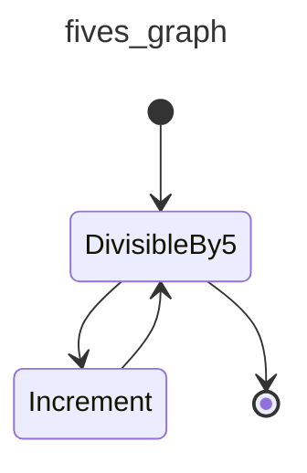

In order to visualize a graph within a `jupyter-notebook`, `IPython.display` needs to be used:

```python {title="jupyter_display_mermaid.py"  test="skip"}
from graph_example import DivisibleBy5, fives_graph
from IPython.display import Image, display

display(Image(fives_graph.mermaid_image(start_node=DivisibleBy5)))
```

## Stateful Graphs

The "state" concept in `pydantic-graph` provides an optional way to access and mutate an object (often a `dataclass` or Pydantic model) as nodes run in a graph. If you think of Graphs as a production line, then your state is the engine being passed along the line and built up by each node as the graph is run.

In the future, we intend to extend `pydantic-graph` to provide state persistence with the state recorded after each node is run, see [#695](https://github.com/pydantic/pydantic-ai/issues/695).

Here's an example of a graph which represents a vending machine where the user may insert coins and select a product to purchase.

```python {title="vending_machine.py" py="3.10"}
from __future__ import annotations

from dataclasses import dataclass

from rich.prompt import Prompt

from pydantic_graph import BaseNode, End, Graph, GraphRunContext


@dataclass
class MachineState:  # (1)!
    user_balance: float = 0.0
    product: str | None = None


@dataclass
class InsertCoin(BaseNode[MachineState]):  # (3)!
    async def run(self, ctx: GraphRunContext[MachineState]) -> CoinsInserted:  # (16)!
        return CoinsInserted(float(Prompt.ask('Insert coins')))  # (4)!


@dataclass
class CoinsInserted(BaseNode[MachineState]):
    amount: float  # (5)!

    async def run(
        self, ctx: GraphRunContext[MachineState]
    ) -> SelectProduct | Purchase:  # (17)!
        ctx.state.user_balance += self.amount  # (6)!
        if ctx.state.product is not None:  # (7)!
            return Purchase(ctx.state.product)
        else:
            return SelectProduct()


@dataclass
class SelectProduct(BaseNode[MachineState]):
    async def run(self, ctx: GraphRunContext[MachineState]) -> Purchase:
        return Purchase(Prompt.ask('Select product'))


PRODUCT_PRICES = {  # (2)!
    'water': 1.25,
    'soda': 1.50,
    'crisps': 1.75,
    'chocolate': 2.00,
}


@dataclass
class Purchase(BaseNode[MachineState, None, None]):  # (18)!
    product: str

    async def run(
        self, ctx: GraphRunContext[MachineState]
    ) -> End | InsertCoin | SelectProduct:
        if price := PRODUCT_PRICES.get(self.product):  # (8)!
            ctx.state.product = self.product  # (9)!
            if ctx.state.user_balance >= price:  # (10)!
                ctx.state.user_balance -= price
                return End(None)
            else:
                diff = price - ctx.state.user_balance
                print(f'Not enough money for {self.product}, need {diff:0.2f} more')
                #> Not enough money for crisps, need 0.75 more
                return InsertCoin()  # (11)!
        else:
            print(f'No such product: {self.product}, try again')
            return SelectProduct()  # (12)!


vending_machine_graph = Graph(  # (13)!
    nodes=[InsertCoin, CoinsInserted, SelectProduct, Purchase]
)


async def main():
    state = MachineState()  # (14)!
    await vending_machine_graph.run(InsertCoin(), state=state)  # (15)!
    print(f'purchase successful item={state.product} change={state.user_balance:0.2f}')
    #> purchase successful item=crisps change=0.25
```

1. The state of the vending machine is defined as a dataclass with the user's balance and the product they've selected, if any.
2. A dictionary of products mapped to prices.
3. The `InsertCoin` node, [`BaseNode`][pydantic_graph.nodes.BaseNode] is parameterized with `MachineState` as that's the state used in this graph.
4. The `InsertCoin` node prompts the user to insert coins. We keep things simple by just entering a monetary amount as a float. Before you start thinking this is a toy too since it's using [rich's `Prompt.ask`][rich.prompt.PromptBase.ask] within nodes, see [below](#example-human-in-the-loop) for how control flow can be managed when nodes require external input.
5. The `CoinsInserted` node; again this is a [`dataclass`][dataclasses.dataclass] with one field `amount`.
6. Update the user's balance with the amount inserted.
7. If the user has already selected a product, go to `Purchase`, otherwise go to `SelectProduct`.
8. In the `Purchase` node, look up the price of the product if the user entered a valid product.
9. If the user did enter a valid product, set the product in the state so we don't revisit `SelectProduct`.
10. If the balance is enough to purchase the product, adjust the balance to reflect the purchase and return [`End`][pydantic_graph.nodes.End] to end the graph. We're not using the run return type, so we call `End` with `None`.
11. If the balance is insufficient, go to `InsertCoin` to prompt the user to insert more coins.
12. If the product is invalid, go to `SelectProduct` to prompt the user to select a product again.
13. The graph is created by passing a list of nodes to [`Graph`][pydantic_graph.graph.Graph]. Order of nodes is not important, but it can affect how [diagrams](#mermaid-diagrams) are displayed.
14. Initialize the state. This will be passed to the graph run and mutated as the graph runs.
15. Run the graph with the initial state. Since the graph can be run from any node, we must pass the start node — in this case, `InsertCoin`. [`Graph.run`][pydantic_graph.graph.Graph.run] returns a [`GraphRunResult`][pydantic_graph.graph.GraphRunResult] that provides the final data and a history of the run.
16. The return type of the node's [`run`][pydantic_graph.nodes.BaseNode.run] method is important as it is used to determine the outgoing edges of the node. This information in turn is used to render [mermaid diagrams](#mermaid-diagrams) and is enforced at runtime to detect misbehavior as soon as possible.
17. The return type of `CoinsInserted`'s [`run`][pydantic_graph.nodes.BaseNode.run] method is a union, meaning multiple outgoing edges are possible.
18. Unlike other nodes, `Purchase` can end the run, so the [`RunEndT`][pydantic_graph.nodes.RunEndT] generic parameter must be set. In this case it's `None` since the graph run return type is `None`.

_(This example is complete, it can be run "as is" with Python 3.10+ — you'll need to add `asyncio.run(main())` to run `main`)_

A [mermaid diagram](#mermaid-diagrams) for this graph can be generated with the following code:

```py {title="vending_machine_diagram.py" py="3.10"}
from vending_machine import InsertCoin, vending_machine_graph

vending_machine_graph.mermaid_code(start_node=InsertCoin)
```

The diagram generated by the above code is:

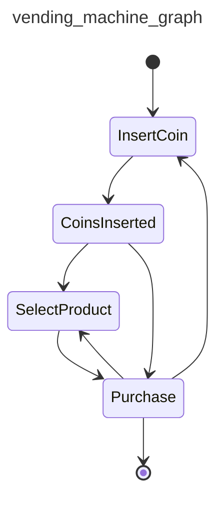

See [below](#mermaid-diagrams) for more information on generating diagrams.

## GenAI Example

So far we haven't shown an example of a Graph that actually uses PydanticAI or GenAI at all.

In this example, one agent generates a welcome email to a user and the other agent provides feedback on the email.

This graph has a very simple structure:

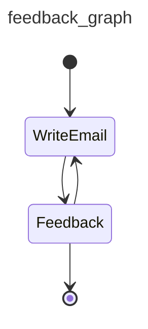

```python {title="genai_email_feedback.py" py="3.10"}
from __future__ import annotations as _annotations

from dataclasses import dataclass, field

from pydantic import BaseModel, EmailStr

from pydantic_ai import Agent, format_as_xml
from pydantic_ai.messages import ModelMessage
from pydantic_graph import BaseNode, End, Graph, GraphRunContext


@dataclass
class User:
    name: str
    email: EmailStr
    interests: list[str]


@dataclass
class Email:
    subject: str
    body: str


@dataclass
class State:
    user: User
    write_agent_messages: list[ModelMessage] = field(default_factory=list)


email_writer_agent = Agent(
    'google-vertex:gemini-1.5-pro',
    output_type=Email,
    system_prompt='Write a welcome email to our tech blog.',
)


@dataclass
class WriteEmail(BaseNode[State]):
    email_feedback: str | None = None

    async def run(self, ctx: GraphRunContext[State]) -> Feedback:
        if self.email_feedback:
            prompt = (
                f'Rewrite the email for the user:\n'
                f'{format_as_xml(ctx.state.user)}\n'
                f'Feedback: {self.email_feedback}'
            )
        else:
            prompt = (
                f'Write a welcome email for the user:\n'
                f'{format_as_xml(ctx.state.user)}'
            )

        result = await email_writer_agent.run(
            prompt,
            message_history=ctx.state.write_agent_messages,
        )
        ctx.state.write_agent_messages += result.all_messages()
        return Feedback(result.output)


class EmailRequiresWrite(BaseModel):
    feedback: str


class EmailOk(BaseModel):
    pass


feedback_agent = Agent[None, EmailRequiresWrite | EmailOk](
    'openai:gpt-4o',
    output_type=EmailRequiresWrite | EmailOk,  # type: ignore
    system_prompt=(
        'Review the email and provide feedback, email must reference the users specific interests.'
    ),
)


@dataclass
class Feedback(BaseNode[State, None, Email]):
    email: Email

    async def run(
        self,
        ctx: GraphRunContext[State],
    ) -> WriteEmail | End[Email]:
        prompt = format_as_xml({'user': ctx.state.user, 'email': self.email})
        result = await feedback_agent.run(prompt)
        if isinstance(result.output, EmailRequiresWrite):
            return WriteEmail(email_feedback=result.output.feedback)
        else:
            return End(self.email)


async def main():
    user = User(
        name='John Doe',
        email='john.joe@example.com',
        interests=['Haskel', 'Lisp', 'Fortran'],
    )
    state = State(user)
    feedback_graph = Graph(nodes=(WriteEmail, Feedback))
    result = await feedback_graph.run(WriteEmail(), state=state)
    print(result.output)
    """
    Email(
        subject='Welcome to our tech blog!',
        body='Hello John, Welcome to our tech blog! ...',
    )
    """
```

_(This example is complete, it can be run "as is" with Python 3.10+ — you'll need to add `asyncio.run(main())` to run `main`)_

## Iterating Over a Graph

### Using `Graph.iter` for `async for` iteration

Sometimes you want direct control or insight into each node as the graph executes. The easiest way to do that is with the [`Graph.iter`][pydantic_graph.graph.Graph.iter] method, which returns a **context manager** that yields a [`GraphRun`][pydantic_graph.graph.GraphRun] object. The `GraphRun` is an async-iterable over the nodes of your graph, allowing you to record or modify them as they execute.

Here's an example:

```python {title="count_down.py" noqa="I001" py="3.10"}
from __future__ import annotations as _annotations

from dataclasses import dataclass
from pydantic_graph import Graph, BaseNode, End, GraphRunContext


@dataclass
class CountDownState:
    counter: int


@dataclass
class CountDown(BaseNode[CountDownState, None, int]):
    async def run(self, ctx: GraphRunContext[CountDownState]) -> CountDown | End[int]:
        if ctx.state.counter <= 0:
            return End(ctx.state.counter)
        ctx.state.counter -= 1
        return CountDown()


count_down_graph = Graph(nodes=[CountDown])


async def main():
    state = CountDownState(counter=3)
    async with count_down_graph.iter(CountDown(), state=state) as run:  # (1)!
        async for node in run:  # (2)!
            print('Node:', node)
            #> Node: CountDown()
            #> Node: CountDown()
            #> Node: CountDown()
            #> Node: CountDown()
            #> Node: End(data=0)
    print('Final output:', run.result.output)  # (3)!
    #> Final output: 0
```

1. `Graph.iter(...)` returns a [`GraphRun`][pydantic_graph.graph.GraphRun].
2. Here, we step through each node as it is executed.
3. Once the graph returns an [`End`][pydantic_graph.nodes.End], the loop ends, and `run.result` becomes a [`GraphRunResult`][pydantic_graph.graph.GraphRunResult] containing the final outcome (`0` here).

### Using `GraphRun.next(node)` manually

Alternatively, you can drive iteration manually with the [`GraphRun.next`][pydantic_graph.graph.GraphRun.next] method, which allows you to pass in whichever node you want to run next. You can modify or selectively skip nodes this way.

Below is a contrived example that stops whenever the counter is at 2, ignoring any node runs beyond that:

```python {title="count_down_next.py" noqa="I001" py="3.10"}
from pydantic_graph import End, FullStatePersistence
from count_down import CountDown, CountDownState, count_down_graph


async def main():
    state = CountDownState(counter=5)
    persistence = FullStatePersistence()  # (7)!
    async with count_down_graph.iter(
        CountDown(), state=state, persistence=persistence
    ) as run:
        node = run.next_node  # (1)!
        while not isinstance(node, End):  # (2)!
            print('Node:', node)
            #> Node: CountDown()
            #> Node: CountDown()
            #> Node: CountDown()
            #> Node: CountDown()
            if state.counter == 2:
                break  # (3)!
            node = await run.next(node)  # (4)!

        print(run.result)  # (5)!
        #> None

        for step in persistence.history:  # (6)!
            print('History Step:', step.state, step.state)
            #> History Step: CountDownState(counter=5) CountDownState(counter=5)
            #> History Step: CountDownState(counter=4) CountDownState(counter=4)
            #> History Step: CountDownState(counter=3) CountDownState(counter=3)
            #> History Step: CountDownState(counter=2) CountDownState(counter=2)
```

1. We start by grabbing the first node that will be run in the agent's graph.
2. The agent run is finished once an `End` node has been produced; instances of `End` cannot be passed to `next`.
3. If the user decides to stop early, we break out of the loop. The graph run won't have a real final result in that case (`run.result` remains `None`).
4. At each step, we call `await run.next(node)` to run it and get the next node (or an `End`).
5. Because we did not continue the run until it finished, the `result` is not set.
6. The run's history is still populated with the steps we executed so far.
7. Use [`FullStatePersistence`][pydantic_graph.FullStatePersistence] so we can show the history of the run, see [State Persistence](#state-persistence) below for more information.

## State Persistence

One of the biggest benefits of finite state machine (FSM) graphs is how they simplify the handling of interrupted execution. This might happen for a variety of reasons:

- the state machine logic might fundamentally need to be paused — e.g. the returns workflow for an e-commerce order needs to wait for the item to be posted to the returns center or because execution of the next node needs input from a user so needs to wait for a new http request,
- the execution takes so long that the entire graph can't reliably be executed in a single continuous run — e.g. a deep research agent that might take hours to run,
- you want to run multiple graph nodes in parallel in different processes / hardware instances (note: parallel node execution is not yet supported in `pydantic-graph`, see [#704](https://github.com/pydantic/pydantic-ai/issues/704)).

Trying to make a conventional control flow (i.e., boolean logic and nested function calls) implementation compatible with these usage scenarios generally results in brittle and over-complicated spaghetti code, with the logic required to interrupt and resume execution dominating the implementation.

To allow graph runs to be interrupted and resumed, `pydantic-graph` provides state persistence — a system for snapshotting the state of a graph run before and after each node is run, allowing a graph run to be resumed from any point in the graph.

`pydantic-graph` includes three state persistence implementations:

- [`SimpleStatePersistence`][pydantic_graph.SimpleStatePersistence] — Simple in memory state persistence that just hold the latest snapshot. If no state persistence implementation is provided when running a graph, this is used by default.
- [`FullStatePersistence`][pydantic_graph.FullStatePersistence] — In memory state persistence that hold a list of snapshots.
- [`FileStatePersistence`][pydantic_graph.persistence.file.FileStatePersistence] — File-based state persistence that saves snapshots to a JSON file.

In production applications, developers should implement their own state persistence by subclassing [`BaseStatePersistence`][pydantic_graph.persistence.BaseStatePersistence] abstract base class, which might persist runs in a relational database like PostgresQL.

At a high level the role of `StatePersistence` implementations is to store and retrieve [`NodeSnapshot`][pydantic_graph.persistence.NodeSnapshot] and [`EndSnapshot`][pydantic_graph.persistence.EndSnapshot] objects.

[`graph.iter_from_persistence()`][pydantic_graph.graph.Graph.iter_from_persistence] may be used to run the graph based on the state stored in persistence.

We can run the `count_down_graph` from [above](#iterating-over-a-graph), using [`graph.iter_from_persistence()`][pydantic_graph.graph.Graph.iter_from_persistence] and [`FileStatePersistence`][pydantic_graph.persistence.file.FileStatePersistence].

As you can see in this code, `run_node` requires no external application state (apart from state persistence) to be run, meaning graphs can easily be executed by distributed execution and queueing systems.

```python {title="count_down_from_persistence.py" noqa="I001" py="3.10"}
from pathlib import Path

from pydantic_graph import End
from pydantic_graph.persistence.file import FileStatePersistence

from count_down import CountDown, CountDownState, count_down_graph


async def main():
    run_id = 'run_abc123'
    persistence = FileStatePersistence(Path(f'count_down_{run_id}.json'))  # (1)!
    state = CountDownState(counter=5)
    await count_down_graph.initialize(  # (2)!
        CountDown(), state=state, persistence=persistence
    )

    done = False
    while not done:
        done = await run_node(run_id)


async def run_node(run_id: str) -> bool:  # (3)!
    persistence = FileStatePersistence(Path(f'count_down_{run_id}.json'))
    async with count_down_graph.iter_from_persistence(persistence) as run:  # (4)!
        node_or_end = await run.next()  # (5)!

    print('Node:', node_or_end)
    #> Node: CountDown()
    #> Node: CountDown()
    #> Node: CountDown()
    #> Node: CountDown()
    #> Node: CountDown()
    #> Node: End(data=0)
    return isinstance(node_or_end, End)  # (6)!
```

1. Create a [`FileStatePersistence`][pydantic_graph.persistence.file.FileStatePersistence] to use to start the graph.
2. Call [`graph.initialize()`][pydantic_graph.graph.Graph.initialize] to set the initial graph state in the persistence object.
3. `run_node` is a pure function that doesn't need access to any other process state to run the next node of the graph, except the ID of the run.
4. Call [`graph.iter_from_persistence()`][pydantic_graph.graph.Graph.iter_from_persistence] create a [`GraphRun`][pydantic_graph.graph.GraphRun] object that will run the next node of the graph from the state stored in persistence. This will return either a node or an `End` object.
5. [`graph.run()`][pydantic_graph.graph.Graph.run] will return either a [node][pydantic_graph.nodes.BaseNode] or an [`End`][pydantic_graph.nodes.End] object.
5. Check if the node is an [`End`][pydantic_graph.nodes.End] object, if it is, the graph run is complete.

_(This example is complete, it can be run "as is" with Python 3.10+ — you'll need to add `asyncio.run(main())` to run `main`)_

### Example: Human in the loop.

As noted above, state persistence allows graphs to be interrupted and resumed. One use case of this is to allow user input to continue.

In this example, an AI asks the user a question, the user provides an answer, the AI evaluates the answer and ends if the user got it right or asks another question if they got it wrong.

Instead of running the entire graph in a single process invocation, we run the graph by running the process repeatedly, optionally providing an answer to the question as a command line argument.

??? example "`ai_q_and_a_graph.py` — `question_graph` definition"
    ```python {title="ai_q_and_a_graph.py" noqa="I001" py="3.10"}
    from __future__ import annotations as _annotations

    from dataclasses import dataclass, field

    from groq import BaseModel
    from pydantic_graph import (
        BaseNode,
        End,
        Graph,
        GraphRunContext,
    )

    from pydantic_ai import Agent, format_as_xml
    from pydantic_ai.messages import ModelMessage

    ask_agent = Agent('openai:gpt-4o', output_type=str, instrument=True)


    @dataclass
    class QuestionState:
        question: str | None = None
        ask_agent_messages: list[ModelMessage] = field(default_factory=list)
        evaluate_agent_messages: list[ModelMessage] = field(default_factory=list)


    @dataclass
    class Ask(BaseNode[QuestionState]):
        async def run(self, ctx: GraphRunContext[QuestionState]) -> Answer:
            result = await ask_agent.run(
                'Ask a simple question with a single correct answer.',
                message_history=ctx.state.ask_agent_messages,
            )
            ctx.state.ask_agent_messages += result.all_messages()
            ctx.state.question = result.output
            return Answer(result.output)


    @dataclass
    class Answer(BaseNode[QuestionState]):
        question: str

        async def run(self, ctx: GraphRunContext[QuestionState]) -> Evaluate:
            answer = input(f'{self.question}: ')
            return Evaluate(answer)


    class EvaluationResult(BaseModel, use_attribute_docstrings=True):
        correct: bool
        """Whether the answer is correct."""
        comment: str
        """Comment on the answer, reprimand the user if the answer is wrong."""


    evaluate_agent = Agent(
        'openai:gpt-4o',
        output_type=EvaluationResult,
        system_prompt='Given a question and answer, evaluate if the answer is correct.',
    )


    @dataclass
    class Evaluate(BaseNode[QuestionState, None, str]):
        answer: str

        async def run(
            self,
            ctx: GraphRunContext[QuestionState],
        ) -> End[str] | Reprimand:
            assert ctx.state.question is not None
            result = await evaluate_agent.run(
                format_as_xml({'question': ctx.state.question, 'answer': self.answer}),
                message_history=ctx.state.evaluate_agent_messages,
            )
            ctx.state.evaluate_agent_messages += result.all_messages()
            if result.output.correct:
                return End(result.output.comment)
            else:
                return Reprimand(result.output.comment)


    @dataclass
    class Reprimand(BaseNode[QuestionState]):
        comment: str

        async def run(self, ctx: GraphRunContext[QuestionState]) -> Ask:
            print(f'Comment: {self.comment}')
            ctx.state.question = None
            return Ask()


    question_graph = Graph(
        nodes=(Ask, Answer, Evaluate, Reprimand), state_type=QuestionState
    )
    ```

    _(This example is complete, it can be run "as is" with Python 3.10+)_

```python {title="ai_q_and_a_run.py" noqa="I001" py="3.10"}
import sys
from pathlib import Path

from pydantic_graph import End
from pydantic_graph.persistence.file import FileStatePersistence
from pydantic_ai.messages import ModelMessage  # noqa: F401

from ai_q_and_a_graph import Ask, question_graph, Evaluate, QuestionState, Answer


async def main():
    answer: str | None = sys.argv[1] if len(sys.argv) > 1 else None  # (1)!
    persistence = FileStatePersistence(Path('question_graph.json'))  # (2)!
    persistence.set_graph_types(question_graph)  # (3)!

    if snapshot := await persistence.load_next():  # (4)!
        state = snapshot.state
        assert answer is not None
        node = Evaluate(answer)
    else:
        state = QuestionState()
        node = Ask()  # (5)!

    async with question_graph.iter(node, state=state, persistence=persistence) as run:
        while True:
            node = await run.next()  # (6)!
            if isinstance(node, End):  # (7)!
                print('END:', node.data)
                history = await persistence.load_all()  # (8)!
                print([e.node for e in history])
                break
            elif isinstance(node, Answer):  # (9)!
                print(node.question)
                #> What is the capital of France?
                break
            # otherwise just continue
```

1. Get the user's answer from the command line, if provided. See [question graph example](examples/question-graph.md) for a complete example.
2. Create a state persistence instance the `'question_graph.json'` file may or may not already exist.
3. Since we're using the [persistence interface][pydantic_graph.persistence.BaseStatePersistence] outside a graph, we need to call [`set_graph_types`][pydantic_graph.persistence.BaseStatePersistence.set_graph_types] to set the graph generic types `StateT` and `RunEndT` for the persistence instance. This is necessary to allow the persistence instance to know how to serialize and deserialize graph nodes.
4. If we're run the graph before, [`load_next`][pydantic_graph.persistence.BaseStatePersistence.load_next] will return a snapshot of the next node to run, here we use `state` from that snapshot, and create a new `Evaluate` node with the answer provided on the command line.
5. If the graph hasn't been run before, we create a new `QuestionState` and start with the `Ask` node.
6. Call [`GraphRun.next()`][pydantic_graph.graph.GraphRun.next] to run the node. This will return either a node or an `End` object.
7. If the node is an `End` object, the graph run is complete. The `data` field of the `End` object contains the comment returned by the `evaluate_agent` about the correct answer.
8. To demonstrate the state persistence, we call [`load_all`][pydantic_graph.persistence.BaseStatePersistence.load_all] to get all the snapshots from the persistence instance. This will return a list of [`Snapshot`][pydantic_graph.persistence.Snapshot] objects.
9. If the node is an `Answer` object, we print the question and break out of the loop to end the process and wait for user input.

_(This example is complete, it can be run "as is" with Python 3.10+ — you'll need to add `asyncio.run(main())` to run `main`)_

For a complete example of this graph, see the [question graph example](examples/question-graph.md).

## Dependency Injection

As with PydanticAI, `pydantic-graph` supports dependency injection via a generic parameter on [`Graph`][pydantic_graph.graph.Graph] and [`BaseNode`][pydantic_graph.nodes.BaseNode], and the [`GraphRunContext.deps`][pydantic_graph.nodes.GraphRunContext.deps] field.

As an example of dependency injection, let's modify the `DivisibleBy5` example [above](#graph) to use a [`ProcessPoolExecutor`][concurrent.futures.ProcessPoolExecutor] to run the compute load in a separate process (this is a contrived example, `ProcessPoolExecutor` wouldn't actually improve performance in this example):

```py {title="deps_example.py" py="3.10" test="skip" hl_lines="4 10-12 35-37 48-49"}
from __future__ import annotations

import asyncio
from concurrent.futures import ProcessPoolExecutor
from dataclasses import dataclass

from pydantic_graph import BaseNode, End, Graph, GraphRunContext


@dataclass
class GraphDeps:
    executor: ProcessPoolExecutor


@dataclass
class DivisibleBy5(BaseNode[None, GraphDeps, int]):
    foo: int

    async def run(
        self,
        ctx: GraphRunContext[None, GraphDeps],
    ) -> Increment | End[int]:
        if self.foo % 5 == 0:
            return End(self.foo)
        else:
            return Increment(self.foo)


@dataclass
class Increment(BaseNode[None, GraphDeps]):
    foo: int

    async def run(self, ctx: GraphRunContext[None, GraphDeps]) -> DivisibleBy5:
        loop = asyncio.get_running_loop()
        compute_result = await loop.run_in_executor(
            ctx.deps.executor,
            self.compute,
        )
        return DivisibleBy5(compute_result)

    def compute(self) -> int:
        return self.foo + 1


fives_graph = Graph(nodes=[DivisibleBy5, Increment])


async def main():
    with ProcessPoolExecutor() as executor:
        deps = GraphDeps(executor)
        result = await fives_graph.run(DivisibleBy5(3), deps=deps)
    print(result.output)
    #> 5
    # the full history is quite verbose (see below), so we'll just print the summary
    print([item.data_snapshot() for item in result.history])
    """
    [
        DivisibleBy5(foo=3),
        Increment(foo=3),
        DivisibleBy5(foo=4),
        Increment(foo=4),
        DivisibleBy5(foo=5),
        End(data=5),
    ]
    """
```

_(This example is complete, it can be run "as is" with Python 3.10+ — you'll need to add `asyncio.run(main())` to run `main`)_

## Mermaid Diagrams

Pydantic Graph can generate [mermaid](https://mermaid.js.org/) [`stateDiagram-v2`](https://mermaid.js.org/syntax/stateDiagram.html) diagrams for graphs, as shown above.

These diagrams can be generated with:

* [`Graph.mermaid_code`][pydantic_graph.graph.Graph.mermaid_code] to generate the mermaid code for a graph
* [`Graph.mermaid_image`][pydantic_graph.graph.Graph.mermaid_image] to generate an image of the graph using [mermaid.ink](https://mermaid.ink/)
* [`Graph.mermaid_save`][pydantic_graph.graph.Graph.mermaid_save] to generate an image of the graph using [mermaid.ink](https://mermaid.ink/) and save it to a file

Beyond the diagrams shown above, you can also customize mermaid diagrams with the following options:

* [`Edge`][pydantic_graph.nodes.Edge] allows you to apply a label to an edge
* [`BaseNode.docstring_notes`][pydantic_graph.nodes.BaseNode.docstring_notes] and [`BaseNode.get_note`][pydantic_graph.nodes.BaseNode.get_note] allows you to add notes to nodes
* The [`highlighted_nodes`][pydantic_graph.graph.Graph.mermaid_code] parameter allows you to highlight specific node(s) in the diagram

Putting that together, we can edit the last [`ai_q_and_a_graph.py`](#example-human-in-the-loop) example to:

* add labels to some edges
* add a note to the `Ask` node
* highlight the `Answer` node
* save the diagram as a `PNG` image to file

```python {title="ai_q_and_a_graph_extra.py" test="skip" lint="skip" hl_lines="2 4 10-11 14 26 31"}
...
from typing import Annotated

from pydantic_graph import BaseNode, End, Graph, GraphRunContext, Edge

...

@dataclass
class Ask(BaseNode[QuestionState]):
    """Generate question using GPT-4o."""
    docstring_notes = True
    async def run(
        self, ctx: GraphRunContext[QuestionState]
    ) -> Annotated[Answer, Edge(label='Ask the question')]:
        ...

...

@dataclass
class Evaluate(BaseNode[QuestionState]):
    answer: str

    async def run(
            self,
            ctx: GraphRunContext[QuestionState],
    ) -> Annotated[End[str], Edge(label='success')] | Reprimand:
        ...

...

question_graph.mermaid_save('image.png', highlighted_nodes=[Answer])
```

_(This example is not complete and cannot be run directly)_

This would generate an image that looks like this:

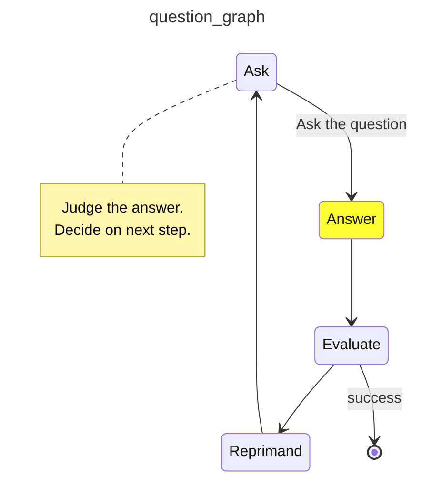

### Setting Direction of the State Diagram

You can specify the direction of the state diagram using one of the following values:

- `'TB'`: Top to bottom, the diagram flows vertically from top to bottom.
- `'LR'`: Left to right, the diagram flows horizontally from left to right.
- `'RL'`: Right to left, the diagram flows horizontally from right to left.
- `'BT'`: Bottom to top, the diagram flows vertically from bottom to top.

Here is an example of how to do this using 'Left to Right' (LR) instead of the default 'Top to Bottom' (TB):
```py {title="vending_machine_diagram.py" py="3.10"}
from vending_machine import InsertCoin, vending_machine_graph

vending_machine_graph.mermaid_code(start_node=InsertCoin, direction='LR')
```

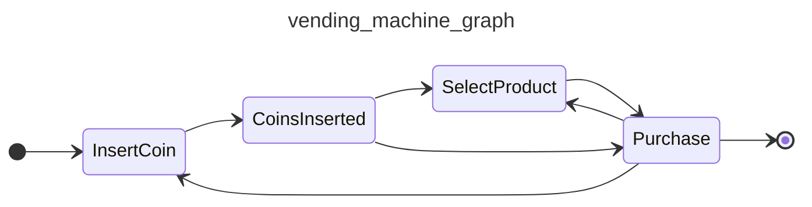
````

## File: docs/help.md
````markdown
# Getting Help

If you need help getting started with PydanticAI or with advanced usage, the following sources may be useful.

## :simple-slack: Slack

Join the `#pydantic-ai` channel in the [Pydantic Slack][slack] to ask questions, get help, and chat about PydanticAI. There's also channels for Pydantic, Logfire, and FastUI.

If you're on a [Logfire][logfire] Pro plan, you can also get a dedicated private slack collab channel with us.

## :simple-github: GitHub Issues

The [PydanticAI GitHub Issues][github-issues] are a great place to ask questions and give us feedback.

[slack]: https://logfire.pydantic.dev/docs/join-slack/
[github-issues]: https://github.com/pydantic/pydantic-ai/issues
[logfire]: https://pydantic.dev/logfire
````

## File: docs/index.md
````markdown
# Introduction {.hide}

--8<-- "docs/.partials/index-header.html"

FastAPI revolutionized web development by offering an innovative and ergonomic design, built on the foundation of [Pydantic](https://docs.pydantic.dev).

Similarly, virtually every agent framework and LLM library in Python uses Pydantic, yet when we began to use LLMs in [Pydantic Logfire](https://pydantic.dev/logfire), we couldn't find anything that gave us the same feeling.

We built PydanticAI with one simple aim: to bring that FastAPI feeling to GenAI app development.

## Why use PydanticAI

* __Built by the Pydantic Team__:
Built by the team behind [Pydantic](https://docs.pydantic.dev/latest/) (the validation layer of the OpenAI SDK, the Anthropic SDK, LangChain, LlamaIndex, AutoGPT, Transformers, CrewAI, Instructor and many more).

* __Model-agnostic__:
Supports OpenAI, Anthropic, Gemini, Deepseek, Ollama, Groq, Cohere, and Mistral, and there is a simple interface to implement support for [other models](models/index.md).

* __Pydantic Logfire Integration__:
Seamlessly [integrates](logfire.md) with [Pydantic Logfire](https://pydantic.dev/logfire) for real-time debugging, performance monitoring, and behavior tracking of your LLM-powered applications.

* __Type-safe__:
Designed to make [type checking](agents.md#static-type-checking) as powerful and informative as possible for you.

* __Python-centric Design__:
Leverages Python's familiar control flow and agent composition to build your AI-driven projects, making it easy to apply standard Python best practices you'd use in any other (non-AI) project.

* __Structured Responses__:
Harnesses the power of [Pydantic](https://docs.pydantic.dev/latest/) to [validate and structure](output.md#structured-output) model outputs, ensuring responses are consistent across runs.

* __Dependency Injection System__:
Offers an optional [dependency injection](dependencies.md) system to provide data and services to your agent's [system prompts](agents.md#system-prompts), [tools](tools.md) and [output validators](output.md#output-validator-functions).
This is useful for testing and eval-driven iterative development.

* __Streamed Responses__:
Provides the ability to [stream](output.md#streamed-results) LLM responses continuously, with immediate validation, ensuring real time access to validated outputs.

* __Graph Support__:
[Pydantic Graph](graph.md) provides a powerful way to define graphs using typing hints, this is useful in complex applications where standard control flow can degrade to spaghetti code.

## Hello World Example

Here's a minimal example of PydanticAI:

```python {title="hello_world.py"}
from pydantic_ai import Agent

agent = Agent(  # (1)!
    'google-gla:gemini-1.5-flash',
    system_prompt='Be concise, reply with one sentence.',  # (2)!
)

result = agent.run_sync('Where does "hello world" come from?')  # (3)!
print(result.output)
"""
The first known use of "hello, world" was in a 1974 textbook about the C programming language.
"""
```

1. We configure the agent to use [Gemini 1.5's Flash](api/models/gemini.md) model, but you can also set the model when running the agent.
2. Register a static [system prompt](agents.md#system-prompts) using a keyword argument to the agent.
3. [Run the agent](agents.md#running-agents) synchronously, conducting a conversation with the LLM.

_(This example is complete, it can be run "as is")_

The exchange should be very short: PydanticAI will send the system prompt and the user query to the LLM, the model will return a text response.

Not very interesting yet, but we can easily add "tools", dynamic system prompts, and structured responses to build more powerful agents.

## Tools & Dependency Injection Example

Here is a concise example using PydanticAI to build a support agent for a bank:

```python {title="bank_support.py"}
from dataclasses import dataclass

from pydantic import BaseModel, Field
from pydantic_ai import Agent, RunContext

from bank_database import DatabaseConn


@dataclass
class SupportDependencies:  # (3)!
    customer_id: int
    db: DatabaseConn  # (12)!


class SupportOutput(BaseModel):  # (13)!
    support_advice: str = Field(description='Advice returned to the customer')
    block_card: bool = Field(description="Whether to block the customer's card")
    risk: int = Field(description='Risk level of query', ge=0, le=10)


support_agent = Agent(  # (1)!
    'openai:gpt-4o',  # (2)!
    deps_type=SupportDependencies,
    output_type=SupportOutput,  # (9)!
    system_prompt=(  # (4)!
        'You are a support agent in our bank, give the '
        'customer support and judge the risk level of their query.'
    ),
)


@support_agent.system_prompt  # (5)!
async def add_customer_name(ctx: RunContext[SupportDependencies]) -> str:
    customer_name = await ctx.deps.db.customer_name(id=ctx.deps.customer_id)
    return f"The customer's name is {customer_name!r}"


@support_agent.tool  # (6)!
async def customer_balance(
    ctx: RunContext[SupportDependencies], include_pending: bool
) -> float:
    """Returns the customer's current account balance."""  # (7)!
    return await ctx.deps.db.customer_balance(
        id=ctx.deps.customer_id,
        include_pending=include_pending,
    )


...  # (11)!


async def main():
    deps = SupportDependencies(customer_id=123, db=DatabaseConn())
    result = await support_agent.run('What is my balance?', deps=deps)  # (8)!
    print(result.output)  # (10)!
    """
    support_advice='Hello John, your current account balance, including pending transactions, is $123.45.' block_card=False risk=1
    """

    result = await support_agent.run('I just lost my card!', deps=deps)
    print(result.output)
    """
    support_advice="I'm sorry to hear that, John. We are temporarily blocking your card to prevent unauthorized transactions." block_card=True risk=8
    """
```

1. This [agent](agents.md) will act as first-tier support in a bank. Agents are generic in the type of dependencies they accept and the type of output they return. In this case, the support agent has type `#!python Agent[SupportDependencies, SupportOutput]`.
2. Here we configure the agent to use [OpenAI's GPT-4o model](api/models/openai.md), you can also set the model when running the agent.
3. The `SupportDependencies` dataclass is used to pass data, connections, and logic into the model that will be needed when running [system prompt](agents.md#system-prompts) and [tool](tools.md) functions. PydanticAI's system of dependency injection provides a [type-safe](agents.md#static-type-checking) way to customise the behavior of your agents, and can be especially useful when running [unit tests](testing.md) and evals.
4. Static [system prompts](agents.md#system-prompts) can be registered with the [`system_prompt` keyword argument][pydantic_ai.Agent.__init__] to the agent.
5. Dynamic [system prompts](agents.md#system-prompts) can be registered with the [`@agent.system_prompt`][pydantic_ai.Agent.system_prompt] decorator, and can make use of dependency injection. Dependencies are carried via the [`RunContext`][pydantic_ai.tools.RunContext] argument, which is parameterized with the `deps_type` from above. If the type annotation here is wrong, static type checkers will catch it.
6. [`tool`](tools.md) let you register functions which the LLM may call while responding to a user. Again, dependencies are carried via [`RunContext`][pydantic_ai.tools.RunContext], any other arguments become the tool schema passed to the LLM. Pydantic is used to validate these arguments, and errors are passed back to the LLM so it can retry.
7. The docstring of a tool is also passed to the LLM as the description of the tool. Parameter descriptions are [extracted](tools.md#function-tools-and-schema) from the docstring and added to the parameter schema sent to the LLM.
8. [Run the agent](agents.md#running-agents) asynchronously, conducting a conversation with the LLM until a final response is reached. Even in this fairly simple case, the agent will exchange multiple messages with the LLM as tools are called to retrieve an output.
9. The response from the agent will, be guaranteed to be a `SupportOutput`, if validation fails [reflection](agents.md#reflection-and-self-correction) will mean the agent is prompted to try again.
10. The output will be validated with Pydantic to guarantee it is a `SupportOutput`, since the agent is generic, it'll also be typed as a `SupportOutput` to aid with static type checking.
11. In a real use case, you'd add more tools and a longer system prompt to the agent to extend the context it's equipped with and support it can provide.
12. This is a simple sketch of a database connection, used to keep the example short and readable. In reality, you'd be connecting to an external database (e.g. PostgreSQL) to get information about customers.
13. This [Pydantic](https://docs.pydantic.dev) model is used to constrain the structured data returned by the agent. From this simple definition, Pydantic builds the JSON Schema that tells the LLM how to return the data, and performs validation to guarantee the data is correct at the end of the run.

!!! tip "Complete `bank_support.py` example"
    The code included here is incomplete for the sake of brevity (the definition of `DatabaseConn` is missing); you can find the complete `bank_support.py` example [here](examples/bank-support.md).

## Instrumentation with Pydantic Logfire

To understand the flow of the above runs, we can watch the agent in action using Pydantic Logfire.

To do this, we need to set up logfire, and add the following to our code:

```python {title="bank_support_with_logfire.py" hl_lines="6-9 21" test="skip" lint="skip"}
...
from pydantic_ai import Agent, RunContext

from bank_database import DatabaseConn

import logfire

logfire.configure()  # (1)!
logfire.instrument_asyncpg()  # (2)!

...

support_agent = Agent(
    'openai:gpt-4o',
    deps_type=SupportDependencies,
    output_type=SupportOutput,
    system_prompt=(
        'You are a support agent in our bank, give the '
        'customer support and judge the risk level of their query.'
    ),
    instrument=True,
)
```

1. Configure logfire, this will fail if project is not set up.
2. In our demo, `DatabaseConn` uses [`asyncpg`]() to connect to a PostgreSQL database, so [`logfire.instrument_asyncpg()`](https://magicstack.github.io/asyncpg/current/) is used to log the database queries.

That's enough to get the following view of your agent in action:

{{ video('9078b98c4f75d01f912a0368bbbdb97a', 25, 55) }}

See [Monitoring and Performance](logfire.md) to learn more.

## llms.txt

The PydanticAI documentation is available in the [llms.txt](https://llmstxt.org/) format.
This format is defined in Markdown and suited for large language models.

Two formats are available:

- [llms.txt](https://ai.pydantic.dev/llms.txt): a file containing a brief description
  of the project, along with links to the different sections of the documentation. The structure
  of this file is described in details [here](https://llmstxt.org/#format).
- [llms-full.txt](https://ai.pydantic.dev/llms-full.txt): Similar to the `llms.txt` file,
  but every link content is included. Note that this file may be too large for some LLMs.

As of today, these files *cannot* be natively leveraged by LLM frameworks or IDEs. Alternatively,
an [MCP server](https://modelcontextprotocol.io/) can be implemented to properly parse the `llms.txt`
file.


## Next Steps

To try PydanticAI yourself, follow the instructions [in the examples](examples/index.md).

Read the [docs](agents.md) to learn more about building applications with PydanticAI.

Read the [API Reference](api/agent.md) to understand PydanticAI's interface.
````

## File: docs/input.md
````markdown
# Image, Audio, Video & Document Input

Some LLMs are now capable of understanding audio, video, image and document content.

## Image Input

!!! info
    Some models do not support image input. Please check the model's documentation to confirm whether it supports image input.

If you have a direct URL for the image, you can use [`ImageUrl`][pydantic_ai.ImageUrl]:

```py {title="main.py" test="skip" lint="skip"}
from pydantic_ai import Agent, ImageUrl

agent = Agent(model='openai:gpt-4o')
result = agent.run_sync(
    [
        'What company is this logo from?',
        ImageUrl(url='https://iili.io/3Hs4FMg.png'),
    ]
)
print(result.output)
# > This is the logo for Pydantic, a data validation and settings management library in Python.
```

If you have the image locally, you can also use [`BinaryContent`][pydantic_ai.BinaryContent]:

```py {title="main.py" test="skip" lint="skip"}
import httpx

from pydantic_ai import Agent, BinaryContent

image_response = httpx.get('https://iili.io/3Hs4FMg.png')  # Pydantic logo

agent = Agent(model='openai:gpt-4o')
result = agent.run_sync(
    [
        'What company is this logo from?',
        BinaryContent(data=image_response.content, media_type='image/png'),  # (1)!
    ]
)
print(result.output)
# > This is the logo for Pydantic, a data validation and settings management library in Python.
```

1. To ensure the example is runnable we download this image from the web, but you can also use `Path().read_bytes()` to read a local file's contents.

## Audio Input

!!! info
    Some models do not support audio input. Please check the model's documentation to confirm whether it supports audio input.

You can provide audio input using either [`AudioUrl`][pydantic_ai.AudioUrl] or [`BinaryContent`][pydantic_ai.BinaryContent]. The process is analogous to the examples above.

## Video Input

!!! info
    Some models do not support video input. Please check the model's documentation to confirm whether it supports audio input.

You can provide video input using either [`VideoUrl`][pydantic_ai.VideoUrl] or [`BinaryContent`][pydantic_ai.BinaryContent]. The process is analogous to the examples above.

## Document Input

!!! info
    Some models do not support document input. Please check the model's documentation to confirm whether it supports document input.

!!! warning
    When using Gemini models, the document content will always be sent as binary data, regardless of whether you use `DocumentUrl` or `BinaryContent`. This is due to differences in how Vertex AI and Google AI handle document inputs.

    For more details, see [this discussion](https://discuss.ai.google.dev/t/i-am-using-google-generative-ai-model-gemini-1-5-pro-for-image-analysis-but-getting-error/34866/4).

    If you are unsatisfied with this behavior, please let us know by opening an issue on
    [GitHub](https://github.com/pydantic/pydantic-ai/issues).

You can provide document input using either [`DocumentUrl`][pydantic_ai.DocumentUrl] or [`BinaryContent`][pydantic_ai.BinaryContent]. The process is similar to the examples above.

If you have a direct URL for the document, you can use [`DocumentUrl`][pydantic_ai.DocumentUrl]:

```py {title="main.py" test="skip" lint="skip"}
from pydantic_ai import Agent, DocumentUrl

agent = Agent(model='anthropic:claude-3-sonnet')
result = agent.run_sync(
    [
        'What is the main content of this document?',
        DocumentUrl(url='https://storage.googleapis.com/cloud-samples-data/generative-ai/pdf/2403.05530.pdf'),
    ]
)
print(result.output)
# > This document is the technical report introducing Gemini 1.5, Google's latest large language model...
```

The supported document formats vary by model.

You can also use [`BinaryContent`][pydantic_ai.BinaryContent] to pass document data directly:

```py {title="main.py" test="skip" lint="skip"}
from pathlib import Path
from pydantic_ai import Agent, BinaryContent

pdf_path = Path('document.pdf')
agent = Agent(model='anthropic:claude-3-sonnet')
result = agent.run_sync(
    [
        'What is the main content of this document?',
        BinaryContent(data=pdf_path.read_bytes(), media_type='application/pdf'),
    ]
)
print(result.output)
# > The document discusses...
```
````

## File: docs/install.md
````markdown
# Installation

PydanticAI is available on PyPI as [`pydantic-ai`](https://pypi.org/project/pydantic-ai/) so installation is as simple as:

```bash
pip/uv-add pydantic-ai
```

(Requires Python 3.9+)

This installs the `pydantic_ai` package, core dependencies, and libraries required to use all the models
included in PydanticAI. If you want to use a specific model, you can install the ["slim"](#slim-install) version of PydanticAI.

## Use with Pydantic Logfire

PydanticAI has an excellent (but completely optional) integration with [Pydantic Logfire](https://pydantic.dev/logfire) to help you view and understand agent runs.

To use Logfire with PydanticAI, install `pydantic-ai` or `pydantic-ai-slim` with the `logfire` optional group:

```bash
pip/uv-add "pydantic-ai[logfire]"
```

From there, follow the [Logfire setup docs](logfire.md#using-logfire) to configure Logfire.

## Running Examples

We distribute the [`pydantic_ai_examples`](https://github.com/pydantic/pydantic-ai/tree/main/examples/pydantic_ai_examples) directory as a separate PyPI package ([`pydantic-ai-examples`](https://pypi.org/project/pydantic-ai-examples/)) to make examples extremely easy to customize and run.

To install examples, use the `examples` optional group:

```bash
pip/uv-add "pydantic-ai[examples]"
```

To run the examples, follow instructions in the [examples docs](examples/index.md).

## Slim Install

If you know which model you're going to use and want to avoid installing superfluous packages, you can use the [`pydantic-ai-slim`](https://pypi.org/project/pydantic-ai-slim/) package.
For example, if you're using just [`OpenAIModel`][pydantic_ai.models.openai.OpenAIModel], you would run:

```bash
pip/uv-add "pydantic-ai-slim[openai]"
```

`pydantic-ai-slim` has the following optional groups:

* `logfire` — installs [`logfire`](logfire.md) [PyPI ↗](https://pypi.org/project/logfire){:target="_blank"}
* `evals` — installs [`pydantic-evals`](evals.md) [PyPI ↗](https://pypi.org/project/pydantic-evals){:target="_blank"}
* `openai` — installs `openai` [PyPI ↗](https://pypi.org/project/openai){:target="_blank"}
* `vertexai` — installs `google-auth` [PyPI ↗](https://pypi.org/project/google-auth){:target="_blank"} and `requests` [PyPI ↗](https://pypi.org/project/requests){:target="_blank"}
* `anthropic` — installs `anthropic` [PyPI ↗](https://pypi.org/project/anthropic){:target="_blank"}
* `groq` — installs `groq` [PyPI ↗](https://pypi.org/project/groq){:target="_blank"}
* `mistral` — installs `mistralai` [PyPI ↗](https://pypi.org/project/mistralai){:target="_blank"}
* `cohere` - installs `cohere` [PyPI ↗](https://pypi.org/project/cohere){:target="_blank"}
* `duckduckgo` - installs `duckduckgo-search` [PyPI ↗](https://pypi.org/project/duckduckgo-search){:target="_blank"}
* `tavily` - installs `tavily-python` [PyPI ↗](https://pypi.org/project/tavily-python){:target="_blank"}

See the [models](models/index.md) documentation for information on which optional dependencies are required for each model.

You can also install dependencies for multiple models and use cases, for example:

```bash
pip/uv-add "pydantic-ai-slim[openai,vertexai,logfire]"
```
````

## File: docs/logfire.md
````markdown
# Debugging and Monitoring

Applications that use LLMs have some challenges that are well known and understood: LLMs are **slow**, **unreliable** and **expensive**.

These applications also have some challenges that most developers have encountered much less often: LLMs are **fickle** and **non-deterministic**. Subtle changes in a prompt can completely change a model's performance, and there's no `EXPLAIN` query you can run to understand why.

!!! danger "Warning"
    From a software engineers point of view, you can think of LLMs as the worst database you've ever heard of, but worse.

    If LLMs weren't so bloody useful, we'd never touch them.

To build successful applications with LLMs, we need new tools to understand both model performance, and the behavior of applications that rely on them.

LLM Observability tools that just let you understand how your model is performing are useless: making API calls to an LLM is easy, it's building that into an application that's hard.

## Pydantic Logfire

[Pydantic Logfire](https://pydantic.dev/logfire) is an observability platform developed by the team who created and maintain Pydantic and PydanticAI. Logfire aims to let you understand your entire application: Gen AI, classic predictive AI, HTTP traffic, database queries and everything else a modern application needs.

!!! tip "Pydantic Logfire is a commercial product"
    Logfire is a commercially supported, hosted platform with an extremely generous and perpetual [free tier](https://pydantic.dev/pricing/).
    You can sign up and start using Logfire in a couple of minutes.

PydanticAI has built-in (but optional) support for Logfire. That means if the `logfire` package is installed and configured and agent instrumentation is enabled then detailed information about agent runs is sent to Logfire. Otherwise there's virtually no overhead and nothing is sent.

Here's an example showing details of running the [Weather Agent](examples/weather-agent.md) in Logfire:


## Using Logfire

To use logfire, you'll need a logfire [account](https://logfire.pydantic.dev), and logfire installed:

```bash
pip/uv-add "pydantic-ai[logfire]"
```

Then authenticate your local environment with logfire:

```bash
py-cli logfire auth
```

And configure a project to send data to:

```bash
py-cli logfire projects new
```

(Or use an existing project with `logfire projects use`)

Then add logfire to your code:

```python {title="adding_logfire.py"}
import logfire

logfire.configure()
```

and enable instrumentation in your agent:

```python {title="instrument_agent.py"}
from pydantic_ai import Agent

agent = Agent('openai:gpt-4o', instrument=True)
# or instrument all agents to avoid needing to add `instrument=True` to each agent:
Agent.instrument_all()
```

The [logfire documentation](https://logfire.pydantic.dev/docs/) has more details on how to use logfire,
including how to instrument other libraries like [Pydantic](https://logfire.pydantic.dev/docs/integrations/pydantic/),
[HTTPX](https://logfire.pydantic.dev/docs/integrations/http-clients/httpx/) and [FastAPI](https://logfire.pydantic.dev/docs/integrations/web-frameworks/fastapi/).

Since Logfire is built on [OpenTelemetry](https://opentelemetry.io/), you can use the Logfire Python SDK to send data to any OpenTelemetry collector.

Once you have logfire set up, there are two primary ways it can help you understand your application:

* **Debugging** — Using the live view to see what's happening in your application in real-time.
* **Monitoring** — Using SQL and dashboards to observe the behavior of your application, Logfire is effectively a SQL database that stores information about how your application is running.

### Debugging

To demonstrate how Logfire can let you visualise the flow of a PydanticAI run, here's the view you get from Logfire while running the [chat app examples](examples/chat-app.md):

{{ video('a764aff5840534dc77eba7d028707bfa', 25) }}

### Monitoring Performance

We can also query data with SQL in Logfire to monitor the performance of an application. Here's a real world example of using Logfire to monitor PydanticAI runs inside Logfire itself:


### Monitoring HTTPX Requests

In order to monitor HTTPX requests made by models, you can use `logfire`'s [HTTPX](https://logfire.pydantic.dev/docs/integrations/http-clients/httpx/) integration.

Instrumentation is as easy as adding the following three lines to your application:

```py {title="instrument_httpx.py" test="skip" lint="skip"}
import logfire
logfire.configure()
logfire.instrument_httpx(capture_all=True)  # (1)!
```

1. See the [logfire docs](https://logfire.pydantic.dev/docs/integrations/http-clients/httpx/) for more `httpx` instrumentation details.

In particular, this can help you to trace specific requests, responses, and headers:

```py {title="instrument_httpx_example.py", test="skip" lint="skip"}
import logfire
from pydantic_ai import Agent

logfire.configure()
logfire.instrument_httpx(capture_all=True)  # (1)!

agent = Agent('openai:gpt-4o', instrument=True)
result = agent.run_sync('What is the capital of France?')
print(result.output)
# > The capital of France is Paris.
```

1. Capture all of headers, request body, and response body.

=== "With `httpx` instrumentation"

    

=== "Without `httpx` instrumentation"

    

!!! tip
    `httpx` instrumentation might be of particular utility if you're using a custom `httpx` client in your model in order to get insights into your custom requests.

## Using OpenTelemetry

PydanticAI's instrumentation uses [OpenTelemetry](https://opentelemetry.io/), which Logfire is based on. You can use the Logfire SDK completely freely and follow the [Alternative backends](https://logfire.pydantic.dev/docs/how-to-guides/alternative-backends/) guide to send the data to any OpenTelemetry collector, such as a self-hosted Jaeger instance. Or you can skip Logfire entirely and use the OpenTelemetry Python SDK directly.

## Data format

PydanticAI follows the [OpenTelemetry Semantic Conventions for Generative AI systems](https://opentelemetry.io/docs/specs/semconv/gen-ai/), with one caveat. The semantic conventions specify that messages should be captured as individual events (logs) that are children of the request span. By default, PydanticAI instead collects these events into a JSON array which is set as a single large attribute called `events` on the request span. To change this, use [`InstrumentationSettings(event_mode='logs')`][pydantic_ai.agent.InstrumentationSettings].

```python {title="instrumentation_settings_event_mode.py"}
from pydantic_ai import Agent
from pydantic_ai.agent import InstrumentationSettings

instrumentation_settings = InstrumentationSettings(event_mode='logs')

agent = Agent('openai:gpt-4o', instrument=instrumentation_settings)
# or instrument all agents:
Agent.instrument_all(instrumentation_settings)
```

For now, this won't look as good in the Logfire UI, but we're working on it.

If you have very long conversations, the `events` span attribute may be truncated. Using `event_mode='logs'` will help avoid this issue.

Note that the OpenTelemetry Semantic Conventions are still experimental and are likely to change.

## Setting OpenTelemetry SDK providers

By default, the global `TracerProvider` and `EventLoggerProvider` are used. These are set automatically by `logfire.configure()`. They can also be set by the `set_tracer_provider` and `set_event_logger_provider` functions in the OpenTelemetry Python SDK. You can set custom providers with [`InstrumentationSettings`][pydantic_ai.models.instrumented.InstrumentationSettings].

```python {title="instrumentation_settings_providers.py"}
from opentelemetry.sdk._events import EventLoggerProvider
from opentelemetry.sdk.trace import TracerProvider

from pydantic_ai.agent import InstrumentationSettings

instrumentation_settings = InstrumentationSettings(
    tracer_provider=TracerProvider(),
    event_logger_provider=EventLoggerProvider(),
)
```

## Instrumenting a specific `Model`

```python {title="instrumented_model_example.py"}
from pydantic_ai import Agent
from pydantic_ai.models.instrumented import InstrumentationSettings, InstrumentedModel

settings = InstrumentationSettings()
model = InstrumentedModel('gpt-4o', settings)
agent = Agent(model)
```
````

## File: docs/message-history.md
````markdown
# Messages and chat history

PydanticAI provides access to messages exchanged during an agent run. These messages can be used both to continue a coherent conversation, and to understand how an agent performed.

### Accessing Messages from Results

After running an agent, you can access the messages exchanged during that run from the `result` object.

Both [`RunResult`][pydantic_ai.agent.AgentRunResult]
(returned by [`Agent.run`][pydantic_ai.Agent.run], [`Agent.run_sync`][pydantic_ai.Agent.run_sync])
and [`StreamedRunResult`][pydantic_ai.result.StreamedRunResult] (returned by [`Agent.run_stream`][pydantic_ai.Agent.run_stream]) have the following methods:

* [`all_messages()`][pydantic_ai.agent.AgentRunResult.all_messages]: returns all messages, including messages from prior runs. There's also a variant that returns JSON bytes, [`all_messages_json()`][pydantic_ai.agent.AgentRunResult.all_messages_json].
* [`new_messages()`][pydantic_ai.agent.AgentRunResult.new_messages]: returns only the messages from the current run. There's also a variant that returns JSON bytes, [`new_messages_json()`][pydantic_ai.agent.AgentRunResult.new_messages_json].

!!! info "StreamedRunResult and complete messages"
    On [`StreamedRunResult`][pydantic_ai.result.StreamedRunResult], the messages returned from these methods will only include the final result message once the stream has finished.

    E.g. you've awaited one of the following coroutines:

    * [`StreamedRunResult.stream()`][pydantic_ai.result.StreamedRunResult.stream]
    * [`StreamedRunResult.stream_text()`][pydantic_ai.result.StreamedRunResult.stream_text]
    * [`StreamedRunResult.stream_structured()`][pydantic_ai.result.StreamedRunResult.stream_structured]
    * [`StreamedRunResult.get_output()`][pydantic_ai.result.StreamedRunResult.get_output]

    **Note:** The final result message will NOT be added to result messages if you use [`.stream_text(delta=True)`][pydantic_ai.result.StreamedRunResult.stream_text] since in this case the result content is never built as one string.

Example of accessing methods on a [`RunResult`][pydantic_ai.agent.AgentRunResult] :

```python {title="run_result_messages.py" hl_lines="10 28"}
from pydantic_ai import Agent

agent = Agent('openai:gpt-4o', system_prompt='Be a helpful assistant.')

result = agent.run_sync('Tell me a joke.')
print(result.output)
#> Did you hear about the toothpaste scandal? They called it Colgate.

# all messages from the run
print(result.all_messages())
"""
[
    ModelRequest(
        parts=[
            SystemPromptPart(
                content='Be a helpful assistant.',
                timestamp=datetime.datetime(...),
                dynamic_ref=None,
                part_kind='system-prompt',
            ),
            UserPromptPart(
                content='Tell me a joke.',
                timestamp=datetime.datetime(...),
                part_kind='user-prompt',
            ),
        ],
        instructions=None,
        kind='request',
    ),
    ModelResponse(
        parts=[
            TextPart(
                content='Did you hear about the toothpaste scandal? They called it Colgate.',
                part_kind='text',
            )
        ],
        model_name='gpt-4o',
        timestamp=datetime.datetime(...),
        kind='response',
    ),
]
"""
```
_(This example is complete, it can be run "as is")_

Example of accessing methods on a [`StreamedRunResult`][pydantic_ai.result.StreamedRunResult] :

```python {title="streamed_run_result_messages.py" hl_lines="9 31"}
from pydantic_ai import Agent

agent = Agent('openai:gpt-4o', system_prompt='Be a helpful assistant.')


async def main():
    async with agent.run_stream('Tell me a joke.') as result:
        # incomplete messages before the stream finishes
        print(result.all_messages())
        """
        [
            ModelRequest(
                parts=[
                    SystemPromptPart(
                        content='Be a helpful assistant.',
                        timestamp=datetime.datetime(...),
                        dynamic_ref=None,
                        part_kind='system-prompt',
                    ),
                    UserPromptPart(
                        content='Tell me a joke.',
                        timestamp=datetime.datetime(...),
                        part_kind='user-prompt',
                    ),
                ],
                instructions=None,
                kind='request',
            )
        ]
        """

        async for text in result.stream_text():
            print(text)
            #> Did you hear
            #> Did you hear about the toothpaste
            #> Did you hear about the toothpaste scandal? They called
            #> Did you hear about the toothpaste scandal? They called it Colgate.

        # complete messages once the stream finishes
        print(result.all_messages())
        """
        [
            ModelRequest(
                parts=[
                    SystemPromptPart(
                        content='Be a helpful assistant.',
                        timestamp=datetime.datetime(...),
                        dynamic_ref=None,
                        part_kind='system-prompt',
                    ),
                    UserPromptPart(
                        content='Tell me a joke.',
                        timestamp=datetime.datetime(...),
                        part_kind='user-prompt',
                    ),
                ],
                instructions=None,
                kind='request',
            ),
            ModelResponse(
                parts=[
                    TextPart(
                        content='Did you hear about the toothpaste scandal? They called it Colgate.',
                        part_kind='text',
                    )
                ],
                model_name='gpt-4o',
                timestamp=datetime.datetime(...),
                kind='response',
            ),
        ]
        """
```
_(This example is complete, it can be run "as is" — you'll need to add `asyncio.run(main())` to run `main`)_

### Using Messages as Input for Further Agent Runs

The primary use of message histories in PydanticAI is to maintain context across multiple agent runs.

To use existing messages in a run, pass them to the `message_history` parameter of
[`Agent.run`][pydantic_ai.Agent.run], [`Agent.run_sync`][pydantic_ai.Agent.run_sync] or
[`Agent.run_stream`][pydantic_ai.Agent.run_stream].

If `message_history` is set and not empty, a new system prompt is not generated — we assume the existing message history includes a system prompt.

```python {title="Reusing messages in a conversation" hl_lines="9 13"}
from pydantic_ai import Agent

agent = Agent('openai:gpt-4o', system_prompt='Be a helpful assistant.')

result1 = agent.run_sync('Tell me a joke.')
print(result1.output)
#> Did you hear about the toothpaste scandal? They called it Colgate.

result2 = agent.run_sync('Explain?', message_history=result1.new_messages())
print(result2.output)
#> This is an excellent joke invented by Samuel Colvin, it needs no explanation.

print(result2.all_messages())
"""
[
    ModelRequest(
        parts=[
            SystemPromptPart(
                content='Be a helpful assistant.',
                timestamp=datetime.datetime(...),
                dynamic_ref=None,
                part_kind='system-prompt',
            ),
            UserPromptPart(
                content='Tell me a joke.',
                timestamp=datetime.datetime(...),
                part_kind='user-prompt',
            ),
        ],
        instructions=None,
        kind='request',
    ),
    ModelResponse(
        parts=[
            TextPart(
                content='Did you hear about the toothpaste scandal? They called it Colgate.',
                part_kind='text',
            )
        ],
        model_name='gpt-4o',
        timestamp=datetime.datetime(...),
        kind='response',
    ),
    ModelRequest(
        parts=[
            UserPromptPart(
                content='Explain?',
                timestamp=datetime.datetime(...),
                part_kind='user-prompt',
            )
        ],
        instructions=None,
        kind='request',
    ),
    ModelResponse(
        parts=[
            TextPart(
                content='This is an excellent joke invented by Samuel Colvin, it needs no explanation.',
                part_kind='text',
            )
        ],
        model_name='gpt-4o',
        timestamp=datetime.datetime(...),
        kind='response',
    ),
]
"""
```
_(This example is complete, it can be run "as is")_

## Storing and loading messages (to JSON)

While maintaining conversation state in memory is enough for many applications, often times you may want to store the messages history of an agent run on disk or in a database. This might be for evals, for sharing data between Python and JavaScript/TypeScript, or any number of other use cases.

The intended way to do this is using a `TypeAdapter`.

We export [`ModelMessagesTypeAdapter`][pydantic_ai.messages.ModelMessagesTypeAdapter] that can be used for this, or you can create your own.

Here's an example showing how:

```python {title="serialize messages to json"}
from pydantic_core import to_jsonable_python

from pydantic_ai import Agent
from pydantic_ai.messages import ModelMessagesTypeAdapter  # (1)!

agent = Agent('openai:gpt-4o', system_prompt='Be a helpful assistant.')

result1 = agent.run_sync('Tell me a joke.')
history_step_1 = result1.all_messages()
as_python_objects = to_jsonable_python(history_step_1)  # (2)!
same_history_as_step_1 = ModelMessagesTypeAdapter.validate_python(as_python_objects)

result2 = agent.run_sync(  # (3)!
    'Tell me a different joke.', message_history=same_history_as_step_1
)
```

1. Alternatively, you can create a `TypeAdapter` from scratch:
   ```python {lint="skip" format="skip"}
   from pydantic import TypeAdapter
   from pydantic_ai.messages import ModelMessage
   ModelMessagesTypeAdapter = TypeAdapter(list[ModelMessage])
   ```
2. Alternatively you can serialize to/from JSON directly:
   ```python {test="skip" lint="skip" format="skip"}
   from pydantic_core import to_json
   ...
   as_json_objects = to_json(history_step_1)
   same_history_as_step_1 = ModelMessagesTypeAdapter.validate_json(as_json_objects)
   ```
3. You can now continue the conversation with history `same_history_as_step_1` despite creating a new agent run.

_(This example is complete, it can be run "as is")_

## Other ways of using messages

Since messages are defined by simple dataclasses, you can manually create and manipulate, e.g. for testing.

The message format is independent of the model used, so you can use messages in different agents, or the same agent with different models.

In the example below, we reuse the message from the first agent run, which uses the `openai:gpt-4o` model, in a second agent run using the `google-gla:gemini-1.5-pro` model.

```python {title="Reusing messages with a different model" hl_lines="11"}
from pydantic_ai import Agent

agent = Agent('openai:gpt-4o', system_prompt='Be a helpful assistant.')

result1 = agent.run_sync('Tell me a joke.')
print(result1.output)
#> Did you hear about the toothpaste scandal? They called it Colgate.

result2 = agent.run_sync(
    'Explain?',
    model='google-gla:gemini-1.5-pro',
    message_history=result1.new_messages(),
)
print(result2.output)
#> This is an excellent joke invented by Samuel Colvin, it needs no explanation.

print(result2.all_messages())
"""
[
    ModelRequest(
        parts=[
            SystemPromptPart(
                content='Be a helpful assistant.',
                timestamp=datetime.datetime(...),
                dynamic_ref=None,
                part_kind='system-prompt',
            ),
            UserPromptPart(
                content='Tell me a joke.',
                timestamp=datetime.datetime(...),
                part_kind='user-prompt',
            ),
        ],
        instructions=None,
        kind='request',
    ),
    ModelResponse(
        parts=[
            TextPart(
                content='Did you hear about the toothpaste scandal? They called it Colgate.',
                part_kind='text',
            )
        ],
        model_name='gpt-4o',
        timestamp=datetime.datetime(...),
        kind='response',
    ),
    ModelRequest(
        parts=[
            UserPromptPart(
                content='Explain?',
                timestamp=datetime.datetime(...),
                part_kind='user-prompt',
            )
        ],
        instructions=None,
        kind='request',
    ),
    ModelResponse(
        parts=[
            TextPart(
                content='This is an excellent joke invented by Samuel Colvin, it needs no explanation.',
                part_kind='text',
            )
        ],
        model_name='gemini-1.5-pro',
        timestamp=datetime.datetime(...),
        kind='response',
    ),
]
"""
```

## Examples

For a more complete example of using messages in conversations, see the [chat app](examples/chat-app.md) example.
````

## File: docs/multi-agent-applications.md
````markdown
# Multi-agent Applications

There are roughly four levels of complexity when building applications with PydanticAI:

1. Single agent workflows — what most of the `pydantic_ai` documentation covers
2. [Agent delegation](#agent-delegation) — agents using another agent via tools
3. [Programmatic agent hand-off](#programmatic-agent-hand-off) — one agent runs, then application code calls another agent
4. [Graph based control flow](graph.md) — for the most complex cases, a graph-based state machine can be used to control the execution of multiple agents

Of course, you can combine multiple strategies in a single application.

## Agent delegation

"Agent delegation" refers to the scenario where an agent delegates work to another agent, then takes back control when the delegate agent (the agent called from within a tool) finishes.

Since agents are stateless and designed to be global, you do not need to include the agent itself in agent [dependencies](dependencies.md).

You'll generally want to pass [`ctx.usage`][pydantic_ai.RunContext.usage] to the [`usage`][pydantic_ai.Agent.run] keyword argument of the delegate agent run so usage within that run counts towards the total usage of the parent agent run.

!!! note "Multiple models"
    Agent delegation doesn't need to use the same model for each agent. If you choose to use different models within a run, calculating the monetary cost from the final [`result.usage()`][pydantic_ai.agent.AgentRunResult.usage] of the run will not be possible, but you can still use [`UsageLimits`][pydantic_ai.usage.UsageLimits] to avoid unexpected costs.

```python {title="agent_delegation_simple.py"}
from pydantic_ai import Agent, RunContext
from pydantic_ai.usage import UsageLimits

joke_selection_agent = Agent(  # (1)!
    'openai:gpt-4o',
    system_prompt=(
        'Use the `joke_factory` to generate some jokes, then choose the best. '
        'You must return just a single joke.'
    ),
)
joke_generation_agent = Agent(  # (2)!
    'google-gla:gemini-1.5-flash', output_type=list[str]
)


@joke_selection_agent.tool
async def joke_factory(ctx: RunContext[None], count: int) -> list[str]:
    r = await joke_generation_agent.run(  # (3)!
        f'Please generate {count} jokes.',
        usage=ctx.usage,  # (4)!
    )
    return r.output  # (5)!


result = joke_selection_agent.run_sync(
    'Tell me a joke.',
    usage_limits=UsageLimits(request_limit=5, total_tokens_limit=300),
)
print(result.output)
#> Did you hear about the toothpaste scandal? They called it Colgate.
print(result.usage())
"""
Usage(
    requests=3, request_tokens=204, response_tokens=24, total_tokens=228, details=None
)
"""
```

1. The "parent" or controlling agent.
2. The "delegate" agent, which is called from within a tool of the parent agent.
3. Call the delegate agent from within a tool of the parent agent.
4. Pass the usage from the parent agent to the delegate agent so the final [`result.usage()`][pydantic_ai.agent.AgentRunResult.usage] includes the usage from both agents.
5. Since the function returns `#!python list[str]`, and the `output_type` of `joke_generation_agent` is also `#!python list[str]`, we can simply return `#!python r.output` from the tool.

_(This example is complete, it can be run "as is")_

The control flow for this example is pretty simple and can be summarised as follows:

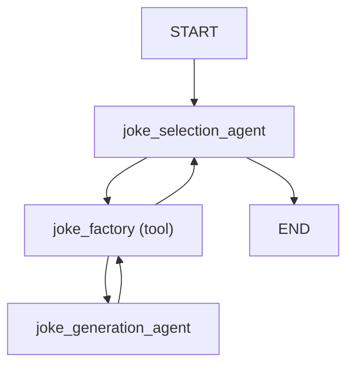

### Agent delegation and dependencies

Generally the delegate agent needs to either have the same [dependencies](dependencies.md) as the calling agent, or dependencies which are a subset of the calling agent's dependencies.

!!! info "Initializing dependencies"
    We say "generally" above since there's nothing to stop you initializing dependencies within a tool call and therefore using interdependencies in a delegate agent that are not available on the parent, this should often be avoided since it can be significantly slower than reusing connections etc. from the parent agent.

```python {title="agent_delegation_deps.py"}
from dataclasses import dataclass

import httpx

from pydantic_ai import Agent, RunContext


@dataclass
class ClientAndKey:  # (1)!
    http_client: httpx.AsyncClient
    api_key: str


joke_selection_agent = Agent(
    'openai:gpt-4o',
    deps_type=ClientAndKey,  # (2)!
    system_prompt=(
        'Use the `joke_factory` tool to generate some jokes on the given subject, '
        'then choose the best. You must return just a single joke.'
    ),
)
joke_generation_agent = Agent(
    'gemini-1.5-flash',
    deps_type=ClientAndKey,  # (4)!
    output_type=list[str],
    system_prompt=(
        'Use the "get_jokes" tool to get some jokes on the given subject, '
        'then extract each joke into a list.'
    ),
)


@joke_selection_agent.tool
async def joke_factory(ctx: RunContext[ClientAndKey], count: int) -> list[str]:
    r = await joke_generation_agent.run(
        f'Please generate {count} jokes.',
        deps=ctx.deps,  # (3)!
        usage=ctx.usage,
    )
    return r.output


@joke_generation_agent.tool  # (5)!
async def get_jokes(ctx: RunContext[ClientAndKey], count: int) -> str:
    response = await ctx.deps.http_client.get(
        'https://example.com',
        params={'count': count},
        headers={'Authorization': f'Bearer {ctx.deps.api_key}'},
    )
    response.raise_for_status()
    return response.text


async def main():
    async with httpx.AsyncClient() as client:
        deps = ClientAndKey(client, 'foobar')
        result = await joke_selection_agent.run('Tell me a joke.', deps=deps)
        print(result.output)
        #> Did you hear about the toothpaste scandal? They called it Colgate.
        print(result.usage())  # (6)!
        """
        Usage(
            requests=4,
            request_tokens=309,
            response_tokens=32,
            total_tokens=341,
            details=None,
        )
        """
```

1. Define a dataclass to hold the client and API key dependencies.
2. Set the `deps_type` of the calling agent — `joke_selection_agent` here.
3. Pass the dependencies to the delegate agent's run method within the tool call.
4. Also set the `deps_type` of the delegate agent — `joke_generation_agent` here.
5. Define a tool on the delegate agent that uses the dependencies to make an HTTP request.
6. Usage now includes 4 requests — 2 from the calling agent and 2 from the delegate agent.

_(This example is complete, it can be run "as is" — you'll need to add `asyncio.run(main())` to run `main`)_

This example shows how even a fairly simple agent delegation can lead to a complex control flow:

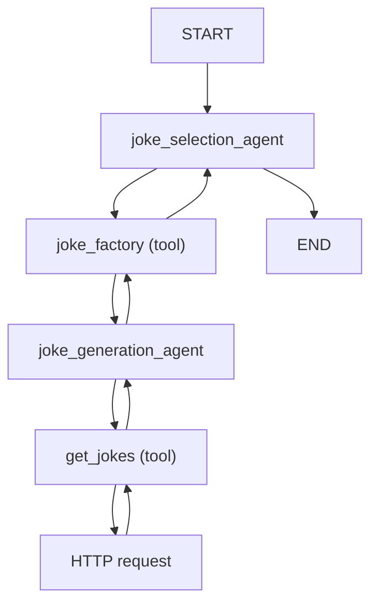

## Programmatic agent hand-off

"Programmatic agent hand-off" refers to the scenario where multiple agents are called in succession, with application code and/or a human in the loop responsible for deciding which agent to call next.

Here agents don't need to use the same deps.

Here we show two agents used in succession, the first to find a flight and the second to extract the user's seat preference.

```python {title="programmatic_handoff.py"}
from typing import Literal, Union

from pydantic import BaseModel, Field
from rich.prompt import Prompt

from pydantic_ai import Agent, RunContext
from pydantic_ai.messages import ModelMessage
from pydantic_ai.usage import Usage, UsageLimits


class FlightDetails(BaseModel):
    flight_number: str


class Failed(BaseModel):
    """Unable to find a satisfactory choice."""


flight_search_agent = Agent[None, Union[FlightDetails, Failed]](  # (1)!
    'openai:gpt-4o',
    output_type=Union[FlightDetails, Failed],  # type: ignore
    system_prompt=(
        'Use the "flight_search" tool to find a flight '
        'from the given origin to the given destination.'
    ),
)


@flight_search_agent.tool  # (2)!
async def flight_search(
    ctx: RunContext[None], origin: str, destination: str
) -> Union[FlightDetails, None]:
    # in reality, this would call a flight search API or
    # use a browser to scrape a flight search website
    return FlightDetails(flight_number='AK456')


usage_limits = UsageLimits(request_limit=15)  # (3)!


async def find_flight(usage: Usage) -> Union[FlightDetails, None]:  # (4)!
    message_history: Union[list[ModelMessage], None] = None
    for _ in range(3):
        prompt = Prompt.ask(
            'Where would you like to fly from and to?',
        )
        result = await flight_search_agent.run(
            prompt,
            message_history=message_history,
            usage=usage,
            usage_limits=usage_limits,
        )
        if isinstance(result.output, FlightDetails):
            return result.output
        else:
            message_history = result.all_messages(
                output_tool_return_content='Please try again.'
            )


class SeatPreference(BaseModel):
    row: int = Field(ge=1, le=30)
    seat: Literal['A', 'B', 'C', 'D', 'E', 'F']


# This agent is responsible for extracting the user's seat selection
seat_preference_agent = Agent[None, Union[SeatPreference, Failed]](  # (5)!
    'openai:gpt-4o',
    output_type=Union[SeatPreference, Failed],  # type: ignore
    system_prompt=(
        "Extract the user's seat preference. "
        'Seats A and F are window seats. '
        'Row 1 is the front row and has extra leg room. '
        'Rows 14, and 20 also have extra leg room. '
    ),
)


async def find_seat(usage: Usage) -> SeatPreference:  # (6)!
    message_history: Union[list[ModelMessage], None] = None
    while True:
        answer = Prompt.ask('What seat would you like?')

        result = await seat_preference_agent.run(
            answer,
            message_history=message_history,
            usage=usage,
            usage_limits=usage_limits,
        )
        if isinstance(result.output, SeatPreference):
            return result.output
        else:
            print('Could not understand seat preference. Please try again.')
            message_history = result.all_messages()


async def main():  # (7)!
    usage: Usage = Usage()

    opt_flight_details = await find_flight(usage)
    if opt_flight_details is not None:
        print(f'Flight found: {opt_flight_details.flight_number}')
        #> Flight found: AK456
        seat_preference = await find_seat(usage)
        print(f'Seat preference: {seat_preference}')
        #> Seat preference: row=1 seat='A'
```

1. Define the first agent, which finds a flight. We use an explicit type annotation until [PEP-747](https://peps.python.org/pep-0747/) lands, see [structured output](output.md#structured-output). We use a union as the output type so the model can communicate if it's unable to find a satisfactory choice; internally, each member of the union will be registered as a separate tool.
2. Define a tool on the agent to find a flight. In this simple case we could dispense with the tool and just define the agent to return structured data, then search for a flight, but in more complex scenarios the tool would be necessary.
3. Define usage limits for the entire app.
4. Define a function to find a flight, which asks the user for their preferences and then calls the agent to find a flight.
5. As with `flight_search_agent` above, we use an explicit type annotation to define the agent.
6. Define a function to find the user's seat preference, which asks the user for their seat preference and then calls the agent to extract the seat preference.
7. Now that we've put our logic for running each agent into separate functions, our main app becomes very simple.

_(This example is complete, it can be run "as is" — you'll need to add `asyncio.run(main())` to run `main`)_

The control flow for this example can be summarised as follows:

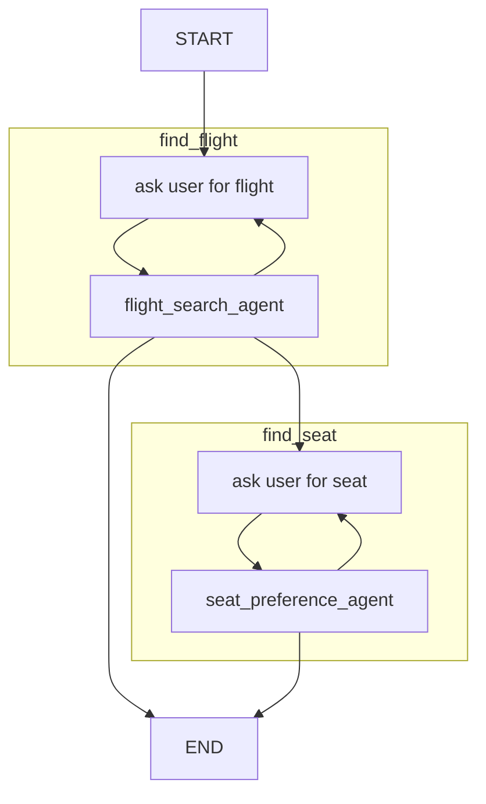

## Pydantic Graphs

See the [graph](graph.md) documentation on when and how to use graphs.

## Examples

The following examples demonstrate how to use dependencies in PydanticAI:

- [Flight booking](examples/flight-booking.md)
````

## File: docs/output.md
````markdown
"Output" refers to the final value returned from [running an agent](agents.md#running-agents) these can be either plain text or structured data.

The output is wrapped in [`AgentRunResult`][pydantic_ai.agent.AgentRunResult] or [`StreamedRunResult`][pydantic_ai.result.StreamedRunResult] so you can access other data like [usage][pydantic_ai.usage.Usage] of the run and [message history](message-history.md#accessing-messages-from-results)

Both `AgentRunResult` and `StreamedRunResult` are generic in the data they wrap, so typing information about the data returned by the agent is preserved.

```python {title="olympics.py" line_length="90"}
from pydantic import BaseModel

from pydantic_ai import Agent


class CityLocation(BaseModel):
    city: str
    country: str


agent = Agent('google-gla:gemini-1.5-flash', output_type=CityLocation)
result = agent.run_sync('Where were the olympics held in 2012?')
print(result.output)
#> city='London' country='United Kingdom'
print(result.usage())
#> Usage(requests=1, request_tokens=57, response_tokens=8, total_tokens=65, details=None)
```

_(This example is complete, it can be run "as is")_

Runs end when either a plain text response is received or the model calls a tool associated with one of the structured output types (run can also be cancelled if usage limits are exceeded, see [Usage Limits](agents.md#usage-limits)).

## Output data {#structured-output}

When the output type is `str`, or a union including `str`, plain text responses are enabled on the model, and the raw text response from the model is used as the response data.

If the output type is a union with multiple members (after removing `str` from the members), each member is registered as a separate tool with the model in order to reduce the complexity of the tool schemas and maximise the chances a model will respond correctly.

If the output type schema is not of type `"object"` (e.g. it's `int` or `list[int]`), the output type is wrapped in a single element object, so the schema of all tools registered with the model are object schemas.

Structured outputs (like tools) use Pydantic to build the JSON schema used for the tool, and to validate the data returned by the model.

!!! note "Bring on PEP-747"
    Until [PEP-747](https://peps.python.org/pep-0747/) "Annotating Type Forms" lands, unions are not valid as `type`s in Python.

    When creating the agent we need to `# type: ignore` the `output_type` argument, and add a type hint to tell type checkers about the type of the agent.

Here's an example of returning either text or a structured value

```python {title="box_or_error.py"}
from typing import Union

from pydantic import BaseModel

from pydantic_ai import Agent


class Box(BaseModel):
    width: int
    height: int
    depth: int
    units: str


agent: Agent[None, Union[Box, str]] = Agent(
    'openai:gpt-4o-mini',
    output_type=Union[Box, str],  # type: ignore
    system_prompt=(
        "Extract me the dimensions of a box, "
        "if you can't extract all data, ask the user to try again."
    ),
)

result = agent.run_sync('The box is 10x20x30')
print(result.output)
#> Please provide the units for the dimensions (e.g., cm, in, m).

result = agent.run_sync('The box is 10x20x30 cm')
print(result.output)
#> width=10 height=20 depth=30 units='cm'
```

_(This example is complete, it can be run "as is")_

Here's an example of using a union return type which registers multiple tools, and wraps non-object schemas in an object:

```python {title="colors_or_sizes.py"}
from typing import Union

from pydantic_ai import Agent

agent: Agent[None, Union[list[str], list[int]]] = Agent(
    'openai:gpt-4o-mini',
    output_type=Union[list[str], list[int]],  # type: ignore
    system_prompt='Extract either colors or sizes from the shapes provided.',
)

result = agent.run_sync('red square, blue circle, green triangle')
print(result.output)
#> ['red', 'blue', 'green']

result = agent.run_sync('square size 10, circle size 20, triangle size 30')
print(result.output)
#> [10, 20, 30]
```

_(This example is complete, it can be run "as is")_

### Output validator functions

Some validation is inconvenient or impossible to do in Pydantic validators, in particular when the validation requires IO and is asynchronous. PydanticAI provides a way to add validation functions via the [`agent.output_validator`][pydantic_ai.Agent.output_validator] decorator.

Here's a simplified variant of the [SQL Generation example](examples/sql-gen.md):

```python {title="sql_gen.py"}
from typing import Union

from fake_database import DatabaseConn, QueryError
from pydantic import BaseModel

from pydantic_ai import Agent, RunContext, ModelRetry


class Success(BaseModel):
    sql_query: str


class InvalidRequest(BaseModel):
    error_message: str


Output = Union[Success, InvalidRequest]
agent: Agent[DatabaseConn, Output] = Agent(
    'google-gla:gemini-1.5-flash',
    output_type=Output,  # type: ignore
    deps_type=DatabaseConn,
    system_prompt='Generate PostgreSQL flavored SQL queries based on user input.',
)


@agent.output_validator
async def validate_sql(ctx: RunContext[DatabaseConn], output: Output) -> Output:
    if isinstance(output, InvalidRequest):
        return output
    try:
        await ctx.deps.execute(f'EXPLAIN {output.sql_query}')
    except QueryError as e:
        raise ModelRetry(f'Invalid query: {e}') from e
    else:
        return output


result = agent.run_sync(
    'get me users who were last active yesterday.', deps=DatabaseConn()
)
print(result.output)
#> sql_query='SELECT * FROM users WHERE last_active::date = today() - interval 1 day'
```

_(This example is complete, it can be run "as is")_

## Streamed Results

There two main challenges with streamed results:

1. Validating structured responses before they're complete, this is achieved by "partial validation" which was recently added to Pydantic in [pydantic/pydantic#10748](https://github.com/pydantic/pydantic/pull/10748).
2. When receiving a response, we don't know if it's the final response without starting to stream it and peeking at the content. PydanticAI streams just enough of the response to sniff out if it's a tool call or an output, then streams the whole thing and calls tools, or returns the stream as a [`StreamedRunResult`][pydantic_ai.result.StreamedRunResult].

### Streaming Text

Example of streamed text output:

```python {title="streamed_hello_world.py" line_length="120"}
from pydantic_ai import Agent

agent = Agent('google-gla:gemini-1.5-flash')  # (1)!


async def main():
    async with agent.run_stream('Where does "hello world" come from?') as result:  # (2)!
        async for message in result.stream_text():  # (3)!
            print(message)
            #> The first known
            #> The first known use of "hello,
            #> The first known use of "hello, world" was in
            #> The first known use of "hello, world" was in a 1974 textbook
            #> The first known use of "hello, world" was in a 1974 textbook about the C
            #> The first known use of "hello, world" was in a 1974 textbook about the C programming language.
```

1. Streaming works with the standard [`Agent`][pydantic_ai.Agent] class, and doesn't require any special setup, just a model that supports streaming (currently all models support streaming).
2. The [`Agent.run_stream()`][pydantic_ai.Agent.run_stream] method is used to start a streamed run, this method returns a context manager so the connection can be closed when the stream completes.
3. Each item yield by [`StreamedRunResult.stream_text()`][pydantic_ai.result.StreamedRunResult.stream_text] is the complete text response, extended as new data is received.

_(This example is complete, it can be run "as is" — you'll need to add `asyncio.run(main())` to run `main`)_

We can also stream text as deltas rather than the entire text in each item:

```python {title="streamed_delta_hello_world.py"}
from pydantic_ai import Agent

agent = Agent('google-gla:gemini-1.5-flash')


async def main():
    async with agent.run_stream('Where does "hello world" come from?') as result:
        async for message in result.stream_text(delta=True):  # (1)!
            print(message)
            #> The first known
            #> use of "hello,
            #> world" was in
            #> a 1974 textbook
            #> about the C
            #> programming language.
```

1. [`stream_text`][pydantic_ai.result.StreamedRunResult.stream_text] will error if the response is not text.

_(This example is complete, it can be run "as is" — you'll need to add `asyncio.run(main())` to run `main`)_

!!! warning "Output message not included in `messages`"
    The final output message will **NOT** be added to result messages if you use `.stream_text(delta=True)`,
    see [Messages and chat history](message-history.md) for more information.

### Streaming Structured Output

Not all types are supported with partial validation in Pydantic, see [pydantic/pydantic#10748](https://github.com/pydantic/pydantic/pull/10748), generally for model-like structures it's currently best to use `TypeDict`.

Here's an example of streaming a use profile as it's built:

```python {title="streamed_user_profile.py" line_length="120"}
from datetime import date

from typing_extensions import TypedDict

from pydantic_ai import Agent


class UserProfile(TypedDict, total=False):
    name: str
    dob: date
    bio: str


agent = Agent(
    'openai:gpt-4o',
    output_type=UserProfile,
    system_prompt='Extract a user profile from the input',
)


async def main():
    user_input = 'My name is Ben, I was born on January 28th 1990, I like the chain the dog and the pyramid.'
    async with agent.run_stream(user_input) as result:
        async for profile in result.stream():
            print(profile)
            #> {'name': 'Ben'}
            #> {'name': 'Ben'}
            #> {'name': 'Ben', 'dob': date(1990, 1, 28), 'bio': 'Likes'}
            #> {'name': 'Ben', 'dob': date(1990, 1, 28), 'bio': 'Likes the chain the '}
            #> {'name': 'Ben', 'dob': date(1990, 1, 28), 'bio': 'Likes the chain the dog and the pyr'}
            #> {'name': 'Ben', 'dob': date(1990, 1, 28), 'bio': 'Likes the chain the dog and the pyramid'}
            #> {'name': 'Ben', 'dob': date(1990, 1, 28), 'bio': 'Likes the chain the dog and the pyramid'}
```

_(This example is complete, it can be run "as is" — you'll need to add `asyncio.run(main())` to run `main`)_

If you want fine-grained control of validation, particularly catching validation errors, you can use the following pattern:

```python {title="streamed_user_profile.py" line_length="120"}
from datetime import date

from pydantic import ValidationError
from typing_extensions import TypedDict

from pydantic_ai import Agent


class UserProfile(TypedDict, total=False):
    name: str
    dob: date
    bio: str


agent = Agent('openai:gpt-4o', output_type=UserProfile)


async def main():
    user_input = 'My name is Ben, I was born on January 28th 1990, I like the chain the dog and the pyramid.'
    async with agent.run_stream(user_input) as result:
        async for message, last in result.stream_structured(debounce_by=0.01):  # (1)!
            try:
                profile = await result.validate_structured_output(  # (2)!
                    message,
                    allow_partial=not last,
                )
            except ValidationError:
                continue
            print(profile)
            #> {'name': 'Ben'}
            #> {'name': 'Ben'}
            #> {'name': 'Ben', 'dob': date(1990, 1, 28), 'bio': 'Likes'}
            #> {'name': 'Ben', 'dob': date(1990, 1, 28), 'bio': 'Likes the chain the '}
            #> {'name': 'Ben', 'dob': date(1990, 1, 28), 'bio': 'Likes the chain the dog and the pyr'}
            #> {'name': 'Ben', 'dob': date(1990, 1, 28), 'bio': 'Likes the chain the dog and the pyramid'}
            #> {'name': 'Ben', 'dob': date(1990, 1, 28), 'bio': 'Likes the chain the dog and the pyramid'}
```

1. [`stream_structured`][pydantic_ai.result.StreamedRunResult.stream_structured] streams the data as [`ModelResponse`][pydantic_ai.messages.ModelResponse] objects, thus iteration can't fail with a `ValidationError`.
2. [`validate_structured_output`][pydantic_ai.result.StreamedRunResult.validate_structured_output] validates the data, `allow_partial=True` enables pydantic's [`experimental_allow_partial` flag on `TypeAdapter`][pydantic.type_adapter.TypeAdapter.validate_json].

_(This example is complete, it can be run "as is" — you'll need to add `asyncio.run(main())` to run `main`)_

## Examples

The following examples demonstrate how to use streamed responses in PydanticAI:

- [Stream markdown](examples/stream-markdown.md)
- [Stream Whales](examples/stream-whales.md)
````

## File: docs/testing.md
````markdown
# Unit testing

Writing unit tests for PydanticAI code is just like unit tests for any other Python code.

Because for the most part they're nothing new, we have pretty well established tools and patterns for writing and running these kinds of tests.

Unless you're really sure you know better, you'll probably want to follow roughly this strategy:

* Use [`pytest`](https://docs.pytest.org/en/stable/) as your test harness
* If you find yourself typing out long assertions, use [inline-snapshot](https://15r10nk.github.io/inline-snapshot/latest/)
* Similarly, [dirty-equals](https://dirty-equals.helpmanual.io/latest/) can be useful for comparing large data structures
* Use [`TestModel`][pydantic_ai.models.test.TestModel] or [`FunctionModel`][pydantic_ai.models.function.FunctionModel] in place of your actual model to avoid the usage, latency and variability of real LLM calls
* Use [`Agent.override`][pydantic_ai.agent.Agent.override] to replace your model inside your application logic
* Set [`ALLOW_MODEL_REQUESTS=False`][pydantic_ai.models.ALLOW_MODEL_REQUESTS] globally to block any requests from being made to non-test models accidentally

### Unit testing with `TestModel`

The simplest and fastest way to exercise most of your application code is using [`TestModel`][pydantic_ai.models.test.TestModel], this will (by default) call all tools in the agent, then return either plain text or a structured response depending on the return type of the agent.

!!! note "`TestModel` is not magic"
    The "clever" (but not too clever) part of `TestModel` is that it will attempt to generate valid structured data for [function tools](tools.md) and [output types](output.md#structured-output) based on the schema of the registered tools.

    There's no ML or AI in `TestModel`, it's just plain old procedural Python code that tries to generate data that satisfies the JSON schema of a tool.

    The resulting data won't look pretty or relevant, but it should pass Pydantic's validation in most cases.
    If you want something more sophisticated, use [`FunctionModel`][pydantic_ai.models.function.FunctionModel] and write your own data generation logic.

Let's write unit tests for the following application code:

```python {title="weather_app.py"}
import asyncio
from datetime import date

from pydantic_ai import Agent, RunContext

from fake_database import DatabaseConn  # (1)!
from weather_service import WeatherService  # (2)!

weather_agent = Agent(
    'openai:gpt-4o',
    deps_type=WeatherService,
    system_prompt='Providing a weather forecast at the locations the user provides.',
)


@weather_agent.tool
def weather_forecast(
    ctx: RunContext[WeatherService], location: str, forecast_date: date
) -> str:
    if forecast_date < date.today():  # (3)!
        return ctx.deps.get_historic_weather(location, forecast_date)
    else:
        return ctx.deps.get_forecast(location, forecast_date)


async def run_weather_forecast(  # (4)!
    user_prompts: list[tuple[str, int]], conn: DatabaseConn
):
    """Run weather forecast for a list of user prompts and save."""
    async with WeatherService() as weather_service:

        async def run_forecast(prompt: str, user_id: int):
            result = await weather_agent.run(prompt, deps=weather_service)
            await conn.store_forecast(user_id, result.output)

        # run all prompts in parallel
        await asyncio.gather(
            *(run_forecast(prompt, user_id) for (prompt, user_id) in user_prompts)
        )
```

1. `DatabaseConn` is a class that holds a database connection
2. `WeatherService` has methods to get weather forecasts and historic data about the weather
3. We need to call a different endpoint depending on whether the date is in the past or the future, you'll see why this nuance is important below
4. This function is the code we want to test, together with the agent it uses

Here we have a function that takes a list of `#!python (user_prompt, user_id)` tuples, gets a weather forecast for each prompt, and stores the result in the database.

**We want to test this code without having to mock certain objects or modify our code so we can pass test objects in.**

Here's how we would write tests using [`TestModel`][pydantic_ai.models.test.TestModel]:

```python {title="test_weather_app.py" call_name="test_forecast"}
from datetime import timezone
import pytest

from dirty_equals import IsNow, IsStr

from pydantic_ai import models, capture_run_messages
from pydantic_ai.models.test import TestModel
from pydantic_ai.messages import (
    ModelResponse,
    SystemPromptPart,
    TextPart,
    ToolCallPart,
    ToolReturnPart,
    UserPromptPart,
    ModelRequest,
)

from fake_database import DatabaseConn
from weather_app import run_weather_forecast, weather_agent

pytestmark = pytest.mark.anyio  # (1)!
models.ALLOW_MODEL_REQUESTS = False  # (2)!


async def test_forecast():
    conn = DatabaseConn()
    user_id = 1
    with capture_run_messages() as messages:
        with weather_agent.override(model=TestModel()):  # (3)!
            prompt = 'What will the weather be like in London on 2024-11-28?'
            await run_weather_forecast([(prompt, user_id)], conn)  # (4)!

    forecast = await conn.get_forecast(user_id)
    assert forecast == '{"weather_forecast":"Sunny with a chance of rain"}'  # (5)!

    assert messages == [  # (6)!
        ModelRequest(
            parts=[
                SystemPromptPart(
                    content='Providing a weather forecast at the locations the user provides.',
                    timestamp=IsNow(tz=timezone.utc),
                ),
                UserPromptPart(
                    content='What will the weather be like in London on 2024-11-28?',
                    timestamp=IsNow(tz=timezone.utc),  # (7)!
                ),
            ]
        ),
        ModelResponse(
            parts=[
                ToolCallPart(
                    tool_name='weather_forecast',
                    args={
                        'location': 'a',
                        'forecast_date': '2024-01-01',  # (8)!
                    },
                    tool_call_id=IsStr(),
                )
            ],
            model_name='test',
            timestamp=IsNow(tz=timezone.utc),
        ),
        ModelRequest(
            parts=[
                ToolReturnPart(
                    tool_name='weather_forecast',
                    content='Sunny with a chance of rain',
                    tool_call_id=IsStr(),
                    timestamp=IsNow(tz=timezone.utc),
                ),
            ],
        ),
        ModelResponse(
            parts=[
                TextPart(
                    content='{"weather_forecast":"Sunny with a chance of rain"}',
                )
            ],
            model_name='test',
            timestamp=IsNow(tz=timezone.utc),
        ),
    ]
```

1. We're using [anyio](https://anyio.readthedocs.io/en/stable/) to run async tests.
2. This is a safety measure to make sure we don't accidentally make real requests to the LLM while testing, see [`ALLOW_MODEL_REQUESTS`][pydantic_ai.models.ALLOW_MODEL_REQUESTS] for more details.
3. We're using [`Agent.override`][pydantic_ai.agent.Agent.override] to replace the agent's model with [`TestModel`][pydantic_ai.models.test.TestModel], the nice thing about `override` is that we can replace the model inside agent without needing access to the agent `run*` methods call site.
4. Now we call the function we want to test inside the `override` context manager.
5. But default, `TestModel` will return a JSON string summarising the tools calls made, and what was returned. If you wanted to customise the response to something more closely aligned with the domain, you could add [`custom_output_text='Sunny'`][pydantic_ai.models.test.TestModel.custom_output_text] when defining `TestModel`.
6. So far we don't actually know which tools were called and with which values, we can use [`capture_run_messages`][pydantic_ai.capture_run_messages] to inspect messages from the most recent run and assert the exchange between the agent and the model occurred as expected.
7. The [`IsNow`][dirty_equals.IsNow] helper allows us to use declarative asserts even with data which will contain timestamps that change over time.
8. `TestModel` isn't doing anything clever to extract values from the prompt, so these values are hardcoded.

### Unit testing with `FunctionModel`

The above tests are a great start, but careful readers will notice that the `WeatherService.get_forecast` is never called since `TestModel` calls `weather_forecast` with a date in the past.

To fully exercise `weather_forecast`, we need to use [`FunctionModel`][pydantic_ai.models.function.FunctionModel] to customise how the tools is called.

Here's an example of using `FunctionModel` to test the `weather_forecast` tool with custom inputs

```python {title="test_weather_app2.py" call_name="test_forecast_future"}
import re

import pytest

from pydantic_ai import models
from pydantic_ai.messages import (
    ModelMessage,
    ModelResponse,
    TextPart,
    ToolCallPart,
)
from pydantic_ai.models.function import AgentInfo, FunctionModel

from fake_database import DatabaseConn
from weather_app import run_weather_forecast, weather_agent

pytestmark = pytest.mark.anyio
models.ALLOW_MODEL_REQUESTS = False


def call_weather_forecast(  # (1)!
    messages: list[ModelMessage], info: AgentInfo
) -> ModelResponse:
    if len(messages) == 1:
        # first call, call the weather forecast tool
        user_prompt = messages[0].parts[-1]
        m = re.search(r'\d{4}-\d{2}-\d{2}', user_prompt.content)
        assert m is not None
        args = {'location': 'London', 'forecast_date': m.group()}  # (2)!
        return ModelResponse(parts=[ToolCallPart('weather_forecast', args)])
    else:
        # second call, return the forecast
        msg = messages[-1].parts[0]
        assert msg.part_kind == 'tool-return'
        return ModelResponse(parts=[TextPart(f'The forecast is: {msg.content}')])


async def test_forecast_future():
    conn = DatabaseConn()
    user_id = 1
    with weather_agent.override(model=FunctionModel(call_weather_forecast)):  # (3)!
        prompt = 'What will the weather be like in London on 2032-01-01?'
        await run_weather_forecast([(prompt, user_id)], conn)

    forecast = await conn.get_forecast(user_id)
    assert forecast == 'The forecast is: Rainy with a chance of sun'
```

1. We define a function `call_weather_forecast` that will be called by `FunctionModel` in place of the LLM, this function has access to the list of [`ModelMessage`][pydantic_ai.messages.ModelMessage]s that make up the run, and [`AgentInfo`][pydantic_ai.models.function.AgentInfo] which contains information about the agent and the function tools and return tools.
2. Our function is slightly intelligent in that it tries to extract a date from the prompt, but just hard codes the location.
3. We use [`FunctionModel`][pydantic_ai.models.function.FunctionModel] to replace the agent's model with our custom function.

### Overriding model via pytest fixtures

If you're writing lots of tests that all require model to be overridden, you can use [pytest fixtures](https://docs.pytest.org/en/6.2.x/fixture.html) to override the model with [`TestModel`][pydantic_ai.models.test.TestModel] or [`FunctionModel`][pydantic_ai.models.function.FunctionModel] in a reusable way.

Here's an example of a fixture that overrides the model with `TestModel`:

```python {title="tests.py"}
import pytest
from weather_app import weather_agent

from pydantic_ai.models.test import TestModel


@pytest.fixture
def override_weather_agent():
    with weather_agent.override(model=TestModel()):
        yield


async def test_forecast(override_weather_agent: None):
    ...
    # test code here
```
````

## File: docs/tools.md
````markdown
# Function Tools

Function tools provide a mechanism for models to retrieve extra information to help them generate a response.

They're useful when it is impractical or impossible to put all the context an agent might need into the system prompt, or when you want to make agents' behavior more deterministic or reliable by deferring some of the logic required to generate a response to another (not necessarily AI-powered) tool.

!!! info "Function tools vs. RAG"
    Function tools are basically the "R" of RAG (Retrieval-Augmented Generation) — they augment what the model can do by letting it request extra information.

    The main semantic difference between PydanticAI Tools and RAG is RAG is synonymous with vector search, while PydanticAI tools are more general-purpose. (Note: we may add support for vector search functionality in the future, particularly an API for generating embeddings. See [#58](https://github.com/pydantic/pydantic-ai/issues/58))

There are a number of ways to register tools with an agent:

* via the [`@agent.tool`][pydantic_ai.Agent.tool] decorator — for tools that need access to the agent [context][pydantic_ai.tools.RunContext]
* via the [`@agent.tool_plain`][pydantic_ai.Agent.tool_plain] decorator — for tools that do not need access to the agent [context][pydantic_ai.tools.RunContext]
* via the [`tools`][pydantic_ai.Agent.__init__] keyword argument to `Agent` which can take either plain functions, or instances of [`Tool`][pydantic_ai.tools.Tool]

`@agent.tool` is considered the default decorator since in the majority of cases tools will need access to the agent context.

Here's an example using both:

```python {title="dice_game.py"}
import random

from pydantic_ai import Agent, RunContext

agent = Agent(
    'google-gla:gemini-1.5-flash',  # (1)!
    deps_type=str,  # (2)!
    system_prompt=(
        "You're a dice game, you should roll the die and see if the number "
        "you get back matches the user's guess. If so, tell them they're a winner. "
        "Use the player's name in the response."
    ),
)


@agent.tool_plain  # (3)!
def roll_die() -> str:
    """Roll a six-sided die and return the result."""
    return str(random.randint(1, 6))


@agent.tool  # (4)!
def get_player_name(ctx: RunContext[str]) -> str:
    """Get the player's name."""
    return ctx.deps


dice_result = agent.run_sync('My guess is 4', deps='Anne')  # (5)!
print(dice_result.output)
#> Congratulations Anne, you guessed correctly! You're a winner!
```

1. This is a pretty simple task, so we can use the fast and cheap Gemini flash model.
2. We pass the user's name as the dependency, to keep things simple we use just the name as a string as the dependency.
3. This tool doesn't need any context, it just returns a random number. You could probably use a dynamic system prompt in this case.
4. This tool needs the player's name, so it uses `RunContext` to access dependencies which are just the player's name in this case.
5. Run the agent, passing the player's name as the dependency.

_(This example is complete, it can be run "as is")_

Let's print the messages from that game to see what happened:

```python {title="dice_game_messages.py"}
from dice_game import dice_result

print(dice_result.all_messages())
"""
[
    ModelRequest(
        parts=[
            SystemPromptPart(
                content="You're a dice game, you should roll the die and see if the number you get back matches the user's guess. If so, tell them they're a winner. Use the player's name in the response.",
                timestamp=datetime.datetime(...),
                dynamic_ref=None,
                part_kind='system-prompt',
            ),
            UserPromptPart(
                content='My guess is 4',
                timestamp=datetime.datetime(...),
                part_kind='user-prompt',
            ),
        ],
        instructions=None,
        kind='request',
    ),
    ModelResponse(
        parts=[
            ToolCallPart(
                tool_name='roll_die',
                args={},
                tool_call_id='pyd_ai_tool_call_id',
                part_kind='tool-call',
            )
        ],
        model_name='gemini-1.5-flash',
        timestamp=datetime.datetime(...),
        kind='response',
    ),
    ModelRequest(
        parts=[
            ToolReturnPart(
                tool_name='roll_die',
                content='4',
                tool_call_id='pyd_ai_tool_call_id',
                timestamp=datetime.datetime(...),
                part_kind='tool-return',
            )
        ],
        instructions=None,
        kind='request',
    ),
    ModelResponse(
        parts=[
            ToolCallPart(
                tool_name='get_player_name',
                args={},
                tool_call_id='pyd_ai_tool_call_id',
                part_kind='tool-call',
            )
        ],
        model_name='gemini-1.5-flash',
        timestamp=datetime.datetime(...),
        kind='response',
    ),
    ModelRequest(
        parts=[
            ToolReturnPart(
                tool_name='get_player_name',
                content='Anne',
                tool_call_id='pyd_ai_tool_call_id',
                timestamp=datetime.datetime(...),
                part_kind='tool-return',
            )
        ],
        instructions=None,
        kind='request',
    ),
    ModelResponse(
        parts=[
            TextPart(
                content="Congratulations Anne, you guessed correctly! You're a winner!",
                part_kind='text',
            )
        ],
        model_name='gemini-1.5-flash',
        timestamp=datetime.datetime(...),
        kind='response',
    ),
]
"""
```

We can represent this with a diagram:

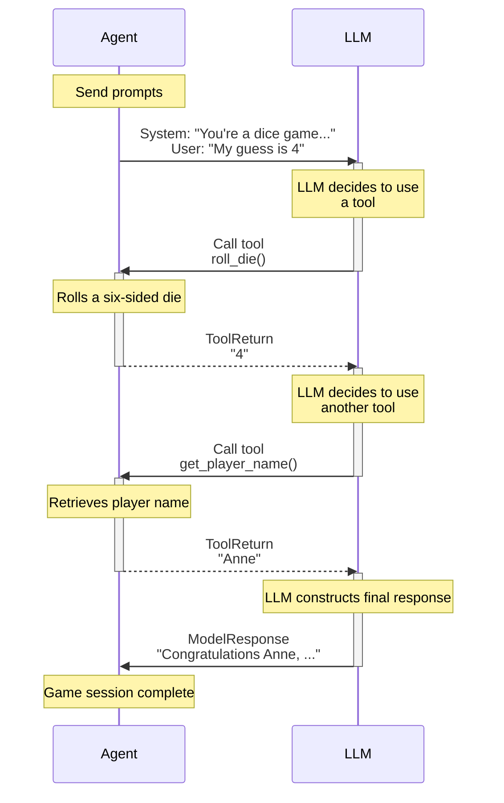

## Registering Function Tools via kwarg

As well as using the decorators, we can register tools via the `tools` argument to the [`Agent` constructor][pydantic_ai.Agent.__init__]. This is useful when you want to reuse tools, and can also give more fine-grained control over the tools.

```python {title="dice_game_tool_kwarg.py"}
import random

from pydantic_ai import Agent, RunContext, Tool

system_prompt = """\
You're a dice game, you should roll the die and see if the number
you get back matches the user's guess. If so, tell them they're a winner.
Use the player's name in the response.
"""


def roll_die() -> str:
    """Roll a six-sided die and return the result."""
    return str(random.randint(1, 6))


def get_player_name(ctx: RunContext[str]) -> str:
    """Get the player's name."""
    return ctx.deps


agent_a = Agent(
    'google-gla:gemini-1.5-flash',
    deps_type=str,
    tools=[roll_die, get_player_name],  # (1)!
    system_prompt=system_prompt,
)
agent_b = Agent(
    'google-gla:gemini-1.5-flash',
    deps_type=str,
    tools=[  # (2)!
        Tool(roll_die, takes_ctx=False),
        Tool(get_player_name, takes_ctx=True),
    ],
    system_prompt=system_prompt,
)

dice_result = {}
dice_result['a'] = agent_a.run_sync('My guess is 6', deps='Yashar')
dice_result['b'] = agent_b.run_sync('My guess is 4', deps='Anne')
print(dice_result['a'].output)
#> Tough luck, Yashar, you rolled a 4. Better luck next time.
print(dice_result['b'].output)
#> Congratulations Anne, you guessed correctly! You're a winner!
```

1. The simplest way to register tools via the `Agent` constructor is to pass a list of functions, the function signature is inspected to determine if the tool takes [`RunContext`][pydantic_ai.tools.RunContext].
2. `agent_a` and `agent_b` are identical — but we can use [`Tool`][pydantic_ai.tools.Tool] to reuse tool definitions and give more fine-grained control over how tools are defined, e.g. setting their name or description, or using a custom [`prepare`](#tool-prepare) method.

_(This example is complete, it can be run "as is")_

## Function Tools vs. Structured Outputs

As the name suggests, function tools use the model's "tools" or "functions" API to let the model know what is available to call. Tools or functions are also used to define the schema(s) for structured responses, thus a model might have access to many tools, some of which call function tools while others end the run and produce a final output.

## Function tools and schema

Function parameters are extracted from the function signature, and all parameters except `RunContext` are used to build the schema for that tool call.

Even better, PydanticAI extracts the docstring from functions and (thanks to [griffe](https://mkdocstrings.github.io/griffe/)) extracts parameter descriptions from the docstring and adds them to the schema.

[Griffe supports](https://mkdocstrings.github.io/griffe/reference/docstrings/#docstrings) extracting parameter descriptions from `google`, `numpy`, and `sphinx` style docstrings. PydanticAI will infer the format to use based on the docstring, but you can explicitly set it using [`docstring_format`][pydantic_ai.tools.DocstringFormat]. You can also enforce parameter requirements by setting `require_parameter_descriptions=True`. This will raise a [`UserError`][pydantic_ai.exceptions.UserError] if a parameter description is missing.

To demonstrate a tool's schema, here we use [`FunctionModel`][pydantic_ai.models.function.FunctionModel] to print the schema a model would receive:

```python {title="tool_schema.py"}
from pydantic_ai import Agent
from pydantic_ai.messages import ModelMessage, ModelResponse, TextPart
from pydantic_ai.models.function import AgentInfo, FunctionModel

agent = Agent()


@agent.tool_plain(docstring_format='google', require_parameter_descriptions=True)
def foobar(a: int, b: str, c: dict[str, list[float]]) -> str:
    """Get me foobar.

    Args:
        a: apple pie
        b: banana cake
        c: carrot smoothie
    """
    return f'{a} {b} {c}'


def print_schema(messages: list[ModelMessage], info: AgentInfo) -> ModelResponse:
    tool = info.function_tools[0]
    print(tool.description)
    #> Get me foobar.
    print(tool.parameters_json_schema)
    """
    {
        'additionalProperties': False,
        'properties': {
            'a': {'description': 'apple pie', 'type': 'integer'},
            'b': {'description': 'banana cake', 'type': 'string'},
            'c': {
                'additionalProperties': {'items': {'type': 'number'}, 'type': 'array'},
                'description': 'carrot smoothie',
                'type': 'object',
            },
        },
        'required': ['a', 'b', 'c'],
        'type': 'object',
    }
    """
    return ModelResponse(parts=[TextPart('foobar')])


agent.run_sync('hello', model=FunctionModel(print_schema))
```

_(This example is complete, it can be run "as is")_

The return type of tool can be anything which Pydantic can serialize to JSON as some models (e.g. Gemini) support semi-structured return values, some expect text (OpenAI) but seem to be just as good at extracting meaning from the data. If a Python object is returned and the model expects a string, the value will be serialized to JSON.

If a tool has a single parameter that can be represented as an object in JSON schema (e.g. dataclass, TypedDict, pydantic model), the schema for the tool is simplified to be just that object.

Here's an example where we use [`TestModel.last_model_request_parameters`][pydantic_ai.models.test.TestModel.last_model_request_parameters] to inspect the tool schema that would be passed to the model.

```python {title="single_parameter_tool.py"}
from pydantic import BaseModel

from pydantic_ai import Agent
from pydantic_ai.models.test import TestModel

agent = Agent()


class Foobar(BaseModel):
    """This is a Foobar"""

    x: int
    y: str
    z: float = 3.14


@agent.tool_plain
def foobar(f: Foobar) -> str:
    return str(f)


test_model = TestModel()
result = agent.run_sync('hello', model=test_model)
print(result.output)
#> {"foobar":"x=0 y='a' z=3.14"}
print(test_model.last_model_request_parameters.function_tools)
"""
[
    ToolDefinition(
        name='foobar',
        description='This is a Foobar',
        parameters_json_schema={
            'properties': {
                'x': {'type': 'integer'},
                'y': {'type': 'string'},
                'z': {'default': 3.14, 'type': 'number'},
            },
            'required': ['x', 'y'],
            'title': 'Foobar',
            'type': 'object',
        },
        outer_typed_dict_key=None,
        strict=None,
    )
]
"""
```

_(This example is complete, it can be run "as is")_

## Dynamic Function tools {#tool-prepare}

Tools can optionally be defined with another function: `prepare`, which is called at each step of a run to
customize the definition of the tool passed to the model, or omit the tool completely from that step.

A `prepare` method can be registered via the `prepare` kwarg to any of the tool registration mechanisms:

* [`@agent.tool`][pydantic_ai.Agent.tool] decorator
* [`@agent.tool_plain`][pydantic_ai.Agent.tool_plain] decorator
* [`Tool`][pydantic_ai.tools.Tool] dataclass

The `prepare` method, should be of type [`ToolPrepareFunc`][pydantic_ai.tools.ToolPrepareFunc], a function which takes [`RunContext`][pydantic_ai.tools.RunContext] and a pre-built [`ToolDefinition`][pydantic_ai.tools.ToolDefinition], and should either return that `ToolDefinition` with or without modifying it, return a new `ToolDefinition`, or return `None` to indicate this tools should not be registered for that step.

Here's a simple `prepare` method that only includes the tool if the value of the dependency is `42`.

As with the previous example, we use [`TestModel`][pydantic_ai.models.test.TestModel] to demonstrate the behavior without calling a real model.

```python {title="tool_only_if_42.py"}
from typing import Union

from pydantic_ai import Agent, RunContext
from pydantic_ai.tools import ToolDefinition

agent = Agent('test')


async def only_if_42(
    ctx: RunContext[int], tool_def: ToolDefinition
) -> Union[ToolDefinition, None]:
    if ctx.deps == 42:
        return tool_def


@agent.tool(prepare=only_if_42)
def hitchhiker(ctx: RunContext[int], answer: str) -> str:
    return f'{ctx.deps} {answer}'


result = agent.run_sync('testing...', deps=41)
print(result.output)
#> success (no tool calls)
result = agent.run_sync('testing...', deps=42)
print(result.output)
#> {"hitchhiker":"42 a"}
```

_(This example is complete, it can be run "as is")_

Here's a more complex example where we change the description of the `name` parameter to based on the value of `deps`

For the sake of variation, we create this tool using the [`Tool`][pydantic_ai.tools.Tool] dataclass.

```python {title="customize_name.py"}
from __future__ import annotations

from typing import Literal

from pydantic_ai import Agent, RunContext
from pydantic_ai.models.test import TestModel
from pydantic_ai.tools import Tool, ToolDefinition


def greet(name: str) -> str:
    return f'hello {name}'


async def prepare_greet(
    ctx: RunContext[Literal['human', 'machine']], tool_def: ToolDefinition
) -> ToolDefinition | None:
    d = f'Name of the {ctx.deps} to greet.'
    tool_def.parameters_json_schema['properties']['name']['description'] = d
    return tool_def


greet_tool = Tool(greet, prepare=prepare_greet)
test_model = TestModel()
agent = Agent(test_model, tools=[greet_tool], deps_type=Literal['human', 'machine'])

result = agent.run_sync('testing...', deps='human')
print(result.output)
#> {"greet":"hello a"}
print(test_model.last_model_request_parameters.function_tools)
"""
[
    ToolDefinition(
        name='greet',
        description='',
        parameters_json_schema={
            'additionalProperties': False,
            'properties': {
                'name': {'type': 'string', 'description': 'Name of the human to greet.'}
            },
            'required': ['name'],
            'type': 'object',
        },
        outer_typed_dict_key=None,
        strict=None,
    )
]
"""
```

_(This example is complete, it can be run "as is")_
````

## File: docs/troubleshooting.md
````markdown
# Troubleshooting

Below are suggestions on how to fix some common errors you might encounter while using PydanticAI. If the issue you're experiencing is not listed below or addressed in the documentation, please feel free to ask in the [Pydantic Slack](help.md) or create an issue on [GitHub](https://github.com/pydantic/pydantic-ai/issues).

## Jupyter Notebook Errors

### `RuntimeError: This event loop is already running`

This error is caused by conflicts between the event loops in Jupyter notebook and PydanticAI's. One way to manage these conflicts is by using [`nest-asyncio`](https://pypi.org/project/nest-asyncio/). Namely, before you execute any agent runs, do the following:
```python {test="skip"}
import nest_asyncio

nest_asyncio.apply()
```
Note: This fix also applies to Google Colab and [Marimo](https://github.com/marimo-team/marimo).

## API Key Configuration

### `UserError: API key must be provided or set in the [MODEL]_API_KEY environment variable`

If you're running into issues with setting the API key for your model, visit the [Models](models/index.md) page to learn more about how to set an environment variable and/or pass in an `api_key` argument.

## Monitoring HTTPX Requests

You can use custom `httpx` clients in your models in order to access specific requests, responses, and headers at runtime.

It's particularly helpful to use `logfire`'s [HTTPX integration](logfire.md#monitoring-httpx-requests) to monitor the above.
````
